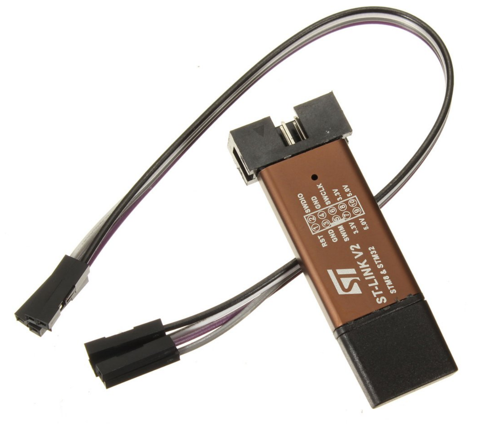
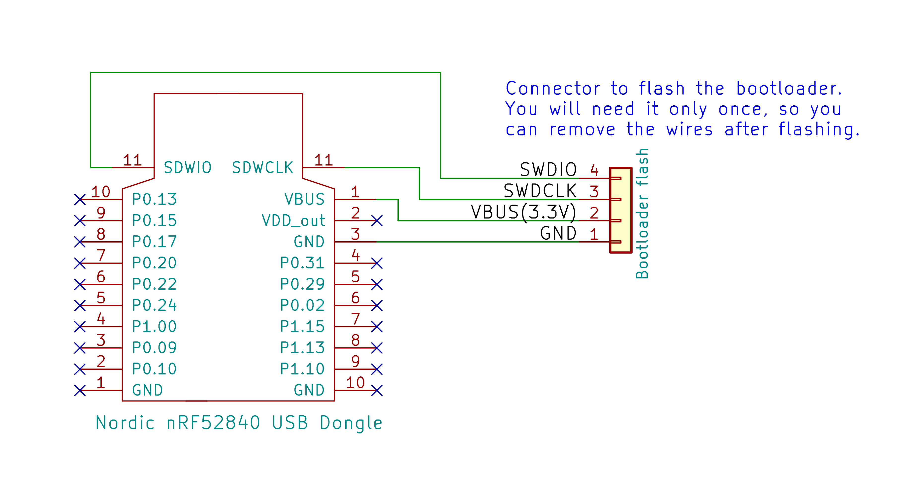

# Installing the bootloader on the Nordic USB Dongle
**Components you will need:**
*  [STLINK V2 (read before buying)](stlinkv2.md): (costs $3)

## Wiring

For flashing the bootloader, connect the SWDCLK, SWDIO, GND and VBUS pins to the STLinkV2 and follow the flashing instructions below using either Windows or Linux.
Once the firmware is flashed, the STLinkV2  connection will not longer be required, as all future updates can be done wirelessly over bluetooth. 

The firmware HEX file to flash is the "bootloader.hex" that you can [download from here](https://github.com/OpenSourceEBike/ev_display_bluetooth_ant/releases).

Schematic for connections:

Wireless board pinout:

## Flashing

* [Flashing Instructions for Windows](windows.md)  
* [Flashing Instructions for Ubuntu](ubuntu.md)  

