I used the VESC Tool on my PC, with a USB connection to VESC. The first step were to do the motor auto detection on VESC Tool.

There are a lot of tutorials on Youtube on how to use VESC Tool to do a motor configuration, you can follow them.

I did control the motor using my keyboard up and down arrows, but I had first to enable this on the VESC Tool.

The idea is to configure the motor FOC parameters is a way the motor startup well, using sensorless (my case) or any other sensors like Hall sensor or a Magnetic encoder sensor.
It also must be configured the battery limit voltages, battery currents and motor currents.
Once the configuration is done, the VESC will be able to run your motor, just by sending a command to VESC with the desired motor current.

# General

## General
  * motor type: FOC
  * invert motor direction: depends if your motor rotates backwards or forwards. When you click your keyboard up arrow and the motor rotates on the direction you wish, then you do not need to invert the motor direction.

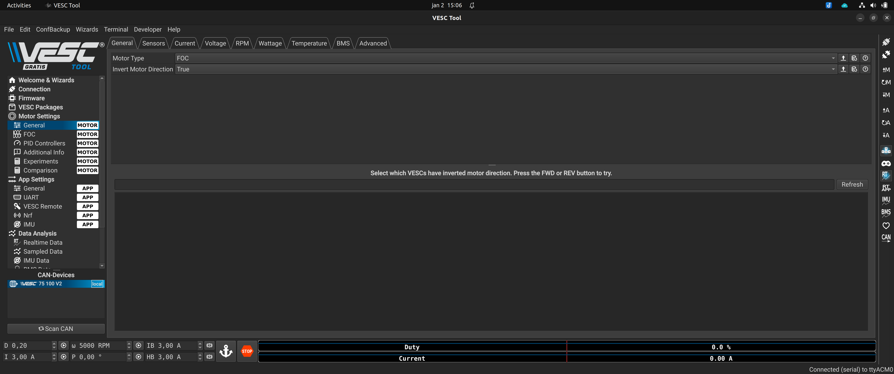

## Sensors

* sensor port mode: select the default option Hall Sensors. As I use sensorless mode, does not matter what is selected here, but I prefer to keep the default option Hall Sensors.

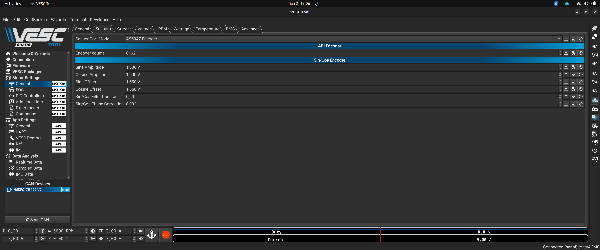

## Current

For motor max current I did choose 30A. I am not sure what should be that value for my motor but I guess that 30A should be ok.

For motor max brake current, it must be set to 0!! Because this is a EBike mid drive motor, it will never brake. Also very important, this VESC only support max of 60V battery and I am using a 48V, that is 54.6V when fully charged and if would be braking, probably that voltage would increase and burn this VESC.

Abosulte max current I set to 35A, 5A more then the motor max current, otherwise the VESC may cut abruptly the motor power when it reachs the max of 5A.

Slow ABS Current Limit to True, otherwise the VESC may cut abruptly the motor power on motor current limit.

Battery Max Current of 15A, that is ok on the limit of my battery as also that means a 720W while my motor should hold only 500W.

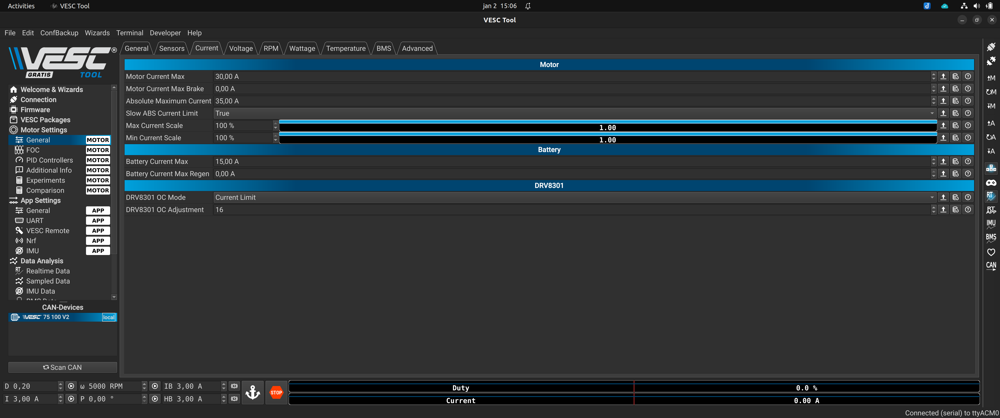

## Voltage

Select the voltages values that apply to your case. NOTE that voltages on the following image are not correct for a 48V / 13S battery.

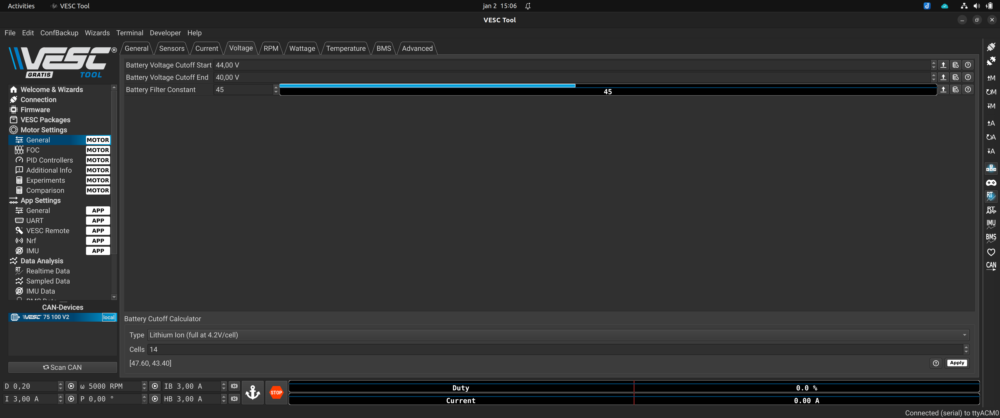

## RPM

I left the default values but I am almost sure my motor never get up to that limit.

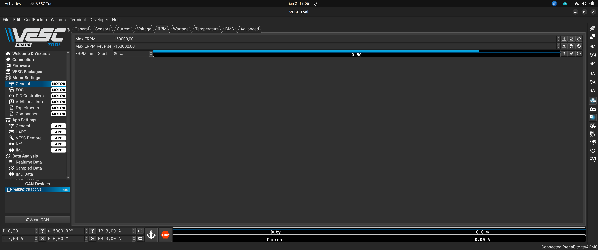

## Wattage

I left the default values but I am almost sure my motor never get up to that limit.

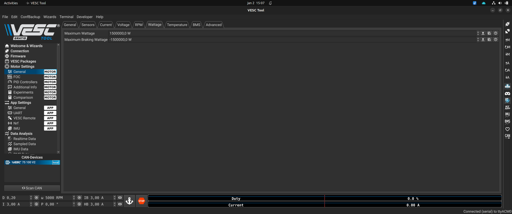

## Temperature

I do not use any temperature sensor connected to the VESC, so I keep this option disable. I only connect the motor temperature sensor to the EBike board.

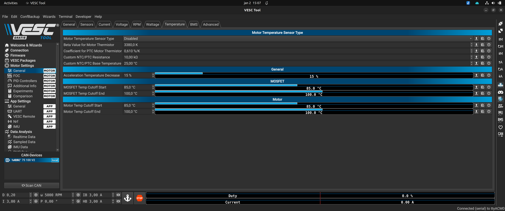

## BMS

I keep this option disable.

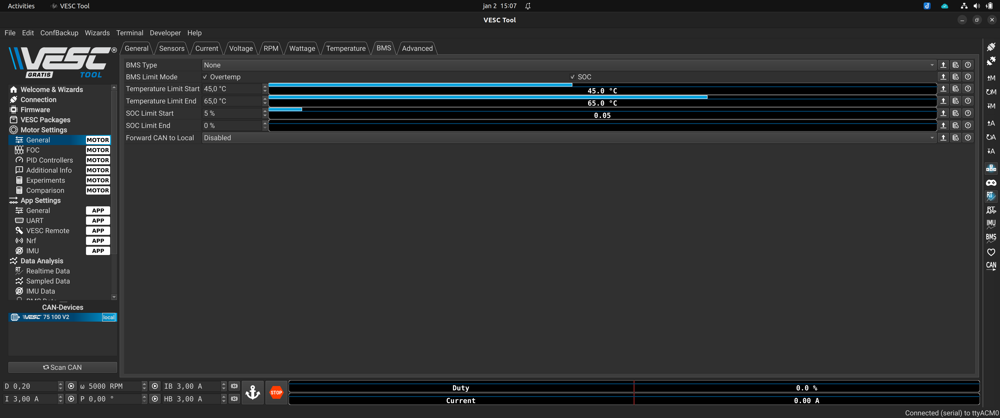

## Advanced

I keep this options on the default value.

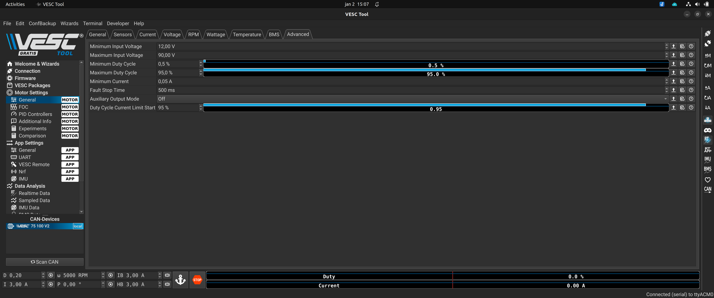

# FOC

## General

Here I selected Sensor Mode: Sensorless.

That values of motor resistance, Inductance, etc, were all auto detected by VESC, when I did the initial motor auto detection. Still we can make on the bellow buttons of this screen the auto detection and then do the apply / motor save configurations.

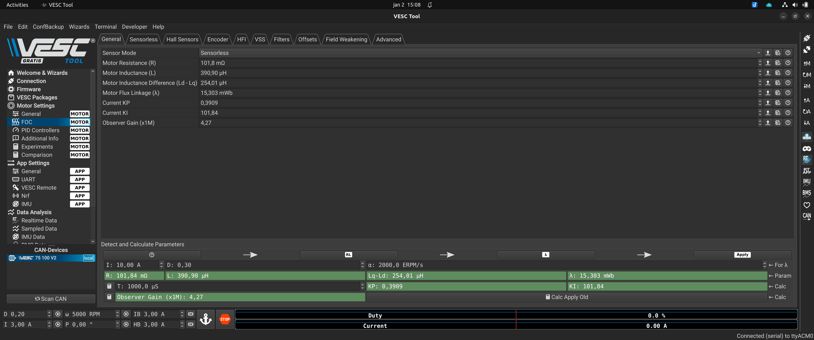

## Sensorless

Here I only changed the Openloop ERPM default value to 1000.

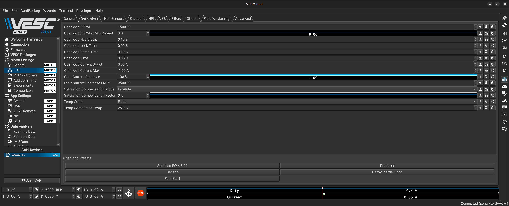

## Filters

I kept the filters disable.

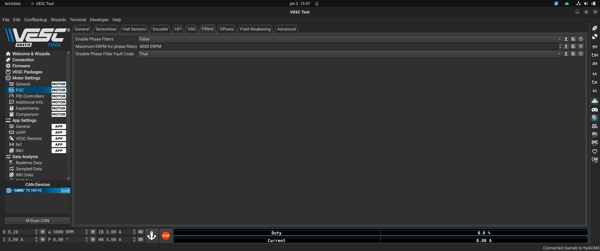

## Offsets

I kept the offsets with the defaul values.

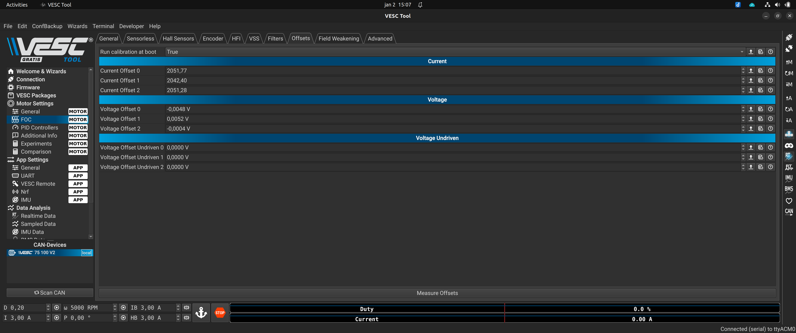

## Field Weakening

I kept Field Weakening disabled, with the value Current Max 0A.

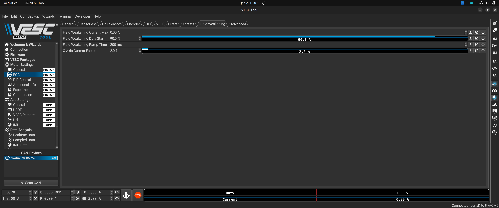

## Advanced

I kept Field Weakening disabled, with the value Current Max 0A.

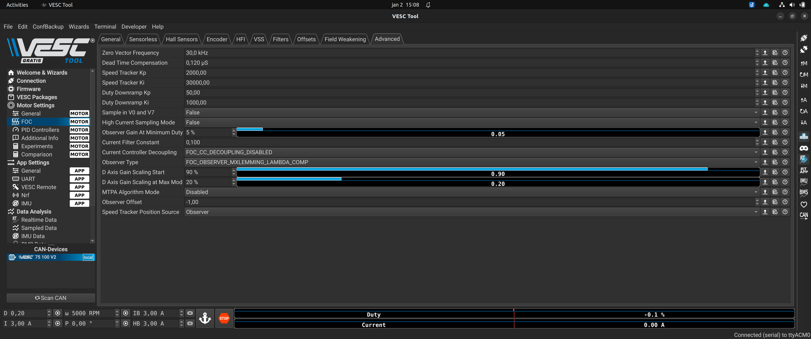