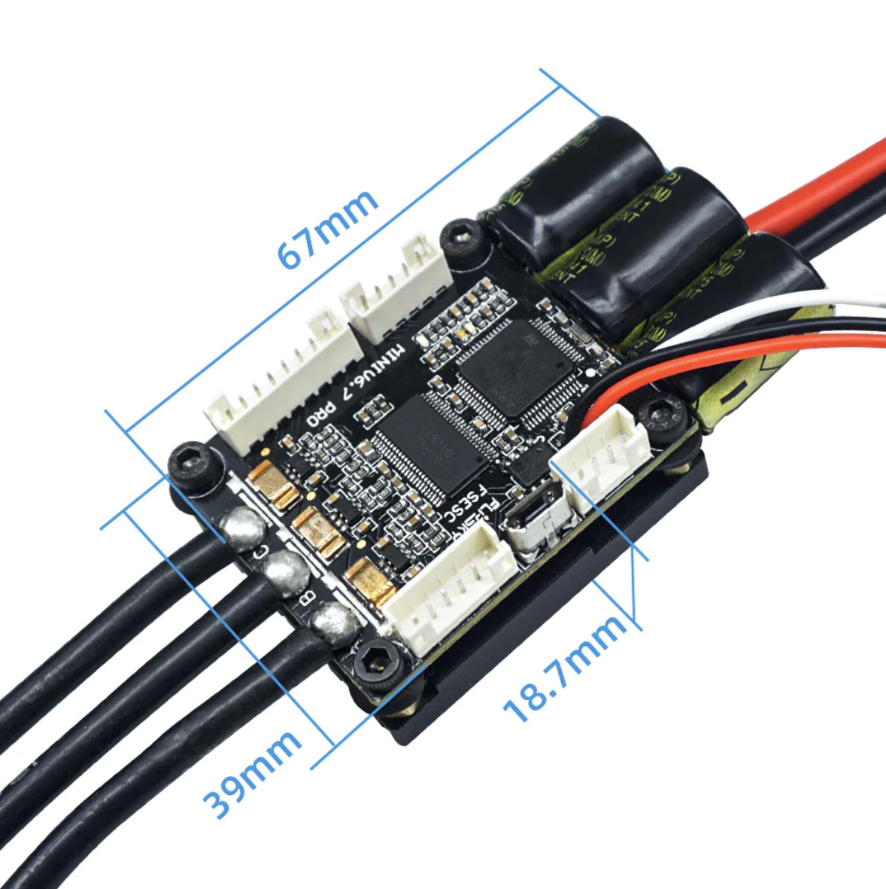
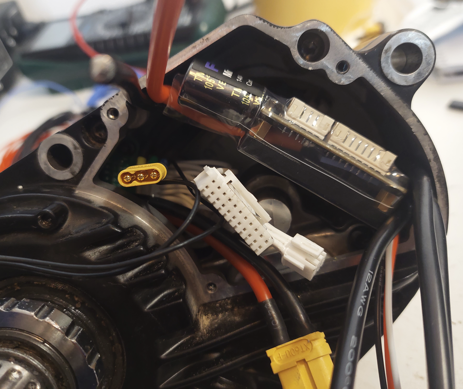

My Ebike has a Bafang M500 motor, on a carbon frame Dengfu E10.
Here are all the details for my build, in the hope it will help you in your build. [If you have questions, please post on this forum](https://endless-sphere.com/forums/viewtopic.php?f=28&t=100777&start=1650).

There was a logic sequence for the build:
1. Connect the VESC to the motor, make the motor rotate and configure the VESC
2. Build the EBike board, connect to the VESC and to the torque sensor and other sensors
3. Build the display and connect to the EBike board
4. Do the final installation on the EBike

# VESC Motor controller

The VESC motor controller I use is the [FLIPSKY Mini FSESC6.7](https://flipsky.net/products/flipsky-mini-fsesc6-7-pro-70a-base-on-vesc6-6-with-aluminum-anodized-heat-sink). It can handle a continuous current of 70A, while I am looking to use only 12A. Also it supports a 48V battery.

And the most important, it is small enough to fit inside the Bafang M500:

I started to connect this VESC to the motor 3 phase wires. Then I connected my 48V EBike battery to the VESC. Finally I connected the VESC to my PC using a USB cable.

On the VESC tool software, I did the motor auto detection, the first motor run and the final configurations -- see [this page with all details about the **VESC configurations**](VESC_configurations/VESC_configurations.md).

# EBike board

# Display

# Final installation

# Power management

Smart BMS on/off switch.