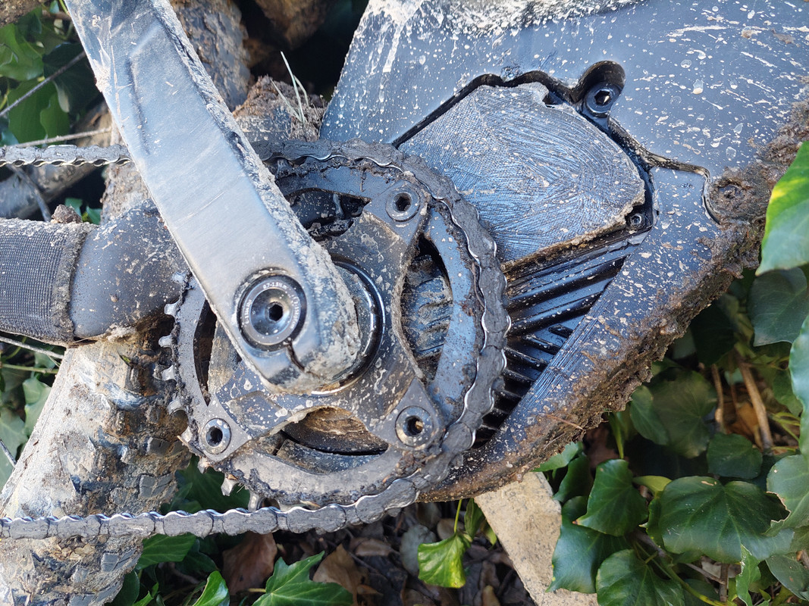
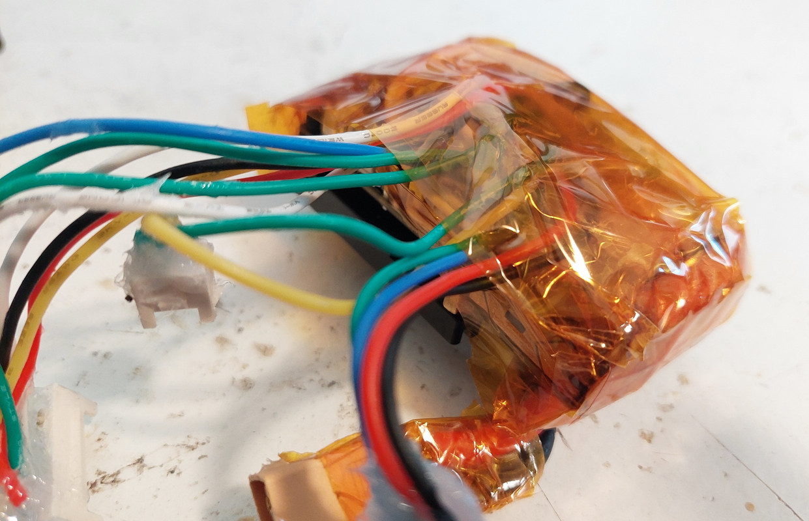
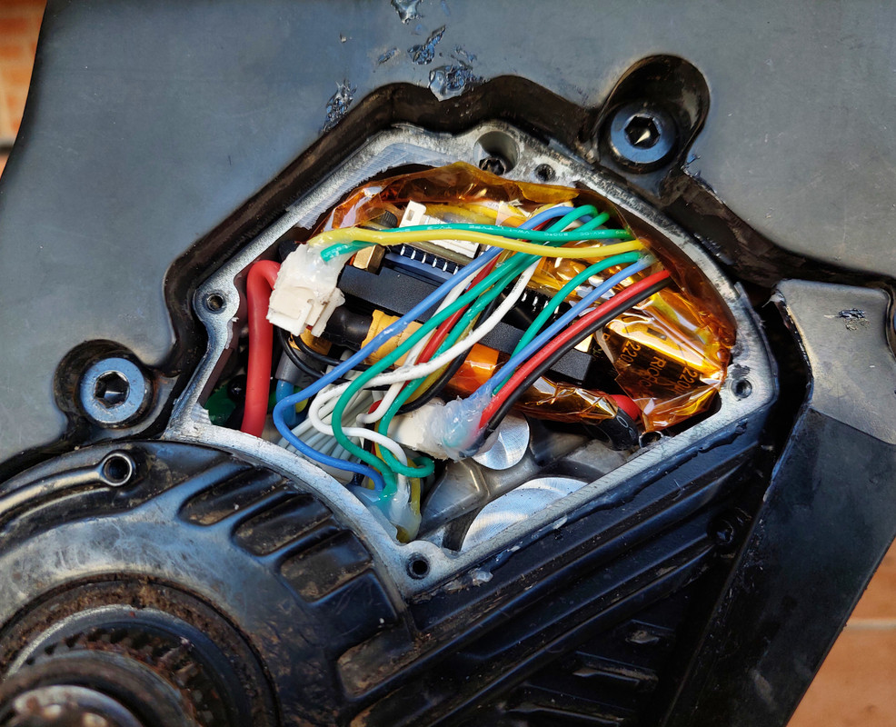
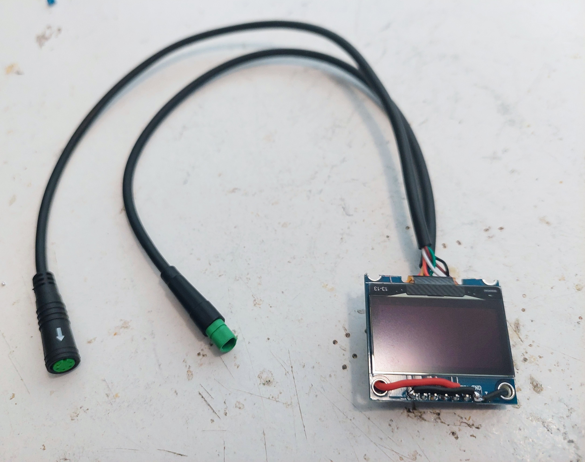
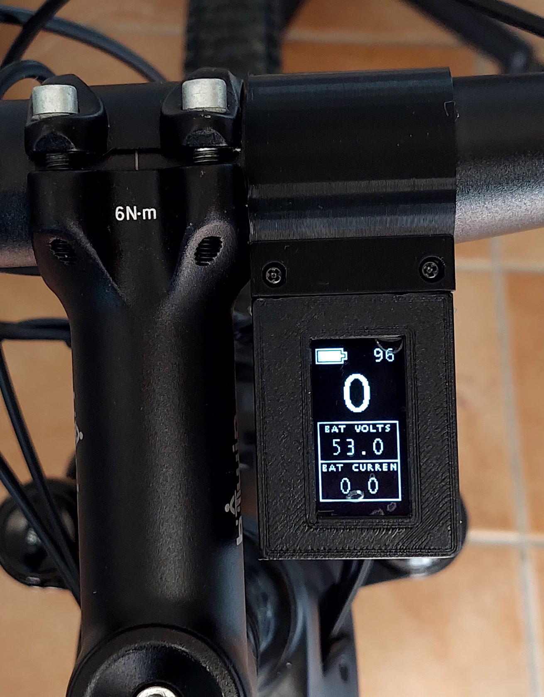
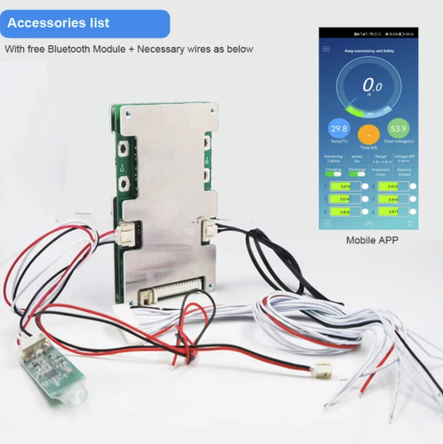

My Ebike has a carbon frame Dengfu E10, with a Bafang M500 motor (as seen on the pictures above).

Here are all the details for my build, in the hope it will help you in your build. [If you have questions, please post on this forum](https://endless-sphere.com/forums/viewtopic.php?f=28&t=100777&start=1650).

This is the logic sequence I did for the build:
1. Connect the VESC to the motor, make the motor rotate and configure the VESC
2. Build the EBike board, connect to the VESC and to the torque sensor and other sensors
3. Build the display and connect to the EBike board
4. Do the final installation on the EBike

# VESC Motor controller

The main task of VESC Motor controller is to drive the motor, make it rotate with motor current / torque, specified by the EBike board software.

The VESC motor controller I use is the [FLIPSKY Mini FSESC6.7](https://flipsky.net/products/flipsky-mini-fsesc6-7-pro-70a-base-on-vesc6-6-with-aluminum-anodized-heat-sink). It can handle a continuous current of 70A, while I am looking to use only 12A. Also it supports a battery from 14V up to 48V, and I am using a 48V one.

And the most important, it is small enough to fit inside the Bafang M500:

I started to connect this VESC to the motor 3 phase wires. Then I connected my 48V EBike battery to the VESC. Finally I connected the VESC to my PC using a USB cable.

On the VESC tool software, I did the motor auto detection, the first motor run and the final configurations -- see all the details on the [**VESC configurations**](VESC_configurations/VESC_configurations.md) page.

Note that you can buy on Aliexpress the battery connector XT60 and the motor 3 phase connector MR30.

# EBike board

The DIY EBike board task is to run the [EBike software application (OpenSource, download here)](https://github.com/OpenSourceEBike/EBike_EScooter_modular_DIY/tree/main/diy_main_board/firmware). This software is high level Pyhton (easy and fast to develop) and we can edit/program the Pyhton software text files wirelessly, using our phone or computer.

The EBike application reads the input sensors as the throttle, maps the throttle value to a motor current (motor torque), and finally send this value to VESC motor controller, that will make the motor rotate with this specific current / torque.
It also sends and receives data to the display.

See all the details on the [**Build EBike board**](build_EBike_board/build_EBike_board.md) page.

# Display

The DIY display main tasks are showing information to user, like what is the battery state of charge, what motor power is being used, and also let user select the motor assist level.

See all the details on the [**Build DIY display**](build_display/build_display.md) page.

# Final installation

The final instalation were done only when I had tested almost all the system. For instance, when building the EBike/EScooter board, I tested the sensorone by one at a time, so when I did the final installation I was sure they were working.

I had a great care, by using a multimeter to tripple check every wire connection and voltages.

## ON/OFF switch

I am using a battery that has a JDB BMS. This BMS is very good because it has a on/off switch feature.<break>

My EBike frame Dengfu E10 has a specific switch to turn on/off the EBike, as also a specific BIG connector to the battery (battery is removable), that also includes the 2 pins for the on/off switch. I then connected this switch pins to the JDB BMS on/off pins. So, I can turn on/off all the EBike electronics using the button on the frame, that will make the battery BMS turn on/off the battery power.

One extra note: this JDB BMS has Bluetooth and a mobile app, where we can also turn on/off the battery power, a historic graph of each cell voltage, battery current, etc. It is a very complete BMS that I strongly recomend.

