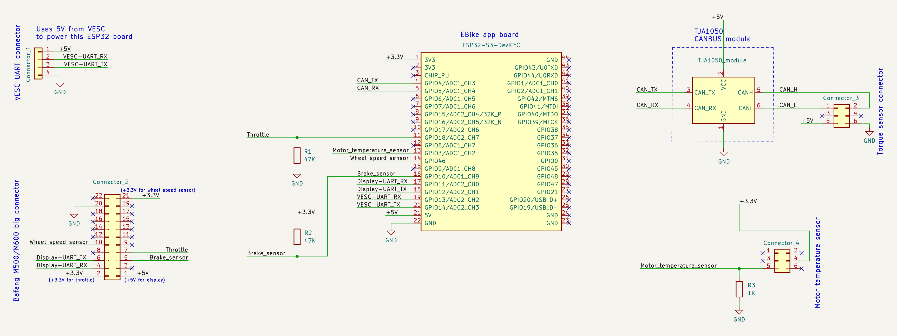
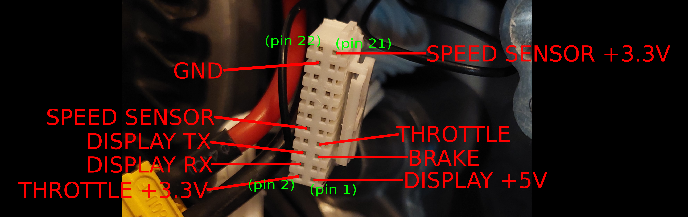
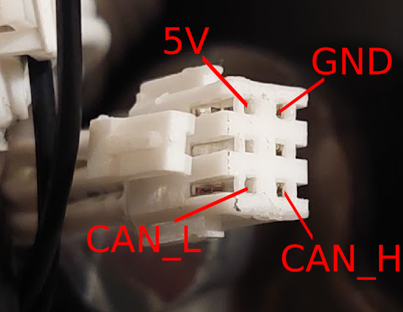
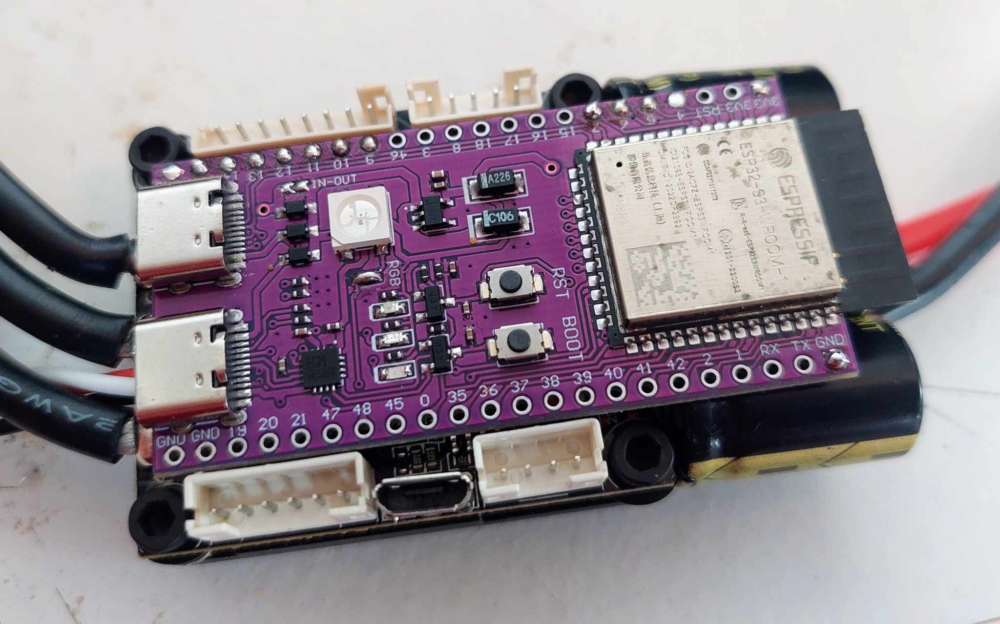
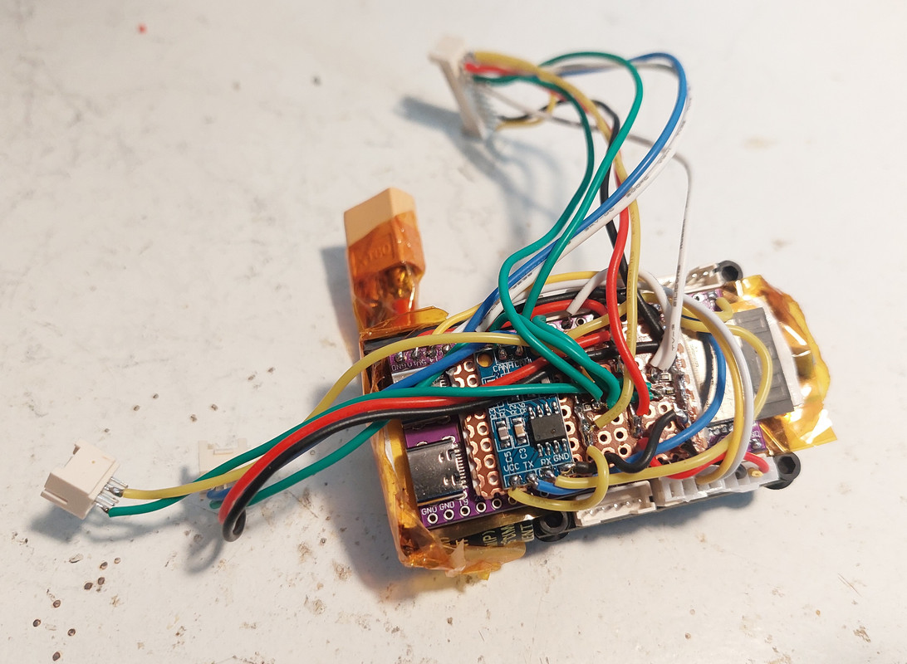

# DIY EBike board

The DIY EBike board task is to run the EBike software application. This software is high level Pyhton (easy and fast to develop) and is programmed by Wifi wireless from a phone or a PC.

The EBike application reads the input sensors as the throttle, maps the throttle value to a motor current (motor torque), and finally send this value to VESC motor controller, that will make the motor rotate with this specific current / torque.
It also sends and receives data to the display.

There are 4 sensors on Bafang M500:
* **Torque sensor:** has a CANBUS connection and outputs the pedal torque and pedal cadence values.
* **Throttle:** is a simple analog signal between 0 and 3.3V that represents the throttle position.
* **Brake:** is a simple digital signal between 0 and 3.3V, that stays at 3.3V while the brakes are not pressed.
* **Motor temperature:** is a simple analog signal between 0 and 3.3V that represents the motor temperature.

The communication between the EBike board and VESC is digital UART.

The communication between the EBike board and display is also digital UART.

This is the EBike board schematic, that is very easy to build due to easy to solder boards and connectors:

The main component is the ESP32-S3-DevKitC-1 N8R2 board. This is the microcontroller board, that runs the high level Pyhton software, has Wifi and Bluetooth.

The connection to VESC is by the 4 wires: 2 wires for UART TX and UART RX that provides the comunication. The other 2 wires and GND and +5V, as the power to the EBike board comes from the VESC.

The throttle wire needs to have a 47K resistor connected to ground. This is a must for the case the throttle disconnects by accident, and this resistor will force the throttle signal to be zero.

The only other board is the TJA1050 (you can buy in Aliexpress), is small and is a CANBUS module. This board is needed to make the ESP32-S3 board being able to communicate with the Bafang M500 torque sensor.
The torque sensor needs also to be powered from 5V.

The brake signal needs to have a 47K resistor connected to +3.3V otherwise it will not work.

The temperature sensor signal needs to have a 1K resistor connected to GND.

You can buy all the boards, components, connectors and even wires, on Aliexpress.
Note that the connectors are:
* big connector with various signals: PHB connector 2.0mm 2x11P
* torque sensor connector: PHB connector 2.0mm 2x3P
* motor temperature sensor connector: PHB connector 2.0mm 2x3P

Here are the connectors pins:

The 2x11P connector:

The 2x3P connector for motor temperature sensor:

## Pictures with details

Here you can see the purple ESP32-S3-DevKitC-1 N8R2 board. Bellow is the VESC motor controller.

I used kapton tape, that is a yellow, strong plastic tape that can withstand high temperatures, under the ESP32 board, to isolate it from the VESC board.

Basically, the ESP32 board is just the righ size to be placed on top of that VESC and even keep free the VESC connectors.

And here the EBike board fully built. That small blue board is the TJA1050 CANBUS module.
I used a little of a perforated board to hold the TJA1050 board and solder some wires there, like the GND, +5V and 3.3V. Also the resistors, I used a SMD 0805 resistors, that are small but not to much.

I used double face tape to fix the boards between them. And I also use Kapton tape a lot for isolation.

That wires are kind of big, but at least they are resistant but also soft, as the exterior seems to be silicone. I bought them on Aliexpress.

And there is only one connector to connect to the VESC (bottom right side on the picture). That connector came with the VESC and as you can see, I am using the black and red wires for GND and +5V. The yellow and white wires for UART TX and UART RX.

