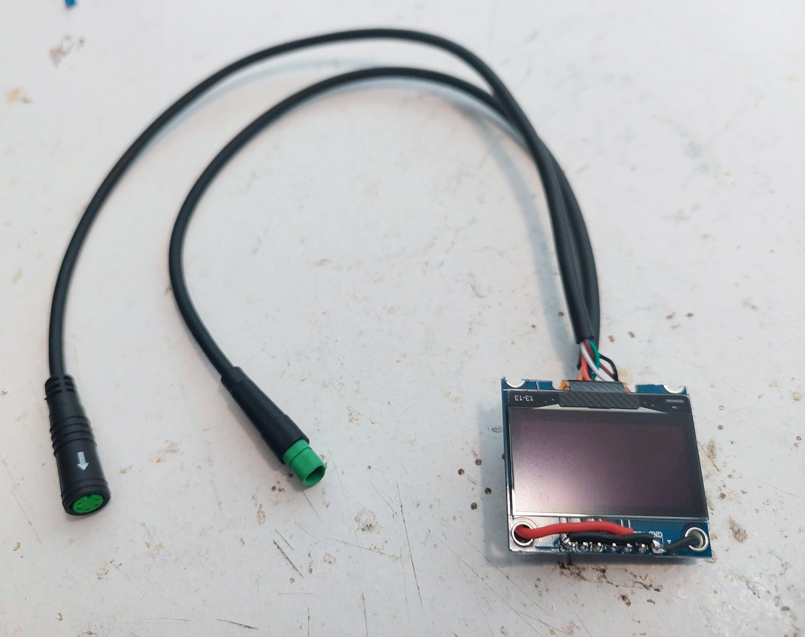

# How to build the display

The following components can be bought in Aliexpress.

## Componentes
You will need the following components:
* **ESP32-S2 Mini Lolin:** 
 
* **OLED display SPI 128x64 pixels 1.3 inches:** 
(I2C display version will not work): 
 
* **3 buttons remote:** 
The 3 buttons is from the EBike 850C display, that can be bought as a spare part - search on Aliexpress for "850c extension". 
 
* **Bafang M500/M510/M600 display extension cable:** 
([HIGO-B5 connector](https://www.aliexpress.com/item/1005003656557018.html)) 
 
* **Four screws M2x12**: 
Buy them in black color if you plan to 3D print the enclose in black color. 
 
* **Silicone**: The silicone will be used to seal the enclosure and make it water prof. There are silicone that is fast to cure like in two hours but this can not work very well, like not gluing well to the 3D printed plastic PLA. There are small tubes of silicone at shops, that you can use just a few pieces at a time. 
  

## Step by step instructions

1 - **3D print the enclosure**:

[ ](enclosure_3d.png)
3D files for 3D printing:
* [base.amf](base.amf) (purple in the picture) - source file for FreeCAD: [base.FCStd](base.FCStd) 
* [cover.amf](cover.amf) (blue in the picture) - source file for FreeCAD: [cover.FCStd](cover.FCStd)
* [clamp.amf](clamp.amf) (orange in the picture) - source file for FreeCAD: [clamp.FCStd](clamp.FCStd)

2 - **Build the display**

Schematic: 
[ ](schematic.png)

The ESP32-S2 is the microcontroller that runs the high level Python software and has Wifi. It can be programmed by wireless Wifi.
This ESP32-S2 communicates with the OLED display using SPI lines. It also reads the remote buttons state. 

Solder the display to the ESP32-S2 board. 
You will see that you can insert directly the display pins SPI_CLK, SPI_MOSI, RESET and DATA_COMMAND - this will simplify a lot. But you also need to cut the +5V and GND pins. You can uses wires for this pins.

Here is the final result, with all wires soldered: 
[ ](display-3.jpg)

Here showing the cables with the connectors. One is to connect to the original Bafang M500 cable and the other to connect to the 3 buttons remote keypad: 
[ ](display-2.jpg)

[ ](display-1.jpg)

And here is the display already inserted on the 3D printed enclosure. 
NOTE that you will need to cut one side of the display so it can be inserted on the 3D printed enclosure: 
[ ](display-4.jpg)

Now it is time to put everything inside the 3D printed enclosure. The big hole at back is enough for the two cables to be inserted. Here an example, and after using transparent silione to keep the cables in place and avoid water entrance:

[ ](display-5.jpg)

On the top, to protect the OLED display and avoid watter entrance, you can put large glue tape as seen on the picture. There are enough clearance on the cover 3D printed part to accomodate this tape:

[ ](build-2.png)

Use the M2x12 screws to tight the cover as also to clamp to the handlebar.

Example of the final result:

(On this picture, not glue tape were yet applied on to of the OELD display)
[ ](08.png)

[ ](02.png)
