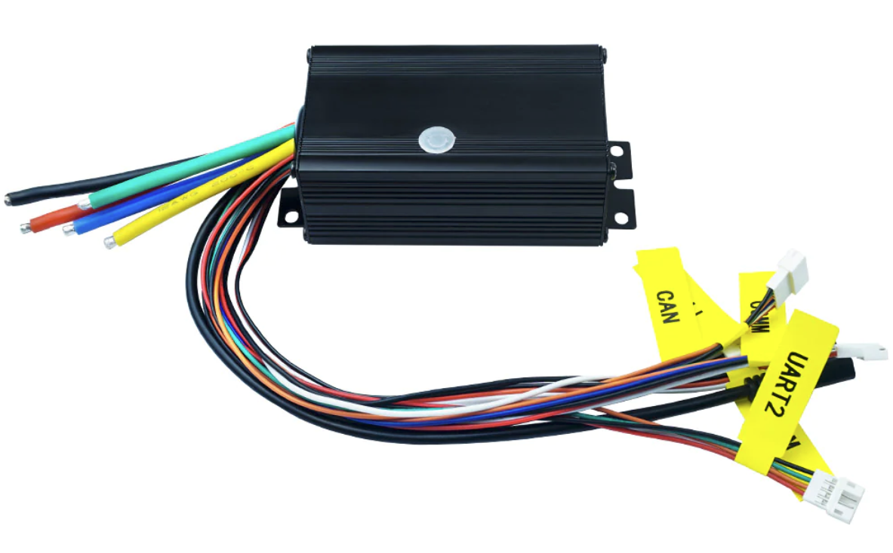
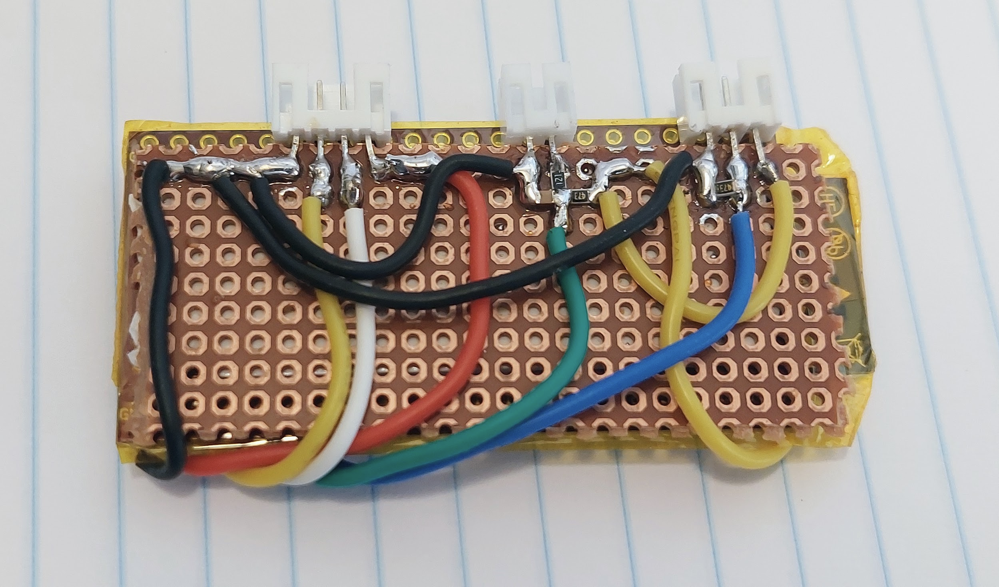
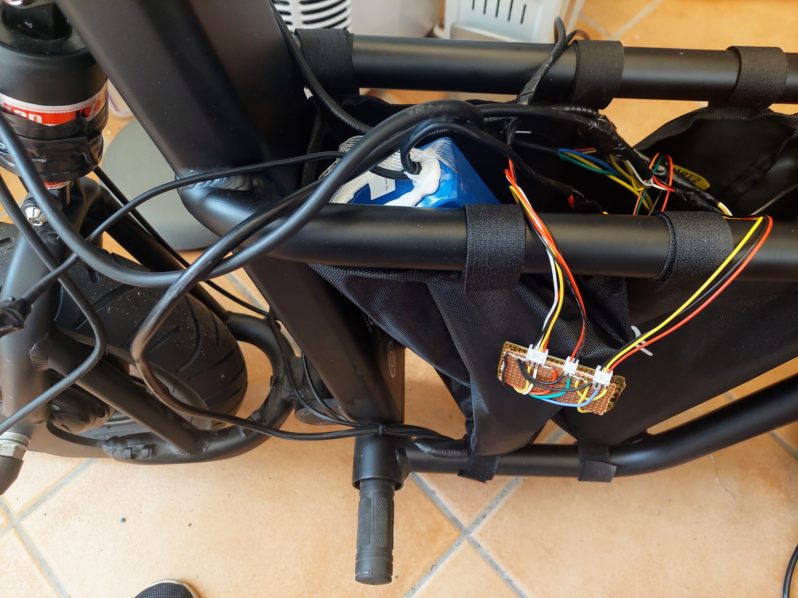

I did this build with my Fiido Q1S.

As a complement, see my **[Build with Bafang M500 mid drive motor](../build_EBike_Bafang_M500/build_EBike_Bafang_M500.md)** that has a more detailed notes.

I bought all the components on Aliexpress (VESC motor controller, ESP32 board, connectors, wires, etc).

This is the logic sequence I did for the build:
1. Connect the VESC to the motor, make the motor rotate and configure the VESC.
2. Build the EScooter board, connect to the VESC, to the Fiido Q1S brake sensors cables and throttle cable.
3. Do the final installation, protect the various cables and protect the connections to make sure they do not get loose or break.

# VESC Motor controller

The main task of VESC Motor controller is to drive the motor, make it rotate with motor current / torque, specified by the EBike board software.

The VESC motor controller I use is the [FLIPSKY 75100](https://flipsky.net/products/flipsky-75100-foc-75v-100a-single-esc-base-on-vesc-for-electric-skateboard-scooter-ebike-speed-controller).

It is a cheap and small VESC.

I started to connect this VESC to the motor 3 phase wires. Then I connected to the Fiido Q1S battery. Finally I connected the VESC to my PC using a USB cable (later I installed the VESC Bluetooth module on UART2 port and so the USB connection is not needed anymore).

On the VESC tool software, I did the motor auto detection, the first motor run and the final configurations.

# EScooter board

The DIY EScooter board task is to run the [EScooter software application (OpenSource, download here)](https://github.com/OpenSourceEBike/EBike_EScooter_modular_DIY/tree/main/diy_main_board/firmware). This software is high level Pyhton (easy and fast to develop) and we can edit/program the Pyhton software text files wirelessly, using our phone or computer.

The EScooter application reads the throttle, maps the throttle value to a motor current, and finally send this value to VESC motor controller, that will make the motor rotate with this specific current / torque.

See all the details on the [**Build EScooter board**](build_EScooter_board/build_EScooter_board.md) page.

# Final installation

The final instalation were done only when I had tested almost all the system. For instance, when building the EBike/EScooter board, I tested the sensors one at a time, so when I did the final installation I was sure they were working.

I had a great care, by using a multimeter to tripple check every wire connection and voltages.

Showing the EScooter board connected to the VESC, brakes and throttle: 

In the end I put tape on all the connectors and cables to make sure they do not get disconnected or brake.

## ON/OFF switch

The quickest and cheap way I found, was to use a ["loop key"](https://forum.esk8.news/t/how-to-make-a-xt90-loop-key/17664).

I bought the a pair of XT90 Amass connector that is anti-spark (this is a must!!) and then I connect the battery negative in series with this connector. So, everytime I want to ride my Fiido Q1S, I will connect the "loop key" and I remove the "loop key" when I finish my ride.

There are other solutions, like a dedicated Anti-spart ON/OFF switch, that could be controlled by the ESCooter board.
