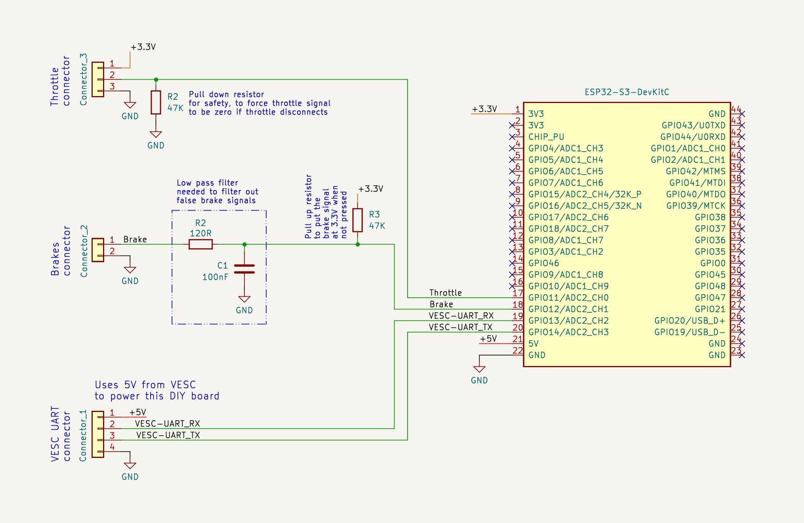
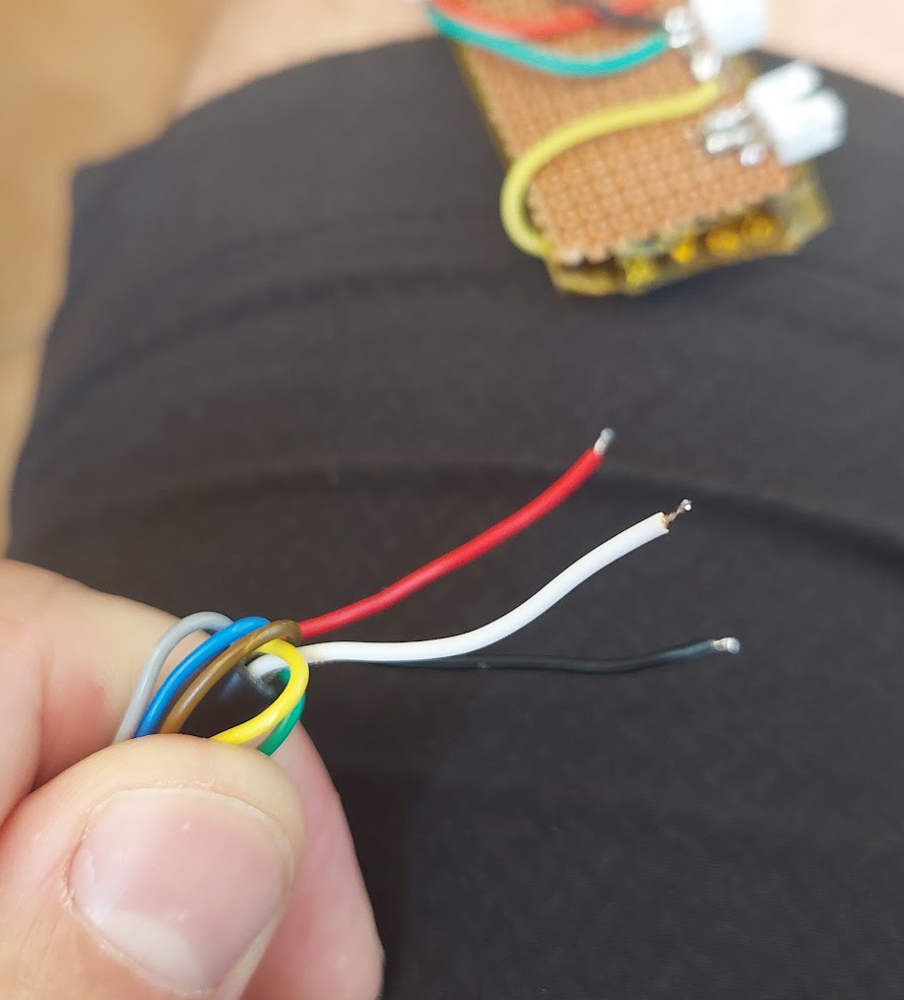

# DIY EScooter board

The DIY EScooter board task is to run the EScooter software application. This software is high level Pyhton (easy and fast to develop) and we can edit/program the Pyhton software text files wirelessly, using our phone or computer.

The EScooter application reads the throttle, maps the throttle value to a motor current, and finally send this value to VESC motor controller, that will make the motor rotate with this current / torque. I also reads the brake signal, and it is active, will set the motor current to zero, disabling the motor.

This is the EScooter board schematic, that is very easy to build due to easy to solder boards and connectors: 

The main component is the ESP32-S3-DevKitC-1 N8R2 board. This is the microcontroller board, that runs the high level Pyhton software, has Wifi and Bluetooth.

The digital communication between the EScooter board and VESC is digital UART.

The connection to VESC is by the 4 wires: 2 wires for UART TX and UART RX that provides the comunication. The other 2 wires and GND and +5V, as the power to the EScooter board comes from the VESC.

**Brake:** brake value is a digital signal: logic 1 (3.3V) if brakes are not pressed and logic 0 (0V) otherwise (as long you use that 47K pull up resistor connected to 3.3V)

**Throttle:** throttle value is an analog signal between 0 and 3.3 volts (as long you connect the throttle red wire to 3.3V)

Throttle wires: black is to be connected to GND; red to the +3.3V and white is the throttle signal:

You can buy all the boards, components, connectors and even wires, on Aliexpress.

## Pictures with details

First I isolated the ESP32-S3-DevKitC-1 N8R2 board with yellow kapton tape. Then I glued with the perforated board with a double sided tape, to the back of the ESP32 board.

I put all the connector in one side of the board. I used SMD resistors and capacitor (0805 size) but through hole components can also be used.
s
I used flexible wires: 

