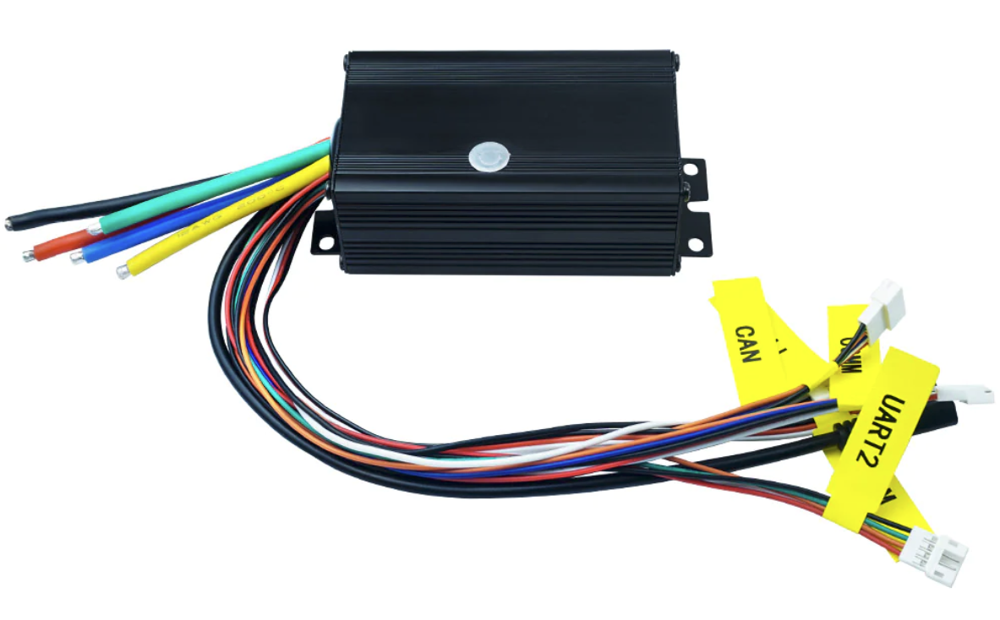
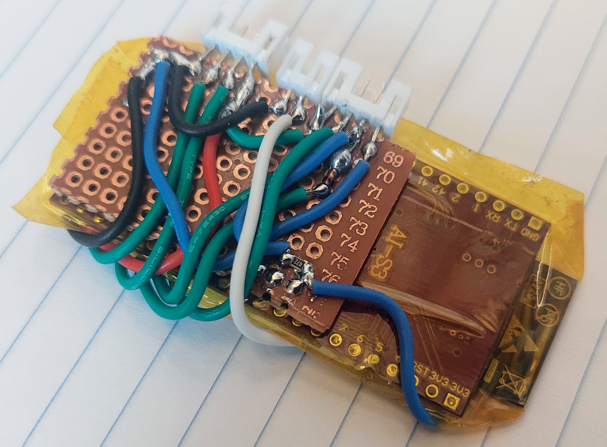
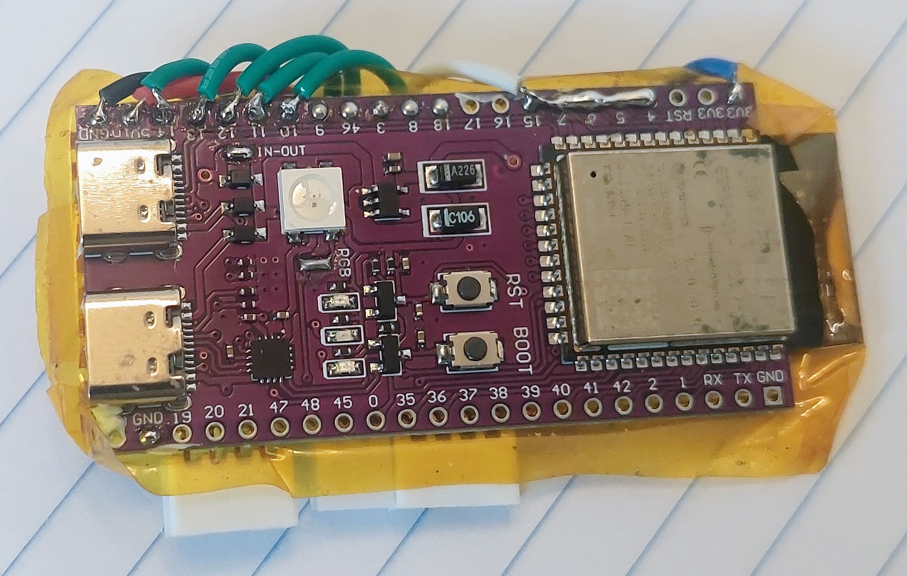
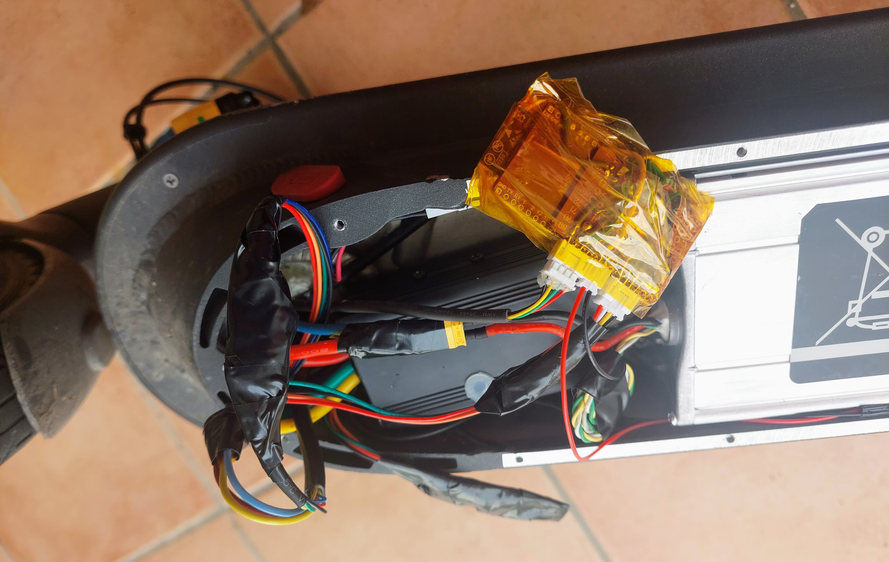

I did build on my Xiaomi M365 Pro 2.

As a complement, see my **[Build with Bafang M500 mid drive motor](build_EBike_Bafang_M500/build_EBike_Bafang_M500.md)** that has a more detailed notes.

I bought all the components on Aliexpress (VESC motor controller, ESP32 board, connectors, wires, etc).

This is the logic sequence I did for the build:
1. Connect the VESC to the motor, make the motor rotate and configure the VESC.
2. Build the EScooter board, connect to the VESC, to the Xaomi M365 dash board and eral lights.
3. Do the final installation, protect the various cables and protect the connections to make sure they do not get loose.

# VESC Motor controller

The main task of VESC Motor controller is to drive the motor, make it rotate with motor current / torque, specified by the EBike board software.

The VESC motor controller I use is the [FLIPSKY 75100](https://flipsky.net/products/flipsky-75100-foc-75v-100a-single-esc-base-on-vesc-for-electric-skateboard-scooter-ebike-speed-controller).

It is a cheap VESC and fit well inside the Xiaomi M365.

I started to connect this VESC to the motor 3 phase wires. Then I connected to the Xiaomi M365 battery. Finally I connected the VESC to my PC using a USB cable (later I installed the VESC Bluetooth module on UART2 port and so the USB connection is not needed anymore).

On the VESC tool software, I did the motor auto detection, the first motor run and the final configurations -- see all the details on the [**VESC configurations**](VESC_configurations/VESC_configurations.md) page.

# EScooter board

The DIY EScooter board task is to run the EScooter software application. This software is high level Pyhton (easy and fast to develop) and we can edit/program the Pyhton software text files wirelessly, using our phone or computer.

The EScooter application reads the throttle, maps the throttle value to a motor speed, and finally send this value to VESC motor controller, that will make the motor rotate with this specific speed.
It also sends and receives data to the display: receives the brake sensor position and on/off button state. Sends various data as the speed, front light state, etc.
Also controls the rear light state.

See all the details on the [**Build EBike board**](build_EBike_board/build_EBike_board.md) page.

# Final installation

The final instalation were done only when I had tested almost all the system. For instance, when building the EBike/EScooter board, I tested the sensors one at a time, so when I did the final installation I was sure they were working.

I had a great care, by using a multimeter to tripple check every wire connection and voltages.

Showing everything connected - the EScooter board is protected with yellow kapton tape: 

Everything in final place. 

In the end I put tape on all the connectors and cables to make sure they do not get disconnected or brake. I also added some foam for extra protection.

## ON/OFF switch

I am using a battery that has a JDB BMS. This BMS is very good because it has a on/off switch feature.<break>

My EBike frame Dengfu E10 has a specific switch to turn on/off the EBike, as also a specific BIG connector to the battery (battery is removable), that also includes the 2 pins for the on/off switch. I then connected this switch pins to the JDB BMS on/off pins. So, I can turn on/off all the EBike electronics using the button on the frame, that will make the battery BMS turn on/off the battery power.

One extra note: this JDB BMS has Bluetooth and a mobile app, where we can also turn on/off the battery power, a historic graph of each cell voltage, battery current, etc. It is a very complete BMS that I strongly recomend.

