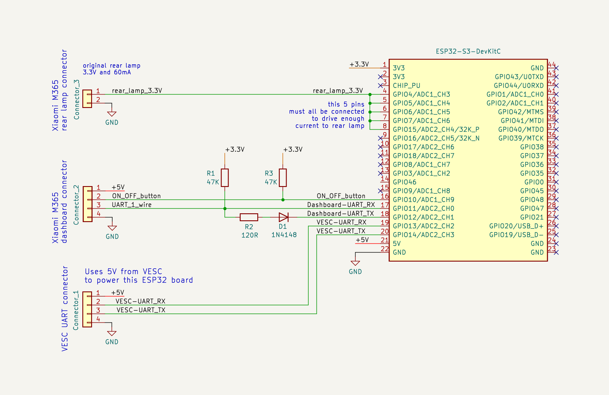
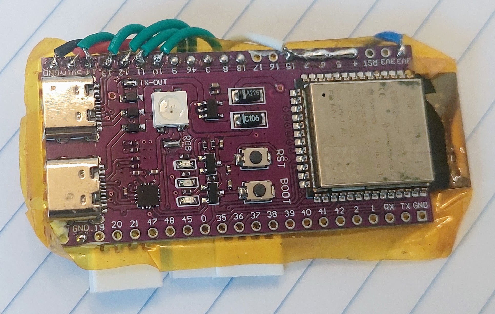

# DIY EScooter board

The DIY EScooter board task is to run the EScooter software application. This software is high level Pyhton (easy and fast to develop) and we can edit/program the Pyhton software text files wirelessly, using our phone or computer.

The EScooter application reads the throttle, maps the throttle value to a motor speed, and finally send this value to VESC motor controller, that will make the motor rotate with this specific speed.
It also sends and receives data to the display: receives the brake sensor position and on/off button state. Sends various data as the speed, front light state, etc.
Also controls the rear light state.

There are 2 outputs on Xiaomi M365 Pro 2 to be controlled:
* **Dashboard:** dashboard enables/disables the front light, show data on the display like the speed, etc.
* **Rear light:** a voltage of 3.3V turns the rear light on (it uses about 60mA at 3.3v).

There are 3 inputs on Xiaomi M365 Pro 2 to be readed:
* **Throttle:** throttle value is a digital signal sent by the Dashboard.
* **Brake:** brake value is a digital signal sent by the Dashboard.
* **ON/OFF button:** ON/OFF button is on the dashboard and is simple digital signal between 0 and 3.3V.

The digital communication between the EScooter board and the Dashboard is digital UART but 1 wire communication.

The digital communication between the EScooter board and VESC is digital UART.

This is the EScooter board schematic, that is very easy to build due to easy to solder boards and connectors: 

The main component is the ESP32-S3-DevKitC-1 N8R2 board. This is the microcontroller board, that runs the high level Pyhton software, has Wifi and Bluetooth.

The connection to VESC is by the 4 wires: 2 wires for UART TX and UART RX that provides the comunication. The other 2 wires and GND and +5V, as the power to the EScooter board comes from the VESC.

The connection to Dashboard is by the 4 wires:
* 1 wire for UART TX and UART RX (1 wire communication) that provides the comunication. That resistors and diode provides a way for the 1 wire UARt communications.
* 1 wire for the Dashboard ON/OFF button state.
* 2 wires: GND and +5V, as the power to the EScooter board comes from the VESC.

The rear lamp signal need to be connected to that 5 pins of the ESP32, so it can drive enought current to enable the lamp.

You can buy all the boards, components, connectors and even wires, on Aliexpress.
Note that the connectors I used were PHB connector 2.0mm 2x11P and PHB connector 2.0mm 3x11P. 
The Dashboard connector is similar but not equal to this ones, but it works anyway. 
The connector for VESC and rear lamp, I simple did cut the original connectors and used this ones instead.

## Pictures with details

First I isolated the ESP32-S3-DevKitC-1 N8R2 board with yellow kapton tape. Then I glued with the perforated board with a double sided tape, to the back of the ESP32 board.

I put all the connector in onse side of the board. I used SMD resistors and diode (0805 size) but through hole components can also be used.

I used flexible wires: 

Top side view of the board, that is also the top side view of ESP32 board:

