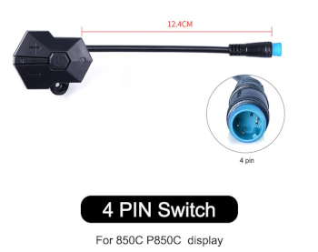

# How to build the display

NOTE that this display only works for Bafang M500/M510/M600 motors.

Some of the following components can be bought in online shops like Aliexpress, Ebay or at specialized electronics shops like [www.mouser.com](https://mouser.com/) or [www.farnell.com](https://www.farnell.com/).

## Componentes
You will need the following components:
* **OLED display SPI 128x64 pixels 1.3 inches or 0.96 inches (I2C display version will not work)**: costs 3€. You need to choose the bigger or the smaller version. It is recommended the bigger 1.3 inches version (the 3D printed enclosure is only available for this one). The smaller version makes impossible to see the numbers on display while riding, you need to stop to be able to read. 
 
* **nRF52840 Nordic USB Dongle**: costs 11€. 
 
* **CAN SPI module**: costs 4€. 
 
* **Step down 80V -> 5V power board [XP Power STH0548S05](https://export.rsdelivers.com/product/xp-power/sth0548s05/xp-power-surface-mount-dc-dc-switching-regulator/1883365)**: costs 11€. 
 
* **3 or 4 buttons remote**: costs 8€. The 3 buttons is from the EBike 850C display, that can be bought as a spare part - search on Aliexpress for "850c extension". The 4 buttons is from the EBike 860C display, that can be bought as a spare part but can be hard to find. 
If you want the ANT+ REMOTE functionalitty (Garmin Edge page change), you will need to use the 4 buttons remote, as this function happens when you press the button number 4. 
 
* **Bafang M500/M510/M600 display extension cable**: [costs 8€](https://www.aliexpress.com/item/1005003656557018.html) 
 
* **2x Diode 1N4148**: can be SMD 0805 size. Costs 0.1€, can be bought on EBay or other shops. 
* **Resistor 470 ohms**: can be SMD 0805 size. Costs 0.1€, can be bought on EBay or other shops. 
* **Resistor 1500 ohms**: can be SMD 0805 size. Costs 0.1€, can be bought on EBay or other shops. 
* **2x resistor 3300 ohms**: can be SMD 0805 size. Costs 0.2€, can be bought on EBay or other shops. 
* **Perf board**: costs 1€. 
 
* **Four screws M2x12**: costs 1€. Buy them in black color if you plan to 3D print the enclose in black color. 
 
* **Silicone**: costs 4€, can be bought on EBay or other shops. The silicone will be used to seal the enclosure and make it water prof. There are silicone that is fast to cure like in two hours but this can not work very well, like not gluing well to the 3D printed plastic PLA. There are small tubes of silicone at shops, that you can use just a few pieces at a time. 
  

## Tools
You will need at least the following tools:
* **Multimeter**: to check the wires connections, voltages and components.
* **Power supply**: to power the display for testing during the build, where you limit the current to a minimum to avoid burning some component in the case you soldered something wrong. If you do not have one yet, you can buy a cheap digital lab power supply of adjustable voltage up to 30V and adjustbale current up to 10A, on Aliexpress for about 50€.

## Step by step instructions

1 - **Flash bootloader and firmware on the nrf52840 board** - see the page: 
1.1 - [How to Flash the Wireless Bootloader on a Nordic Dongle](bootloader.md) 
1.2 - [How to update the firmware](dfu.md) 

In the steps 1.1 and 1.2 you flash the bootloader and then update the firmware, if all goes as expected, then the NRF52840 board is working.

2 - **3D print the enclosure**:

3D files for 3D printing (1.3 inches OLED display only):
* [base.amf](3D_print_enclosure/Bafang_M500_M600/base.amf) (purple in the picture)
* [cover.amf](3D_print_enclosure/Bafang_M500_M600/cover.amf) (blue in the picture)
* [clamp.amf](3D_print_enclosure/Bafang_M500_M600/clamp.amf) (orange in the picture).

1 - **Build your board**

1.1 - Understand the circuit, see the schematic: 

### Schematic explanation

* the DC-DC converts the high battery voltage to output 5 volts, which will then be the input for the NRF52840 board as also to the OLED display.

* the NRF52840 board communicates with the OLED display using SPI connection.

* the NRF52840 board communicates with the CAN module using SPI connection. This CAN module sends and receive data from the Bafang motors.

* the NRF52840 board reads the 3 buttons state from the keypad. In the case you are using 4 buttons keypad, connect the button number 4 to the pin P0.17 of the NRF52840 board.

NRF52840 board pinout:

