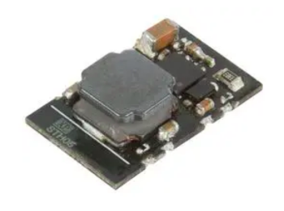
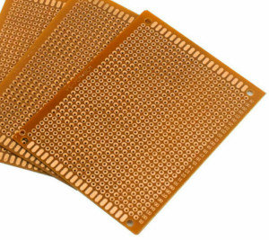

# How to build the display

NOTE that this display only works for Bafang M500/M600 motors.

Some of the following components can bought on online shops like Aliexpress, Ebay or at specialized electronics shops like [www.mouser.com](https://mouser.com/) or [www.farnell.com](https://www.farnell.com/).

You will need the following components:
* **OLED display SPI 128x64 pixels 1.3 inches or 0.96 inches (I2C display version will not work)**: costs 3€. You need to choose the smaller or the bigger version. It is recommended the bigger 1.3 inches version. The smaller version makes impossible to see the numbers on display while riding, you need to stop to be able to read. 
 
* **nRF52840 Nordic USB Dongle**: costs 11€. 
 
* **Step down 80V -> 5V power board [XP Power STH0548S05](https://export.rsdelivers.com/product/xp-power/sth0548s05/xp-power-surface-mount-dc-dc-switching-regulator/1883365)**: costs 11€. 
 
* **Diode 1N4148**: costs 0.1€, can be bought on EBay or other shops. 
* **Resistor 470 ohms**: costs 0.1€, can be bought on EBay or other shops. 
* **Resistor 3300 ohms**: costs 0.1€, can be bought on EBay or other shops. 
* **Perf board**: costs 1€. 
 
* **Bafang  display extension cable**: [costs 8€](https://www.aliexpress.com/item/1005003656557018.html) 

## Step by step instructions

1 - **Build your board**

1.1 - Understand the circuit, see the schematic: 

### Schematic explanation

* the DC-DC converts the high battery voltage to output 5 volts, which will then be the input for the NRF52840 board as also to OLED display.

* the NRF52840 board communicates with the OLED display using SPI connection.

* the NRF52840 board reads the 3 buttons state from the keypad.

* the NRF52840 board communicates with CAN module.

NRF52840 board pinout:

