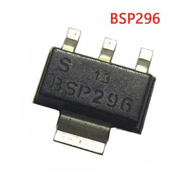
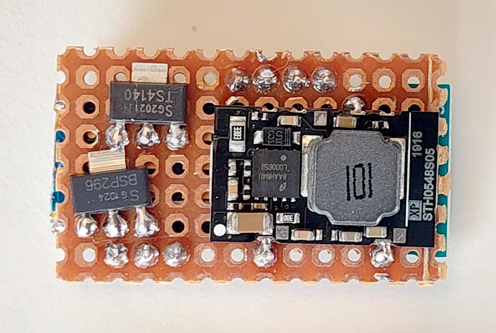

# How to build the display

Some of the following components can bought on online shops like Aliexpress, Ebay or at specialized electronics shops like [www.mouser.com](https://mouser.com/) or [www.farnell.com](https://www.farnell.com/).

You will need the following components:
* **OLED display I2C 128x64 pixels 1.3 inches or 0.96 inches**: costs 3€. You need to choose the smaller or the bigger version. It is recommended the bigger 1.3 inches version. The smaller version makes impossible to see the numbers on display while riding, you need to stop to be able to read. 
It must be the I2C version, that has 4 pins only. There are SPI version which uses more than 4 pins. 
 
* **nRF52840 Nordic USB Dongle**: costs 11€. 
 
* **Step down 80V -> 5V power board [XP Power STH0548S05](https://export.rsdelivers.com/product/xp-power/sth0548s05/xp-power-surface-mount-dc-dc-switching-regulator/1883365)**: costs 11€.
 
* **Power switch BTS4140N**: costs 2€. 
 
* **Transistor BSP296 or BSS123**: costs 2€. 
 
* **3 buttons remote**: costs 8€. This remote is from the EBike 850C display, that can be bought as a spare part - search on Aliexpress for "850c extension". 
 
* **Perf board**: costs 1€. 
 
* **TSDZ2 display extension cable**: costs 6€. This extension will work for TSDZ2 with 6 pin display connector - if you have the 8 pin instead, you need to figure out a way to do the extension. 
Buy two units in the case you damage one unit. 
 
* **Four screws M2x12**: costs 1€. Buy them in black color if you plan to 3D print the enclose in black color. 
 
* **Silicone**: costs 4€, can be bought on EBay or other shops. The silicone will be used to seal the enclosure and make it water prof. There are silicone that is fast to cure like in two hours but this can not work very well, like not gluing well to the 3D printed plastic PLA. There are small tubes of silicone at shops, that you can use just a few pieces at a time. 
  

## Step by step instructions

1 - **Flash bootloader on the nrf52840 board** - see the page: [How to Flash the Wireless Bootloader on a Nordic Dongle](bootloader.md). 
In this step you flash the bootloader firmware on your nrf52840 board and check to see if is working as expected - if you can flash, then the board is working.

2 - **3D print the enclosure**:
* 1.3 inches OLED display: [display_base.amf](3D_print_enclosure/OLED_1.3_display/display_base.amf)
  and [display_cover.amf](3D_print_enclosure/OLED_1.3_display/display_cover.amf)
* 0.96 inches OLED display: [display_base.amf](3D_print_enclosure/OLED_0.96_display/display_base.amf)
  and [display_cover.amf](3D_print_enclosure/OLED_0.96_display/display_cover.amf)

3D printed enclosures, version for the OLED display 1.3 inches at left and 0.96 inches at right: 

3 - **Build your board**

3.1 - Understand the circuit, see the schematic:

### Schematic explanation

* the DC-DC converts the high battery voltage to output 5 volts, which will then be the input for the NRF52840 board.

* the NRF52840 has a regulator that will convert the 5 volts to 3.3 volts out the VDD OUT pin, which will power the OLED display.

* the NRF52840 board communicates with the OLED display using I2C connection: SDA and SCL lines.

* the NRF52840 board reads directly 3 buttons state from the keypad.

* the NRF52840 board controls as ON or OFF state the switch BSP296, which in turn will control the BTS4140N and will then disable or enable the battery voltage to the motor controller - this will effectively turn ON or OFF the TSDZ2 motor controller.

* the NRF52840 board communicates directly with the TSDZ2 motor controller using the UART TX and RX lines.

* the brake signal (wire multiple brake sensors in parallel) goes directly from the brake sensor input of the TSDZ2 motor controller.

NRF52840 board pinout:

3.2 - Cut your nRF52840 board with a metal saw by hand so this way it will be smaller. Check it is ok on the enclosure, if not you can use a file tool to do the final adjustment - here a picture as example:

3.3 - Start soldering the components on a perfboard. Cut the perfboard in a way that is has almost the same area as the 3D printed box: 

NOTE: always triple check the connections you did as it is easy for you to do a mistake. For instance, exchanging battery voltage pin with GND pin will most probably result in a burned NRF52840 and/or the DC-DC board.

The NRF52840 board were soldered to the perfboard (but still missing some connections). 
The OLED display connections do not need that pins as they will be soldered on the inverse side directly to the pads of NRF52840 board: 

Here we can see the perford on the other side and some pins already soldered: 

Next step is to solder the DC-DC board. Only that three connections of DC-DC are used, the GND on one side and Vin and Vout on the other side - see next image. 
Then also solder the TSDZ2 wires of VBattery and GND (do not forget to put the connector through the hole on the 3D printed enclosure). Connect to TSDZ2 with battery ON and check with a multimeter the input of DC-DC as also the output and it should be 5 volts. Move to next step only if you have the 5 volts, if not, you probably did something wrong.

Next solder the 4 wires for the OLED display. Connect again to the TSDZ2 with battery ON and you should see the display working, showing some text like "OS Display". If the display is not working, check the voltage on the display pins, you need to have 3.3 volts between the VCC and GND pins. Move to next step only if the display is working.

Next you may want to unsolder the display to be easier for the next steps and solder it again as the last step.

Next solder the BTS4140 and BSP296 (or BSS123, which is smaller): 

Next I soldered most of the wires, including the ones of the cable to connect on the TSDZ2 display connector. On next picture, the wires for the keypad are missing. 
And I could use thinner wires, but I used the ones I had at hand: 

After have everything soldered, you can finally solder the display. Everything should work now and if TSDZ2 motor is working correctly, the motor should initialize correctly after seconds seconds and you should see the main screen:

Next you need to close and make the display water prof. For that I use a large transparent tape and put it on top of the display in a way it will also cover the laterals. Then I put silicone on the lateral and then the cover part/top part/frame of the enclosure, that will squezze the silicone and the tape against the enclosure wall and that way make it water prof:

You will then need to also put silicone to cover very well the cables hole on the enclosure -- the the white silicone on the next picture:

Next insert and tight the four screws and let the silicone cure for the next twelve or twenty four hours.

Congratulations, now you should have a nice display! 
You can fix  it to your handle bar using a rubber band (like the ones used by Garmin GPS mounts - you can buy them online).

Some pictures of my display:

