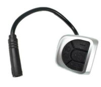
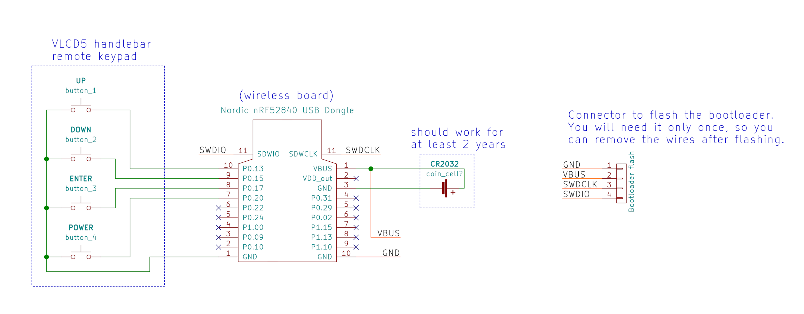

# How to build wireless remote

You will need the following components:
* **nRF52840 Nordic USB Dongle** 
  
* **VLCD5 Keypad (or other similar)**: costs 10€, this is the keypad from the TSDZ2 original display. Can be bought in many online shops like EBay". 
  
* **CR2032 coin cell**: costs 1€, can be bought in any local shop or on EBay or other online shops.
 
   

## Step by step instructions

1. **Flash bootloader on the nrf52840 board** - see the page: [How to Flash the Wireless Bootloader on a Nordic Dongle](getting_started.md)

2. **Build your board** - solder all the components following the next schematic. For instance, you can use a [perfboard](https://en.wikipedia.org/wiki/Perfboard) to solder the components and the wires.

Note that you MUST cut the small trace SB2 and solder the SB1, on the back of the nrf52840 board.

Schematic:

nrf52840 board pinout:

3. **Flash firmware on the nrf52840 board** - see the page: [How to Flash the Wireless Remote and Motor Controller Firmware](firmware.md)

4. **Test** - Make sure the TSDZ2 wireless board if off. Power up the remote board and the firmware will blink the LED (LD2) with red color.

## [back](./index.md)