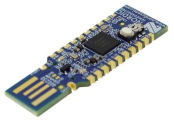
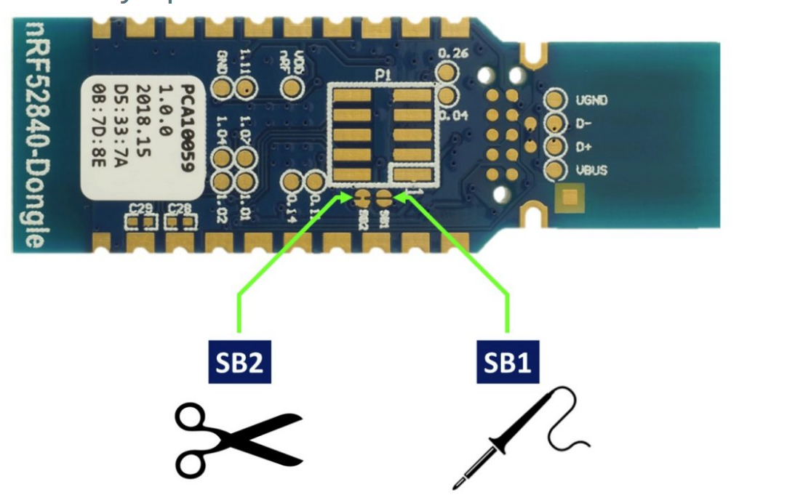

# How to build wireless remote
You will need the following components:
* **[programmed  nRF52840 Nordic USB Dongle]** 
  
* **VLCD5 Keypad**: costs 10€, this is the keypad from the TSDZ2 original display. Can be bought in many online shops like EBay". 
  
* **CR2032 coin cell**: costs 1€, can be bought in any local shop or on EBay or other online shops.
*  
   

## **Convert the board to use an external coin battery** 
  You can modify the dongle to use an external 3V CR2032 battery The CRC2032 button cell powers up the wireless board. Connect the cell positive to the VDD OUT pin and the negative to GND.
   

To ensure the dongle has the longest possible battery life it is necessary to cut the SB2 and solder the SB1 pads on the bottom of the board to open the circuit.

__Why do we need to cut SB2 and solder SB1?__
Please note that the usual power supply of the nRF52840 Dongle is 5V supplied to the VBUS pin of the dongle; see the [schematic for the dongle](./pca10059_schematic_and_pcb.pdf). VBUS supplies power to a on-chip high voltage regulator of the nRF52840 SoC. The output of this regulator (3.3V) supplies the SoC and the LEDs. The cut on SB2 opens the connection to the high voltage regulator and greatly improves power dissipation when using an external battery (Power off mode dissipation improves from ~10uA to ~0.5uA - a 10X improvement. This improves the battery life from 1 to over 2 years!)
To get started, you need to first replace the bootloader that comes with a new  Nordic nrf52840 Dongle with a bluetooth enabled wireless bootloader.

### See: [How to Flash the Wireless Bootloader on a Nordic Dongle](getting_started.md)

Once you have the wireless bootloader installed, you need to load the firmware for both the remote control and the motor controller. The firmware can be uploaded using bluetooth wirelessly to the nrf52840 dongle, a process that makes future firmware updates a breeze!

### See: [How to Flash the Wireless Remote and Motor Controller Firmware](firmware.md)

With the nrf52840 dongle programmed and ready to be used, you will need to assenble the components needed for both the remote control and the wireless motor controller

## Schematic
Solder the remote control and brake sensor to the dongle as follows:

## [back](./index.md)