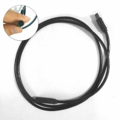

## How to build the TSDZ2 wireless board

You will need to acquire the following components:
* **[Wireless board - nRF52840 Nordic USB Dongle](https://www.nordicsemi.com/Software-and-tools/Development-Kits/nRF52840-Dongle)**: costs 10€ and can be bought in many online shops. 
  
* **60V -> 5V power board - EBike buck dd7818ta 80V -> 5V 1A**: costs 4€ and can be bought in many online shops like EBay, just search for "EBike buck dd7818ta 80". Other DC-DC converters can be used, like the [Traco power TEC-2-4811WI](https://uk.farnell.com/tracopower/tec-2-4811wi/dc-dc-converter-5v-0-4a/dp/2854928). Please note that any DC converter that you choose must have a voltage input of at least 60V and a 5V output.  
  
  
* **Power switch BTS4140N**: costs 2€, can be bought on EBay or other shops. 
  
* **Transistor BSP296**: costs 2€, can be bought on EBay or other shops. 
  
* **TSDZ2 display extension cable**: costs 6€, can be bought on EBay or other shops. 
  

## Schematic

## Firmware Installation

Once you have put the board assembled you are now ready to program the wireless bootloader.
follow the instructions [here](https://github.com/OpenSourceEBike/TSDZ2_wireless/tree/master/EBike_wireless_bootloader).
With the bootloader installed you can now program the Over the Air (OTA) updates for the wireless motor controller located [here](https://github.com/OpenSourceEBike/TSDZ2_wireless/releases)

To program the motor configuration and control the TSDZ2, download and install the android app from here: [https://github.com/OpenSourceEBike/TSDZ2_wireless/releases](https://github.com/OpenSourceEBike/TSDZ2_wireless/releases)

## [back](getting_started.md)
