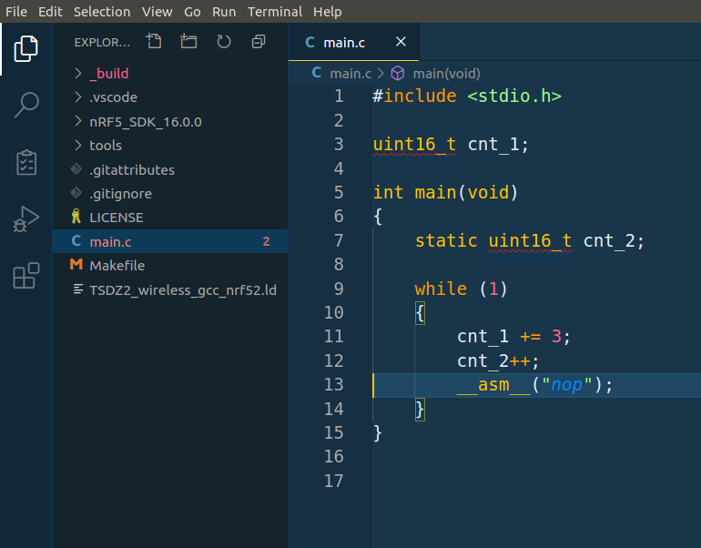
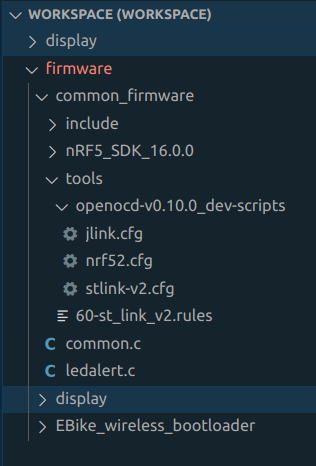
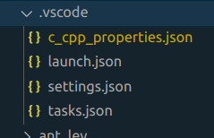
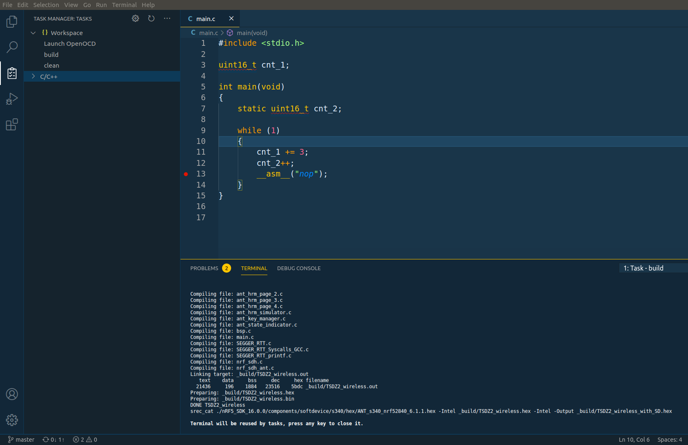
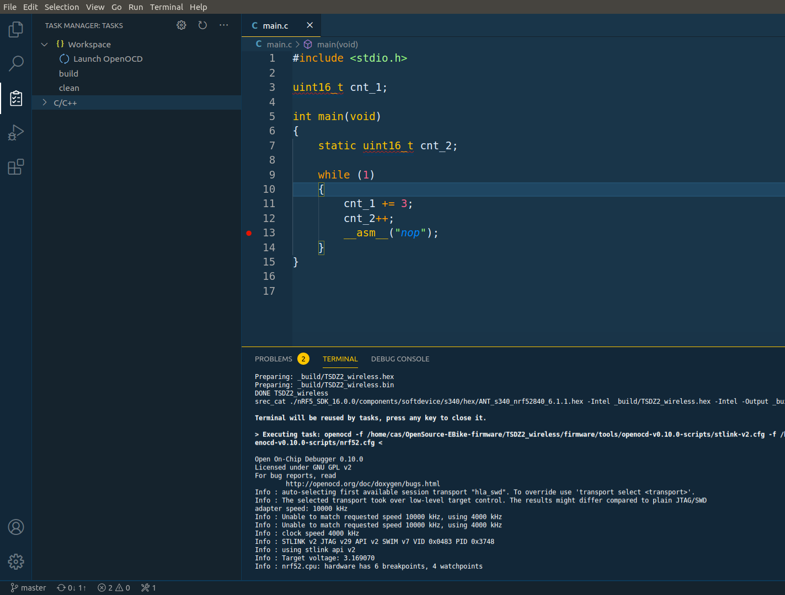
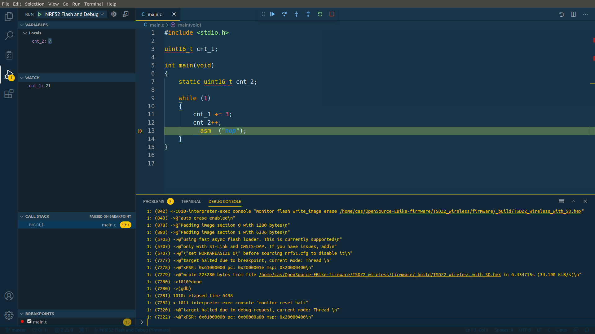

# Configure Code Studio IDE for firmware development, flash and debug

For the firmware development, flash and debug, you can use the OpenSource and free IDE [Visual Studio Code](https://code.visualstudio.com/). There are others that will work like the Eclipse but are not the focus of this document.

This guide assumes you are using Linux Ubuntu (if you are on Windows or MACOS you may find other guides on Internet but the concept will be the same). For Windows you may use the [Linux on Windows](https://docs.microsoft.com/en-us/windows/wsl/).

**NOTES:**
* You can follow this notes both for debug a STM32 or a NRF52 microcontroller.
* You can, buy on Aliexpress or Ebay, and use, a cheap JLink or STLinkV2. The JLINK is physically more robust and so is the recommend one.
* The instructions on this guide were tested on Linux Ubuntu. If you have a Windows or MAC OS, you can search Internet for similar guides and adapt, and take this one as a reference.

## Software or configurations you need to install / do

- add your user to the dialout group: __sudo usermod -a -G dialout USER_NAME__ and reboot
- install [Visual Studio Code](https://code.visualstudio.com/)
  - install C/C++ extension (to edit C/C++ source files)
  - install Cortex-Debug extension (to be able to debug ARM microcontroller)
  - install Task Manager extension (to call make and other commands)
- install OpenOCD (to connect to STLinkV2): __sudo apt-get install openocd__
- install GDB GNU debugger (for debug and connect to OpenOCD): __sudo apt-get install gdb-multiarch__
- install ARM C/C++ GCC compiler: __sudo apt-get install gcc-arm-none-eabi__
- install ARM binutils: __sudo apt-get install binutils-arm-none-eabi__
- install ARM newlib: __sudo apt-get install libnewlib-arm-none-eabi__
- install srec_cat tool (only needed for NRF52): __sudo apt-get install srecord__
- install nrfutil tool (only needed for NRF52): __sudo pip3 install nrfutil__

## Open project folder with Visual Studio Code

Click on menu File -> Open folder... and select the firmware directory. You should see the firmware similar to this:



**NOTES:**
* Usually I keep the folder *tools* with OpenOCD scritps inside the project folder and this files are needed for the OpenOCD to work:



* The hiden folder *.vscode* must also be present inside the project folder, that will contain the *tasks.json* with tasks configurations and *launch.json* with OpenOCD debug session commands:



## Build the code

Because you installed the Task Manager extension, you should see Task manager icon on the left bar - click on it. The build, clean and Launch OpenOCD tasks should be available.

Start by clicking on the clean to clean the code and then click on the build to build the code and you should see something similar to this - note the output on the terminal:



NOTE: The tasks will only be visible if they are configured on the .vscode/tasks.json.

The clean and build tasks simple call the __make clean__ and __make__ on the terminal. You can call the __make clean__ and __make__ on the terminal to check that they work (make uses the Makefile that you will find on the project source folder).

## Flash the firmware and debug

1. Connect the STLinkV2 to the board. If you have a nRF52840 MDK Dongle see the pinout in the schematic folder. If you have the blue nRF52840 Dongle it has a different pinout, see [nRF52840 Dongle Pinout.png](nRF52840_Dongle_Pinout.png), note that you do not need to connect the RST pin.

Note that you will also need to install the STLinkV2 udev rules file that are on the *tools* folder, so the STLinkV2 can be accessed by the OpenOCD:
```
sudo cp 60-st_link_v2.rules /etc/udev/rules.d
sudo udevadm control --reload-rules
```

2. Click on the task Launch OpenOCD

You will need to click only once. The OpenOCD should connect to the microcontroller and keep active - see the example output of OpenOCD on the terminal, when a correct connection was done with the microcontroller:



The task Launch OpenOCD configuration is on the file .vscode/tasks.json.

3. Click NRF52 Flash and Debug

Click on the debug icon on the left panel and then click on the small green arrow for the NRF52 Flash and Debug - will flash the firmware on the microcontroller and then start the debug of the firmware.. Wait a few seconds and you should see something like this:



The NRF52 Flash and Debug configuration is on the file .vscode/launch.json.

## Use OpenOCD to unlock / erase / flash the firmware

To make sure you can flash the firmware correctly, it always help to make sure a full erase is done first. Sometimes, the flash memory is fully or partially locked (some sectors locked) and must be unlocked first of a full erase.

The idea is that you start OpenOCD (click on the Visual Code Studio task Launch OpenOCD) and then you open a terminal and connect by telnet:
```
sudo telnet localhost 4444
```

You should execute "help" on the OpenOCD terminal to see which are the possible commands of your interest and read the instructions for each command:
```
help
```

For instance, here is the sequence to initialize the microcontroller:
```
init
reset halt
```

Then to erase the microcontroller (not needed on STM32F103):
```
nrf5 mass_erase
```

The next command will flash the firmware:
```
flash write_image erase ABSOLUTE_PATH_TO_FIRMWARE_ON_YOUR_PC/FIRMWARE.hex
```

The next commands will initialize the microcontroller and so you can now start debugging on Visual Code Studio:
```
reset halt
```

### Unlocking / removing flash protection

If you are using a STM32F103, the very first time you use it, you may need to unlock it with the following OpenOCD commands:
```
init
reset halt
stm32f1x unlock 0
reset halt
```

For NRF52 ([taken from this guide](https://blog.dbrgn.ch/2020/5/16/nrf52-unprotect-flash-jlink-openocd/)):
```
dap apreg 1 0x04 0x01
```