# Remote Control Power Analysis 
A very useful tool for determining power utilization of nrf52840 boards is the [Nordic Power Profile Kit](https://www.nordicsemi.com/Software-and-tools/Development-Tools/Power-Profiler-Kit-2)
This tool was used with the remote control to estimate the useful lifetime of a CR2032 coin battery used with the remote control.
## Setup
The remote control was powered on the VDD pin with a 3V CR3032 lithium battery following the instructions described in [how to build the wireless remote](./TSDZ2_wireless_remote.md)
## Remote Control Power modes 
The firmware for the remote control has two low power operating modes.
1. **POWER IDLE MODE** This is the default power mode of the remote when it is not processing any button commands. 
The average current dissipated by the remote in this mode with Ant Lev active is 37.5 uA as shown below: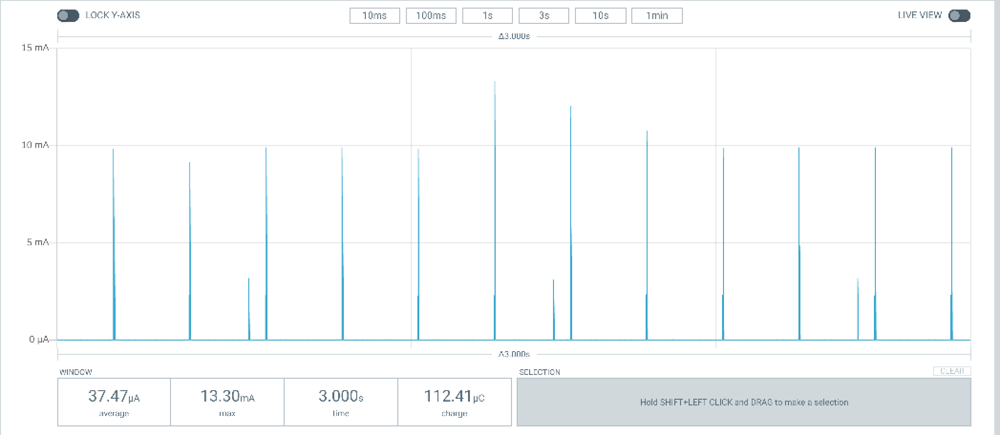
(The spikes in the current is caused by the switching voltage regulator used in the nrf52840 board. Essentially, the board power supply uses capacitive charging/discharging to reduce power consumption, and this leads to spiking in the current.) 
If both Ant Lev and Ant Controls is active in the remote the average idle current jumps to 75.26 uA as shown below:
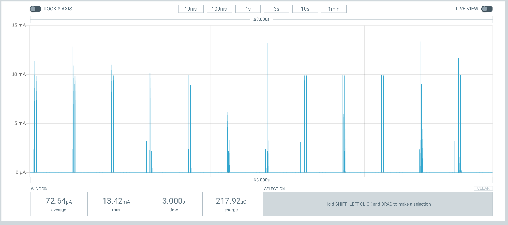
In **POWER IDLE** mode, the remote is powered on and ready to immediately process button commands.
2. **POWER OFF MODE**
   In this mode, the remote control turns off all  bluetooth and ANT wireless capabilities. The remote is put into a minimal power dissipation mode. The average power off current in this mode is only 0.36 uA as shown below:
   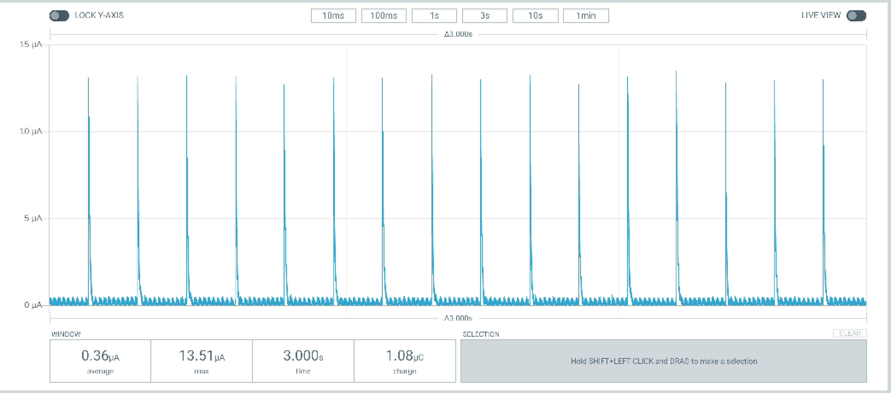
3. **ANT LEV TRANSMISSION MODE**
    In this mode, either the plus or minus button is pressed to increase or decrease the assist level on the ebike.
    The average current dissipated by the the remote control when the remote control is pressed once a second is 326 uA as shown below:
    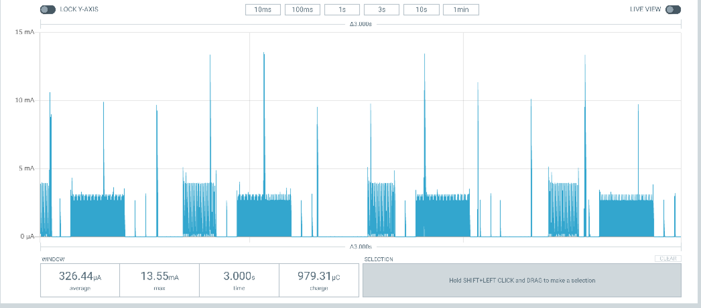
    if the button is pressed once every 2 seconds, the average current drops to 169.0 uA, about 1/2 the current as expected:
    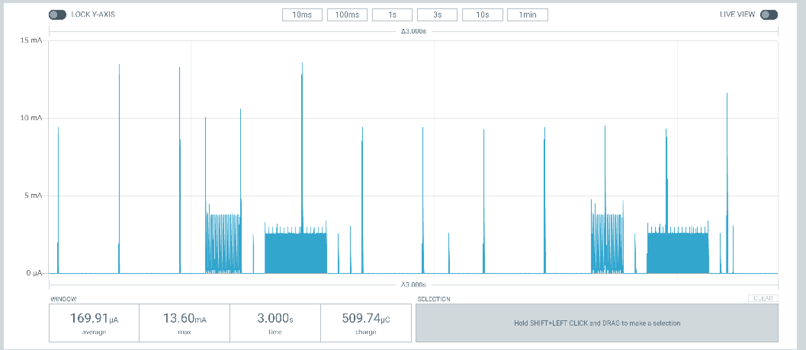
4. **ANT LEV + ANT CONTROLS TRANSMISSION MODE**
   In this mode, both Ant Lev and Ant Controls are active. The average current is 272 uA when the plus button is pressed once every second as shown below:
   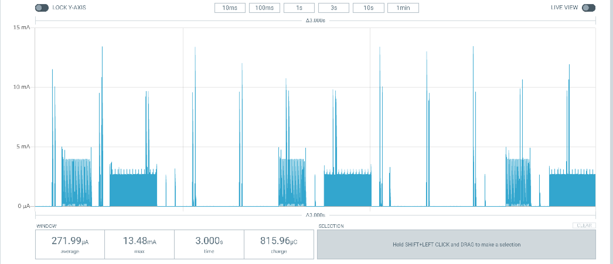
 
5. **ANT PAIRING MODE**
   When the board is searching for an ANT device, the average current dissipated by the board is 944 mA. You can see the current effects of the LEDs flashing during pairing in the current trace below:
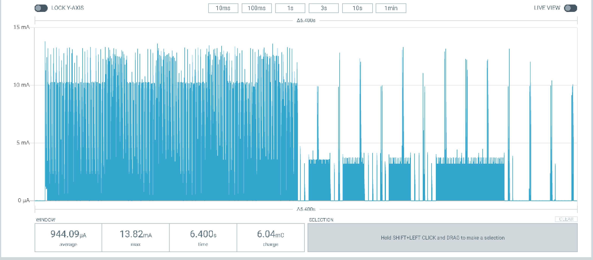
6. **BLUETOOTH PAIRING MODE**
 When the board is searching for an Bluetooth device, the average current dissipated by the board is 375.82 uA, as shown below:
 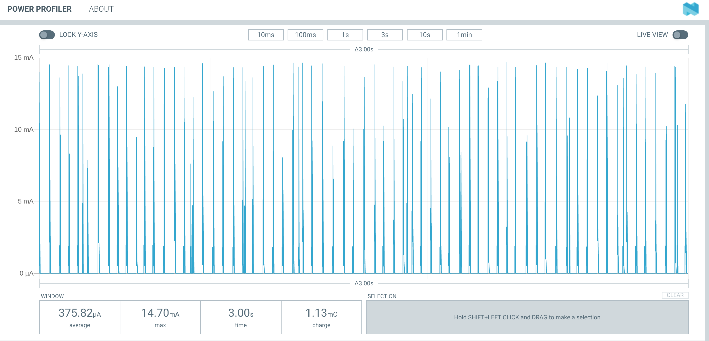

   ## CR2032 Battery life estimation
   To estimate the battery life of this battery, we use this [spreadsheet](./Battery_Life_Calculator.xls), along with some conservative assumptions:

   - The milliamp-hr (mah) energy capacity of the CR2032 battery is rated at 225mah, conservatively de-rated to 80% or 180 mah based on [an analysis done by Nordic Semiconductor on the impact that switching power supplies have on the performance of a CR2032 coin cell](./High_pulse_drain_impact_on_CR2032_coin_cell_battery_capacity.pdf) 
  The conclusion of this document is shown below:
  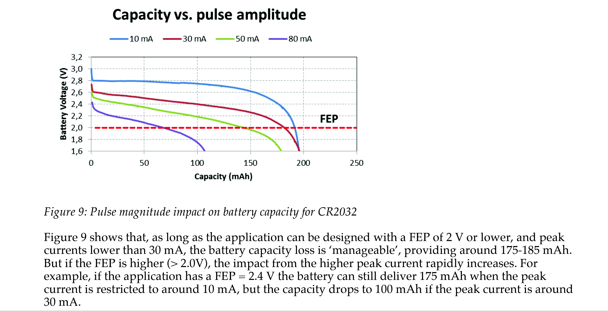
  FEP is the "Functional End Point" voltage at which the remote will no longer operate. (2 V). As can be seen from the power mode graphs above, the current peaks in the remote are between 10 and 15ma. We can therefore expect approximately 180 mah effective capacity from a CR2032 cell.
  This is the battery capacity used in the estimation of battery life.
   - The idle current is 75 uA (see **POWER OFF MODE** above) This assumes that you are not using a garmin bike computer. (if you are, change this value in the speadsheet to 37.5 uA)
   - the **POWER OFF** current is 0.036 uA
 -   
   - the average duration of a high current during a button click (where the board is in transmitting mode) is 482ms as measured below:
  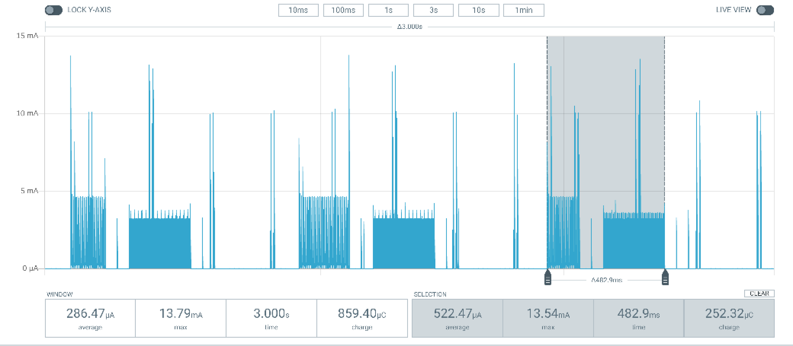
   -  The ebike is ridden 14 hrs/week
   -  The remote control spends virtually no time in bluetooth mode. (bluetooth is used only when setting up the remote)
   -  low brightness is used on the led
   
     Feeding these assumptions into the  [Battery Life Calculator](./Battery_Life_Calculator.xls) spreadsheet, the battery life is estimated to be **22 months!**. 
  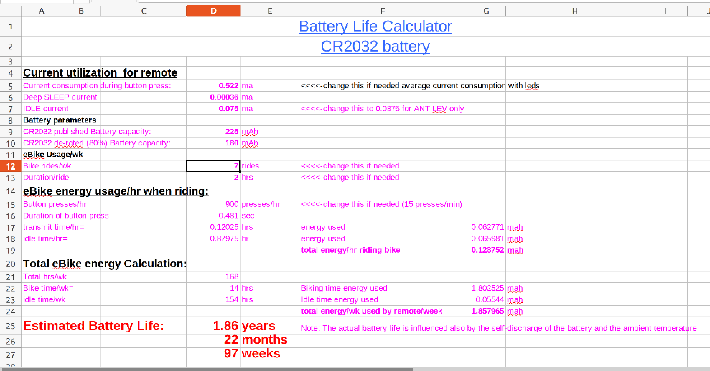
  ## Conclusion
  Based on quite conservative assumptions, it is expected that the remote will continue functioning well for at least a year. 
  **Replacing the battery annually is recommended.**

 