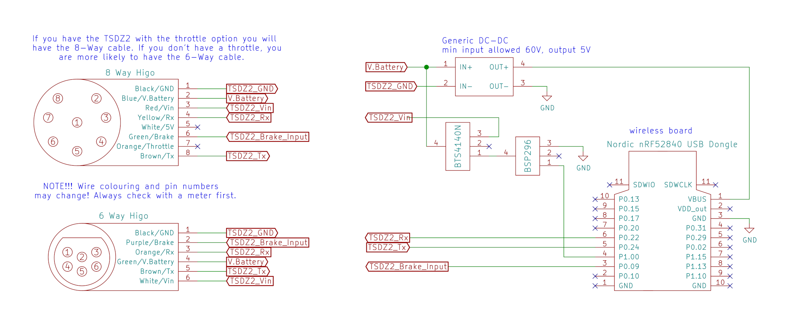
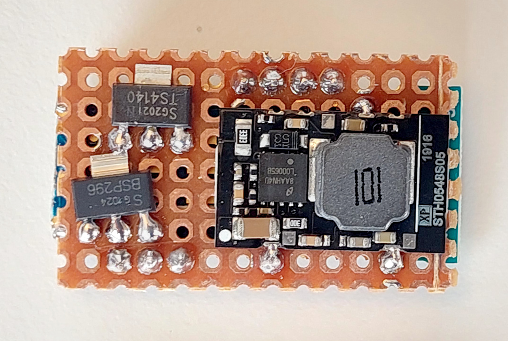
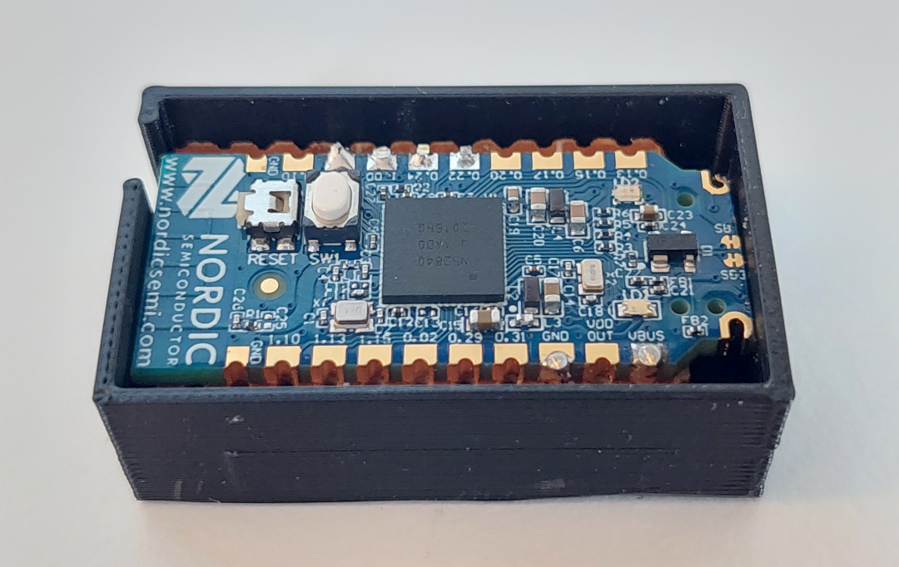
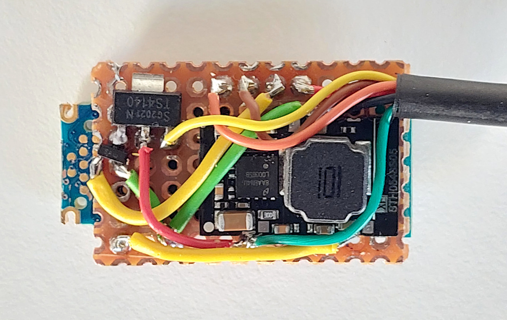
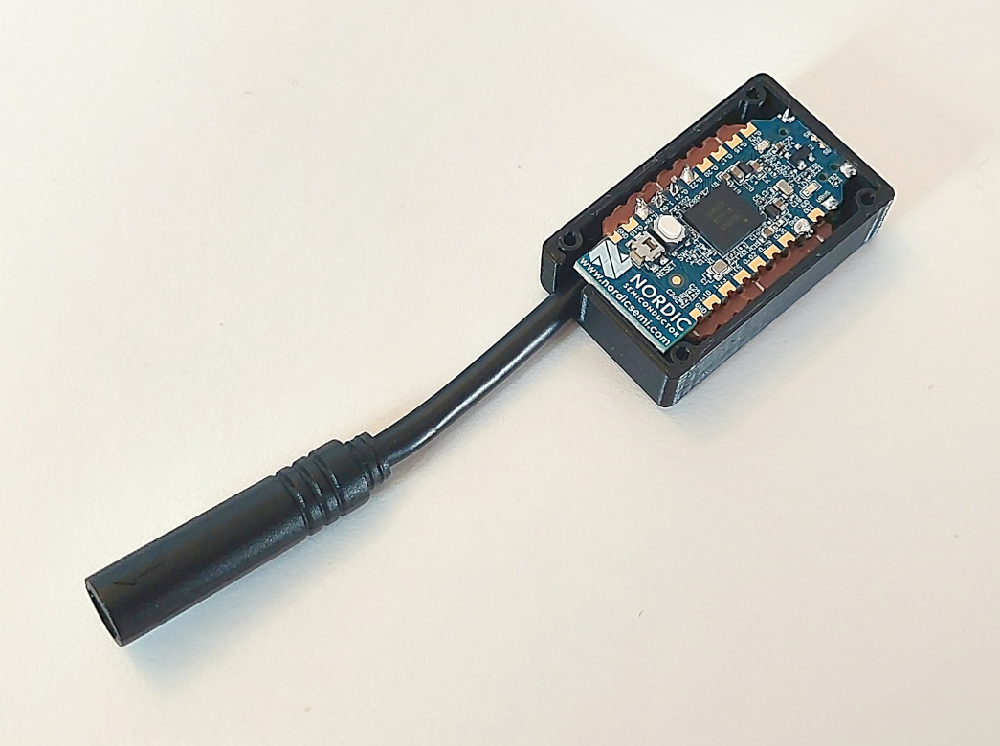
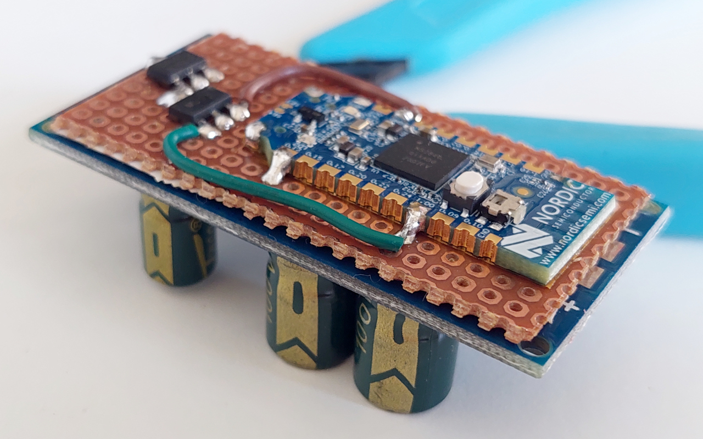
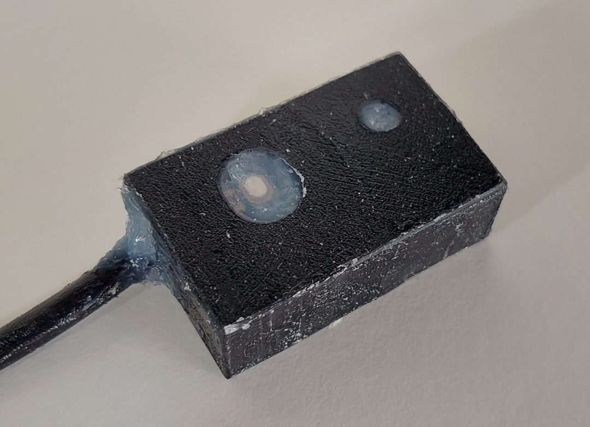
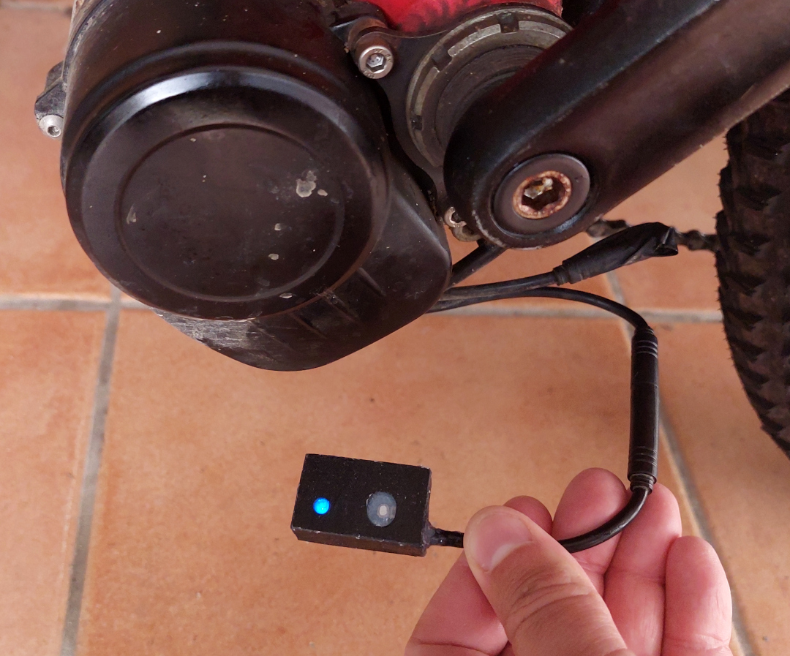

# Build the TSDZ2 wireless controller

Before you start you need to decide how you want to attach buttons and brake sensors and whether you want the option to have fewer wires on your EBike.

Both options require the use of the mobile app to configure the EBike. The mobile app connection is not required to control the EBike when riding - but can be used to provide real-time statistics; speed/motor current etc.

* **TSDZ2 EBike wireless controller** and **Wired Remote**:
    * You will not need to build the wireless remote.
    * Button keypad connects to the board directly.
    * Brake sensors connect direct to the motor.
    * You can mount the board either on the handlebars (so you can see LED signals easily) or you can mount closer to the motor if preferred.

* **TSDZ2 EBike wireless controller** and **[Wireless Remote](remote/build_remotes)**:
    * You will need to build the wireless remote.
    * Button keypad and Brake sensors connect to the Wireless Remote.
    * Wireless Remote is battery powered so can be mounted on the handlebars with no cables.
    * EBike wireless controller is mounted close to the motor. 

You will need the following components:
* **nRF52840 Nordic USB Dongle** 
  
* **Step down 80V -> 5V power board**: costs 6€ and can be bought in many online shops like EBay, just search for "EBike buck dd7818ta 80". Alternatively you can use the [XP Power STH0548S05](https://export.rsdelivers.com/product/xp-power/sth0548s05/xp-power-surface-mount-dc-dc-switching-regulator/1883365) that is smaller but a bit more expensive. Please note that any DC-DC converter that you choose must have a voltage input of at least 60V and a 5V output.  
WARNING: the step down power boards based on LM2576HV, although very popular, they did work initially but later that did burn sudendly and result also in burned nRF52840 board!
  

* **Perf board**: costs 1€, can be bought on EBay or other shops. 
  
* **Power switch BTS4140N**: costs 2€, can be bought on EBay or other shops. 
  
* **Transistor BSP296**: costs 2€, can be bought on EBay or other shops. 
  
* **TSDZ2 display extension cable**: costs 6€, can be bought on EBay or other shops. 
  

* **Four screws M2x6**: costs 1€, can be bought on EBay or other shops. This screws can be M2x4 up to M2x8. Buy them in black color if you plan to 3D print the enclose in black color. 
  

* **Silicone**: costs 4€, can be bought on EBay or other shops. The silicone will be used to seal the enclosure and make it water prof. There are silicone that is fast to cure like in two hours but this can not work very well, for not gluing well to the 3D printed plastic PLA. There are small tubes of silicone at shops, that you can use just a few pieces at a time. 
  

## Step by step instructions

1 - **Flash bootloader on the nrf52840 board** - see the page: [How to Flash the Wireless Bootloader on a Nordic Dongle](getting_started.md)

2 - **Build your board**

2.1 - Cut your nRF52840 board with a metal saw by hand and this way it will be smaller - here a picture as example:

2.2 - Solder all the components following the next schematic.

Schematic: Standard Controller (also need to build Wireless Remote)

Schematic: Wireless Controller with Wired Buttons (Wired Remote)

Wire multiple brake sensors in parallel.

nrf52840 board pinout:

---

**Small DC-DC (XP Power STH 0548S05)**

*Next steps considers you are using the small DC-DC [XP Power STH0548S05](https://export.rsdelivers.com/product/xp-power/sth0548s05/xp-power-surface-mount-dc-dc-switching-regulator/1883365). If you decided to use the "EBike buck dd7818ta 80", the see below*

A perfboard were cut in a way that is has almost the same area as the 3D printed box: 

The nrf52840 board were soldered to the perfboard using six small wires, to connect the needed six pads as you can see on the schematic: 

Here we can see the perford on the other side and the six small wires soldered: 

Next step were to solder the DC-DC board and the mosfets. Only that three connections of DC-DC are used, the GND on one side and Vin and Vout on the other side. Also I did not have with me the BSP296 mosfet and used another equivalent but smaller. (I also did cut a bit more the perfboard but was a mistake): 

Next, I tested to see if the board did fit on the case (image from old design): 

Next I soldered all the wires including the ones of the cable to connect on the TSDZ2 display connector. 
See that other than the TSDZ2 display connector wires, there is only need for more five wires. And I could use for sure thinner wires, but I used the ones I had at hand: 

Assembly: 

Use the four M2x6 screws to fix the cover. The hole is for the RGB LED but you can verify you can still click on the board button: 

Download here the files for 3D print the box:
* [TSDZ2_wireless_small_box.amf](https://github.com/OpenSourceEBike/OpenSourceEBike.github.io/raw/main/TSDZ2_wireless_small_box.amf)
* [TSDZ2_wireless_small_box_cover.amf](https://github.com/OpenSourceEBike/OpenSourceEBike.github.io/raw/main/TSDZ2_wireless_small_box_cover.amf)

**Big DC-DC (dd7818ta)**
*The follow information is about a way to build TSDZ2 EBike wireless controller using the DC-DC **EBike buck dd7818ta 80V -> 5V 1A.*

A perfboard were cut in a way that is has almost the same are as the power DC-DC board. See here all the boards, DC-DC power board on the left, perfboard at center and the nRF52840 at right: 

The nrf52840 board were soldered to the perfboard (note that there is tape under the nrf52840 board, to insulate his back from the metal parts of the perf board).  
The mosfets were also soldered: 

Here are the wires soldered (note that I also had to cut a bit the perfboard on the top, so it will be easier to solder the wires to the power on next stage): 

Finally I used a thin double sided tape to fix the perfboard to the back of the DC-DC board: 

Now with all the wires soldered, with the cable to connect on the TSDZ2 display connector: 

There is a red LED on the DC-DC board that is always on, to save that power, I simple removed the resistor R4 nard the LED: 

And inside of a 3D printed box. Note that I used a small zip tie to block the cable so it will not be possible to pull it to outside: 

Download here the files for 3D print the box:
* [TSDZ2_wireless_box.amf](https://github.com/OpenSourceEBike/OpenSourceEBike.github.io/raw/main/TSDZ2_wireless_box.amf)
* [TSDZ2_wireless_box_cover.amf](https://github.com/OpenSourceEBike/OpenSourceEBike.github.io/raw/main/TSDZ2_wireless_box_cover.amf)

---

3 - **Flash firmware on the nrf52840 board** - see the page: [How to Flash the Wireless Remote and Motor Controller Firmware](firmware.md)

4 - **Test** -
To avoid damaging your board or/and the TSDZ2 controller, follow the following steps to plug your board on the TSDZ2:
   1. Disconnect the battery to the TSDZ2,
   2. Wait few seconds to discharge the capacitors in the TSDZ2,
   3. Connect your wireless controller to the TSDZ2,
   4. Plug the battery back. 
when the board is powered up and running the firmware, you should see the "TSDZ2" Bluetooth device on your mobile phone.

5 - **Making water prof and install on EBike**

I did fill be box holes with translucid silicone and inserted the board - my objective is to have a water prof device. But I do not put to much silicone because I may need to repair the board later. I put silicone on the cables, to avoid the vibrations on the bicycle to break the wires over the time.

After 24 hours waiting for silicone to dry. I did fully cover the hole and it works very well to see the LED light(image from old design): 

Checking to see if it still works (image from old design): 

Final installation on the frame of my EBike (image from old design): 

