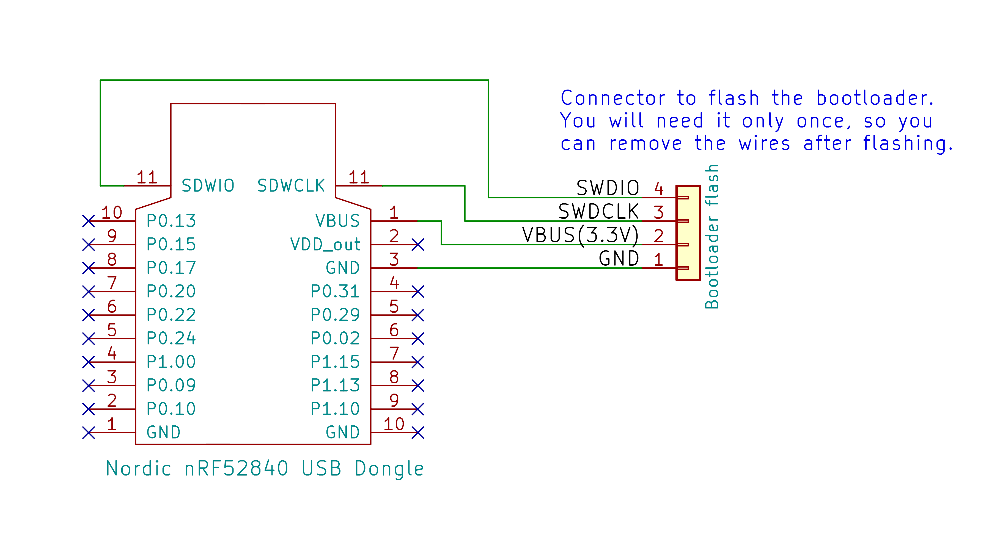

# Installing the bootloader
**Components you will need:**
*  [STLINK V2 (read before buying)](stlinkv2.md): (costs $3)

* **nRF52840 Nordic USB Dongle**: from previous steps<br/>
<br/>

## Wiring

For flashing the bootloader, connect the SWDCLK, SWDIO, GND and VBUS pins to the STLinkV2 and follow the flashing instructions below using either Windows or Linux.
Once the firmware is flashed, the STLinkV2  connection will not longer be required, as all future updates can be done wirelessly over bluetooth. 

The firmware HEX file to flash is the "bootloader.hex" that you can [download from here](https://github.com/OpenSourceEBike/ev_display_bluetooth_ant/releases).

Schematic for connections:


Wireless board pinout:


## Flashing


### Using Windows

1. Download [openocd for windows](https://gnutoolchains.com/arm-eabi/openocd/) and unzip the file on your PC desktop
2. Copy the resulting folder to a convenient place on your PC. For ease of access use C:/
3. Rename the folder openocd
4. Copy the Wireless Bootloader .hex file you have previously downloaded into c:/openocd/bin
5. In the Windows search box enter cmd to open a command prompt
6. Enter cd C:/openocd/bin
7. Enter the following. (All in one line)

```openocd.exe -f ../share/openocd/scripts/interface/stlink.cfg -f ../share/openocd/scripts/target/nrf52.cfg -c "init" -c "halt" -c "nrf5 mass_erase" -c "exit"```

8. This will erase the entire flash. This is necessary, because simply flashing bootloader leaves other flash content unchanged, and that may prevent the software from booting properly.

9. Enter the following. (All in one line)

```openocd.exe -f ../share/openocd/scripts/interface/stlink.cfg -f ../share/openocd/scripts/target/nrf52.cfg -c "program bootloader.hex verify" -c "exit"```

10. This will flash and verify the write. If you see ** Verified OK **, the flashing has been successful.


### Using Ubuntu
1.    Open a terminal
2. Install OpenOCD (to connect to STLinkV2):
   
   Enter: __sudo apt-get install openocd__:

   
 
3. Connect the STLinkV2 to the board. For the  nRF52840 Nordic Dongle see the pinout below to connect to the SWDIO, SWDCLK, and GND pins, note that you do not need to connect the RST pin.
   
   

4. Note that you will also need to install the STLinkV2 udev rules file that are on the firmware/tools/ folder, so the STLinkV2 can be accessed by the OpenOCD:
    ```
    sudo cp 60-st_link_v2.rules /etc/udev/rules.d
    sudo udevadm control --reload-rules
    ```

5. From the terminal window, navigate to the openocd directory, and enter the following command to start the openocd server:
   
    ```
    $ openocd -f stlink-v2.cfg -f nrf52.cfg
    ```  
    

6. Start another terminal session to access the openocd server, and enter the following command:
    ```
    $ telnet localhost 4444
    ```
    Next enter the following commands on the telnet terminal:

    ```
    $ reset init
    $ halt
    $ nrf52.dap apreg 1 0x04 0x01
    $ nrf5 mass_erase
    $ program (path to hex)/bootloader.hex verify
    $ reset exit 
    ``` 

    

This will flash and verify the write.
If you see ** Verified OK **, the flashing has been successful.

---

Congratulations!
* You now have the bootloader installed on the Nordic board.
* Future firmware upgrades can be done wirelessly.
* For more information on how to use the bootloader's Device Firmware Update (DFU) process to install a bootloader update or the remote control firmware or the wireless controller firmware, see [Understanding The Bootloader DFU Process](./dfu.md).

