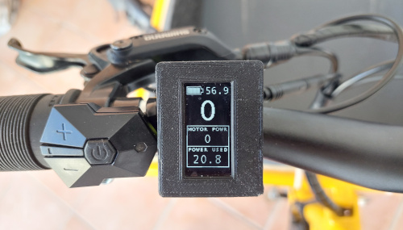
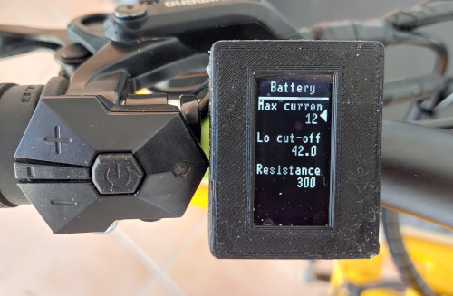

# OpenSource Ebike display

[This display is OpenSource](https://github.com/OpenSourceEBike/ev_display_bluetooth_ant) and easy to DIY, and was tested with Bafang **M500/M510/M600** EBike mid drive as also [**TSDZ2** Ebike mid drive motor running our OpenSource firmware](https://github.com/OpenSourceEBike/TSDZ2_wiki/wiki). 

Main screen showing battery SOC, speed, motor power and battery power used (TSDZ2 version): 

Configurations screen, showing some battery configuration options (TSDZ2 version): 

## Main advantages of this display

* easy to build as DIY
* all the advanced configurations for the motor and battery are done directly on the display
* supports Bluetooth and ANT wireless communications
* supports 1.3 and 0.96 (TSDZ2 only) inches 128x64 OLED displays
* easy to install our firmware, includes OTA wireless updates
* easy to repair, can be opened easily and the electronic components are popular ones available worldwide
* easy to customize with some extra electronics so it can be reused on other devices
* if you decide to stop using it, you can dismantle and reuse the electronic components on other projects

## Motivation

On the last years we developed OpenSource firmware for popular cheap EBike displays and we found some hard limitations:
* some displays stop to work suddenly, are expensive and can not be repaired because they are sealed and are not meant to be opened
* manufacturers makes different versions over the time of the same display and the firmware need to be developed again (at least partially)
* on some displays is almost impossible to install our advanced firmware
* it is impossible to use the same display for different devices because sometimes there are small electronics differences on the communications, like some devices using UART, other CANBUS and other UART one wire

## Project philosophy
* develop a simple display to be easy to build as DIY and repair. Try to use popular and easy to acquire parts
* small and discrete display
* show motor data and make motor configurations
* implement ANT+ LEV EBike wireless standard to send / integrate the motor data to cycling computer displays as Garmin Edge
* do not implement features as GPS navigation: instead users should use a cycling computer as Garmin Edge that implements navigation, has advanced cycling metrics and integrates natively with ANT+ LEV EBike wireless standard

## How to build

See here **[How to build the display - TSDZ2 version](build_display.md)**.

See here **[How to build the display - Bafang M500/M510/M600 version](build_display-bafang_m500_M600.md)**.

## Operating Instructions

See here How to use the display (TODO)

## Community help

* Forum message: [DIY OpenSource display for EVs, TSDZ2 EBike motor and Xiaomi scooter](https://endless-sphere.com/forums/viewtopic.php?f=7&t=113971)
* Developers: [tools used for development](development/README.md)

# Other projects

* [TSDZ2 wireless and fully wireless remote](tsdz2_wireless/index.md) (with Garmin Edge integration for page change).
