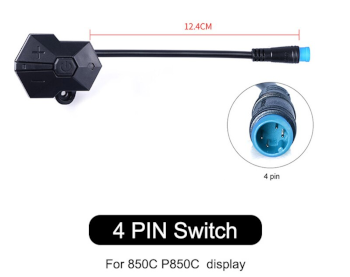
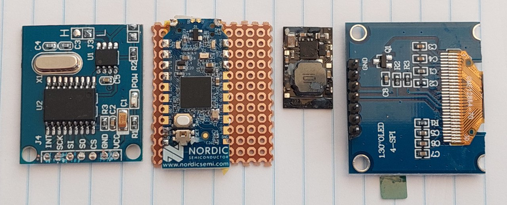
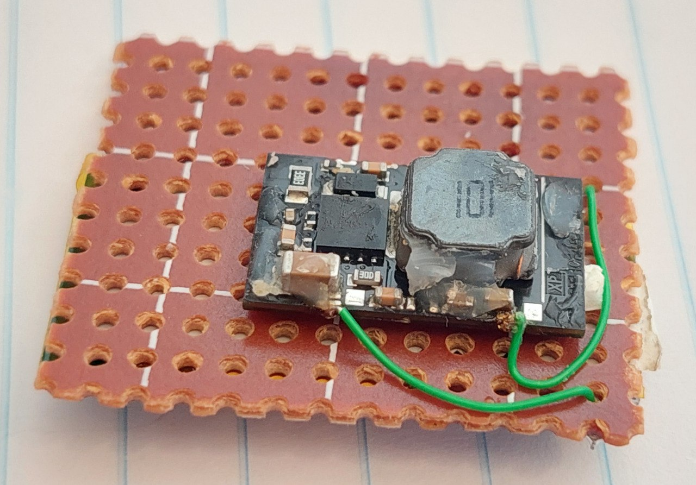
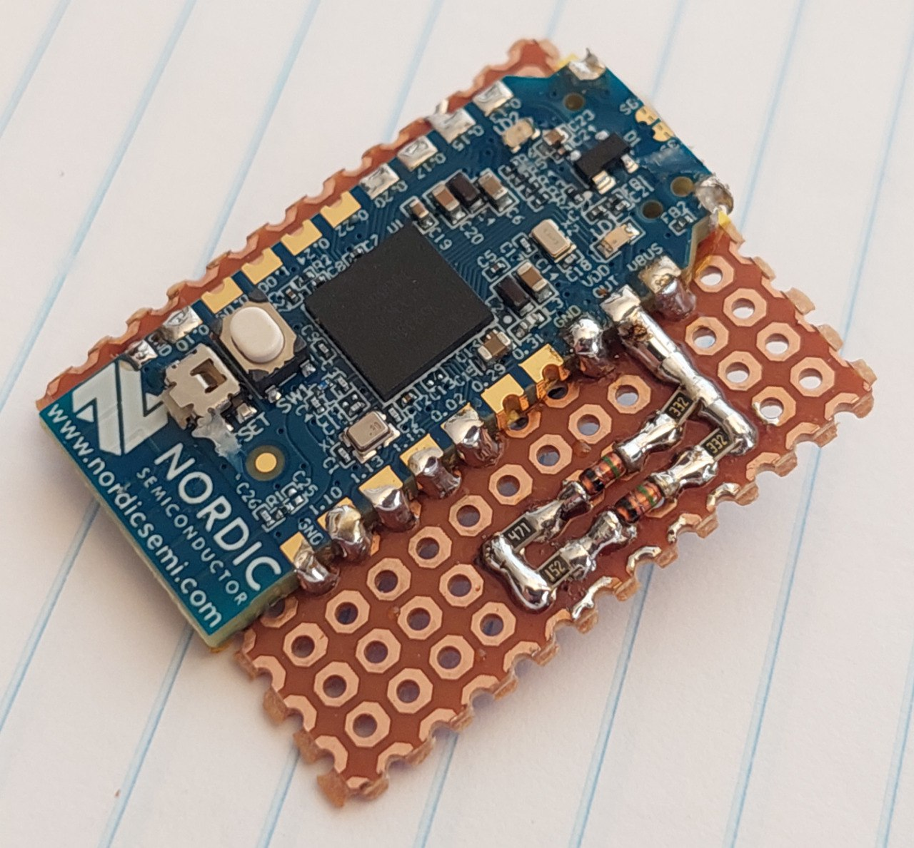
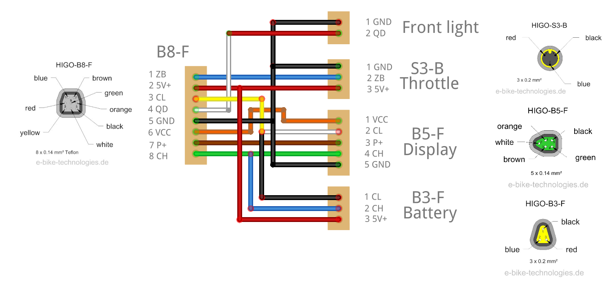
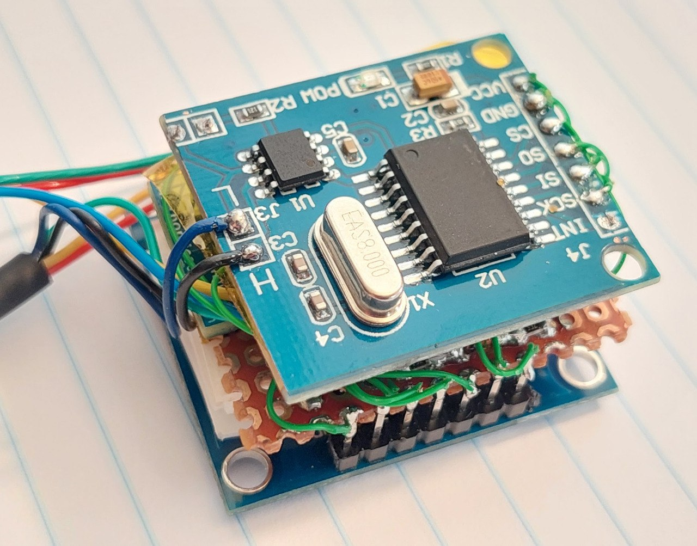
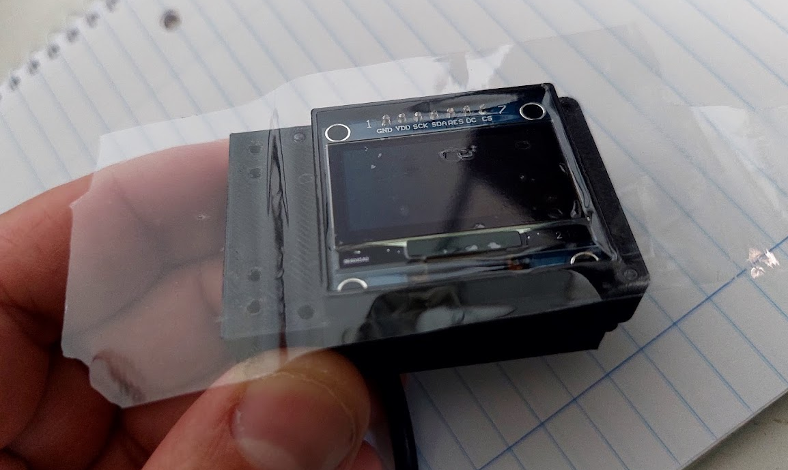

# How to build the display

NOTE that this display only works for Bafang M500/M510/M600 motors.

Some of the following components can be bought in online shops like Aliexpress, Ebay or at specialized electronics shops like [www.mouser.com](https://mouser.com/) or [www.farnell.com](https://www.farnell.com/).

## Componentes
You will need the following components:
* **OLED display SPI 128x64 pixels 1.3 inches or 0.96 inches (I2C display version will not work)**: costs 3€. You need to choose the bigger or the smaller version. It is recommended the bigger 1.3 inches version (the 3D printed enclosure is only available for this one). The smaller version makes impossible to see the numbers on display while riding, you need to stop to be able to read. 
 
* **nRF52840 Nordic USB Dongle**: costs 11€. 
 
* **CAN SPI module**: costs 4€. 
 
* **Step down 80V -> 5V power board [XP Power STH0548S05](https://export.rsdelivers.com/product/xp-power/sth0548s05/xp-power-surface-mount-dc-dc-switching-regulator/1883365)**: costs 11€. 
 
* **3 or 4 buttons remote**: costs 8€. The 3 buttons is from the EBike 850C display, that can be bought as a spare part - search on Aliexpress for "850c extension". The 4 buttons is from the EBike 860C display, that can be bought as a spare part but can be hard to find. 
If you want the ANT+ REMOTE functionalitty (Garmin Edge page change), you will need to use the 4 buttons remote, as this function happens when you press the button number 4. 
 
* **Bafang M500/M510/M600 display extension cable (HIGO-B5 connector)**: [costs 8€](https://www.aliexpress.com/item/1005003656557018.html) 
 
* **2x Diode 1N4148**: can be SMD 0805 size. Costs 0.1€, can be bought on EBay or other shops. 
* **Resistor 470 ohms**: can be SMD 0805 size. Costs 0.1€, can be bought on EBay or other shops. 
* **Resistor 1500 ohms**: can be SMD 0805 size. Costs 0.1€, can be bought on EBay or other shops. 
* **2x resistor 3300 ohms**: can be SMD 0805 size. Costs 0.2€, can be bought on EBay or other shops. 
* **Perf board**: costs 1€. 
 
* **Four screws M2x12**: costs 1€. Buy them in black color if you plan to 3D print the enclose in black color. 
 
* **Silicone**: costs 4€, can be bought on EBay or other shops. The silicone will be used to seal the enclosure and make it water prof. There are silicone that is fast to cure like in two hours but this can not work very well, like not gluing well to the 3D printed plastic PLA. There are small tubes of silicone at shops, that you can use just a few pieces at a time. 
  

## Tools
You will need at least the following tools:
* **Multimeter**: to check the wires connections, voltages and components.
* **Power supply**: to power the display for testing during the build, where you limit the current to a minimum to avoid burning some component in the case you soldered something wrong. If you do not have one yet, you can buy a cheap digital lab power supply of adjustable voltage up to 30V and adjustbale current up to 10A, on Aliexpress for about 50€.

## Step by step instructions

1 - **Flash bootloader and firmware on the nrf52840 board** - see the page: 
1.1 - [How to Flash the Wireless Bootloader on a Nordic Dongle](bootloader.md) 
1.2 - [How to update the firmware](dfu.md) 

In the steps 1.1 and 1.2 you flash the bootloader and then update the firmware, if all goes as expected, then the NRF52840 board is working.

2 - **3D print the enclosure**:

3D files for 3D printing (1.3 inches OLED display only):
* [base.amf](3D_print_enclosure/Bafang_M500_M600/base.amf) (purple in the picture)
* [cover.amf](3D_print_enclosure/Bafang_M500_M600/cover.amf) (blue in the picture)
* [clamp.amf](3D_print_enclosure/Bafang_M500_M600/clamp.amf) (orange in the picture).

3 - **Build your board**

3.1 - Understand the circuit, see the schematic: 

### Schematic explanation

* the DC-DC converts the high battery voltage and outputs 5 volts, which will then be the input for the NRF52840 board as also to the OLED display.

* the wireless board has the NRF52840 microcontroller that is "the brain" of the display, and communicates with the OLED display and CAN module using SPI lines. It also reads the remote buttons state. 
In the case you are using 4 buttons keypad, connect the button number 4 to the pin P0.17 of the NRF52840 board.

* the CAN module sends and receive data to the Bafang motors.

* the resistors and diodes implement the same circuit as the Bafang M500/M510/M600 original display.

* when the display is off, the CTRL wire has battery voltage and P+ VBAT has 0 volts. Once the user presses ON/OFF button on the remote, the CTRL wire will then have 4.5 volts and if user long press the ON/OFF button, the P+ VBAT will get the battery voltage (to power up the display). 
The DOWN button has a similar circuit and the Bafang motor controller uses it to detect when users wants the walk assist mode.

NRF52840 board pinout:

3.2 - Cut your nRF52840 board with a metal saw by hand so this way it will be smaller. Check it is ok on the enclosure, if not you can use a file tool to do the final adjustment. 
Also cut the CAN module board, the display board and the perfboard, to the similar sizes / shapes as seen on the picture. All this boards need to go inside the 3D printed enclosure - here a picture as example:

3.3 - Use thin double layer tape to fix the DC-DC to the back of perfboard. Solder thin wires to the GND, Vin and Vout pins (look at the datasheet of the DC-DC to find the pins) that will be used on the front side of perfboard: 

NOTE: always triple check the connections you did as it is easy for you to do a mistake. For instance, exchanging battery voltage pin with GND pin will most probably result in a burned NRF52840 and/or the DC-DC board.

How can use the power supply with 10V and limited current like 50mA, to power up the DC-DC and see if it correctly provides 5V at his output. 

Next, use some tape to insulate the bottom of the wireless board and solder it on the front of perfboard, as seen on the image. 
Also solder the resistors and diodes as seen on the image (this are SMD 0805 size):

Wire the DC-DC output wires GND and 5V to the wireless board (follow the schematic).

Now you can use the power supply with 10V and limited current like 50mA, to power up the DC-DC and see if LEDs on the wireless board blink (bootloader must be already flashed on this step) when you apply the power. You can also check that wireless board OUT pin is 3.3V.

Continue to wire everything as seen om the schematic but leave the CAN module for the end. See next picture.

Use thin wires when possible. For the wires of display extension cable, you will need to figure out each pin on the HIGO-B5 connector - see next image.

Now that you have the display cable wired, giving power to DC-DC, that will then power the wireless board and the OLED display, and the remote buttons wired, you can now connect to your Bafang motor. You can use the power supply with 30V and with current limit to a current like 100mA, to power up your Bafang motor. That way, if you made any mistakes when connecting the cables to the display, hopefully nothing will burn.

Assuming the bootloader and firmware are already flashed on this step, when you long press the ON/OFF button, you should see the OLED display turn on. It should not go to main screen as the motor communications are not yet ready because the CAN module board is not yet connected.

Finally wire the CAN module board:

In the end, the display should show the same way as next picture. Note that I did setup my power supply to 30V, that is why the motor controller sends the battery voltage value as about 30V and battery SOC as empty, since my motor is for a 48V battery.

Now it is time to put everything inside the 3D printed enclosure. The big hole at back is enough for the two cables to be inserted. Here an example, and after using transparent silione to keep the cables in place and avoid water entrance:

On the top, to protect the OLED display and avoid watter entrance, you can put large glue tape as seen on the picture. There are enough clearance on the cover 3D printed part to accomodate this tape:

Use the M2x12 screws to tight the cover as also to clamp to the handlebar.

Example of the final result:

(On this picture, not glue tape were yet applied on to of the OELD display)

