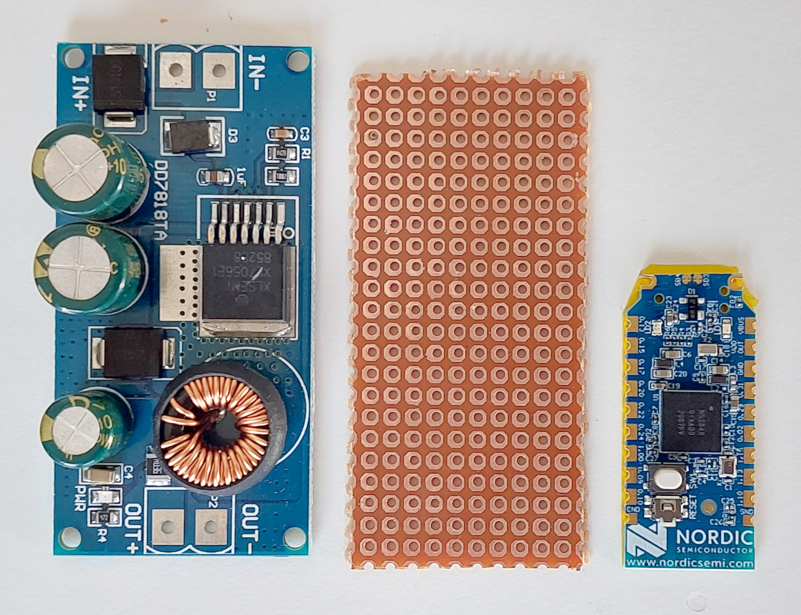

# How to build the TSDZ2 EBike wireless controller

Before you start you need to decide how you want to attach buttons and brake sensors and whether you want the option to have fewer wires on your EBike.

Both options require the use of the mobile app to configure the EBike. The mobile app connection is not required to control the EBike when riding - but can be used to provide real-time statistics; speed/motor current etc.

* **TSDZ2 EBike wireless controller** and **Wired Remote**:
    * You will need to build only one board and it connects to the motor via 6/8 pin cable.
    * Button keypad connects to the board directly.
    * Brake sensors connect direct to the motor.
    * You can mount the board either on the handlebars (so you can see LED signals easily) or you can mount closer to the motor if preferred.

* **TSDZ2 EBike wireless controller** and **[Wireless Remote](remote/build_remotes)**:
    * You will need to build two boards. The first one for the EBike wireless controller and it connects to the motor via 6/8 pin cable. The second board will be for the wireless remote.
    * Button keypad and Brake sensors connect to the Wireless Remote.
    * Wireless Remote is battery powered so can be mounted on the handlebars with no cables.
    * EBike wireless controller is mounted close to the motor. 

You will need the following components:
* **nRF52840 Nordic USB Dongle** 
  
* **60V -> 5V power board - EBike buck dd7818ta 80V -> 5V 1A**: costs 4€ and can be bought in many online shops like EBay, just search for "EBike buck dd7818ta 80". Other DC-DC converters can be used, like the [Traco power TEC-2-4811WI](https://uk.farnell.com/tracopower/tec-2-4811wi/dc-dc-converter-5v-0-4a/dp/2854928). Please note that any DC-DC converter that you choose must have a voltage input of at least 60V and a 5V output.  
EBike buck dd7818ta 80V: 
  
[Traco power TEC-2-4811WI](https://uk.farnell.com/tracopower/tec-2-4811wi/dc-dc-converter-5v-0-4a/dp/2854928): 
  
* **Perf board**: costs 1€, can be bought on EBay or other shops. 
  
* **Power switch BTS4140N**: costs 2€, can be bought on EBay or other shops. 
  
* **Transistor BSP296**: costs 2€, can be bought on EBay or other shops. 
  
* **TSDZ2 display extension cable**: costs 6€, can be bought on EBay or other shops. 
  

## Step by step instructions

1 - **Flash bootloader on the nrf52840 board** - see the page: [How to Flash the Wireless Bootloader on a Nordic Dongle](getting_started.md)

2 - **Build your board**

2.1 - Cut your nRF52840 board with a metal saw by hand and this way it will be smaller - here a picture as example:

2.2 - Solder all the components following the next schematic.

Schematic: Standard Controller (also need to build Wireless Remote)

Schematic: Wireless Controller with Wired Buttons (Wired Remote)

Wire multiple brake sensors in parallel.

nrf52840 board pinout:

A perfboard were cut in a way that is has almost the same are as the power DC-DC board. See here all the boards, DC-DC power board on the left, perfboard at center and the nRF52840 at right: 

The nrf52840 board were soldered to the perfboard (note that there is tape under the nrf52840 board, to insulate his back from the metal parts of the perf board).  
The mosfets were also soldered: 

Here are the wires soldered (note that I also had to cut a bit the perfboard on the top, so it will be easier to solder the wires to the power on next stage): 

Finally I used a thin double sided tape to fix the perfboard to the back of the DC-DC board: 

Now with all the wires soldered, with the cable to connect on the TSDZ2 display connector: 

There is a red LED on the DC-DC board that is always on, to save that power, I simple removed the resistor R4 nard the LED: 

And inside of a 3D printed box. Note that I used a small zip tie to block the cable so it will not be possible to pull it to outside: 

Download here the files for 3D print the box:
* [TSDZ2-wireless-box.amf](TSDZ2-wireless-box.amf)
* [TSDZ2-wireless-box_cover.amf](TSDZ2-wireless-box_cover.amf)

3 - **Flash firmware on the nrf52840 board** - see the page: [How to Flash the Wireless Remote and Motor Controller Firmware](firmware.md)

4 - **Test** - when the board is powered up and running the firmware, you should see the "TSDZ2" Bluetooth device on your mobile phone.
