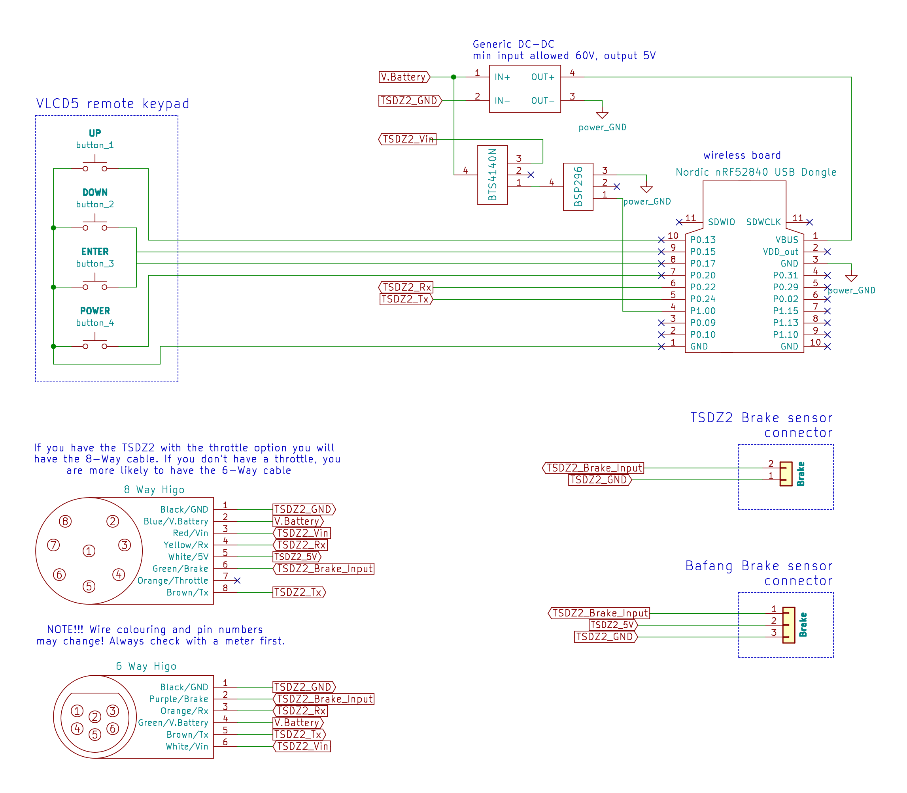
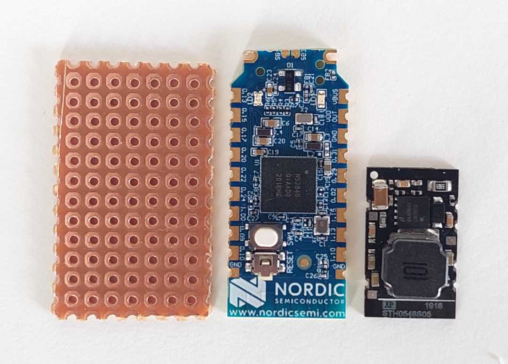
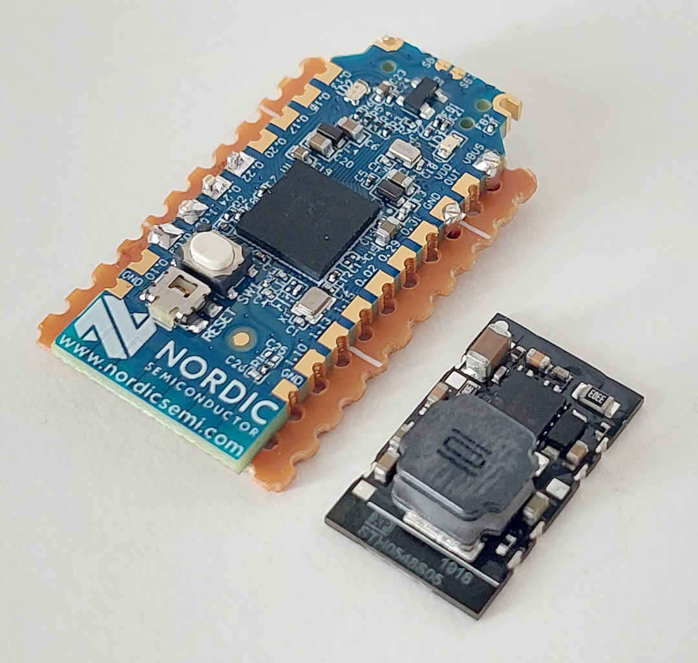
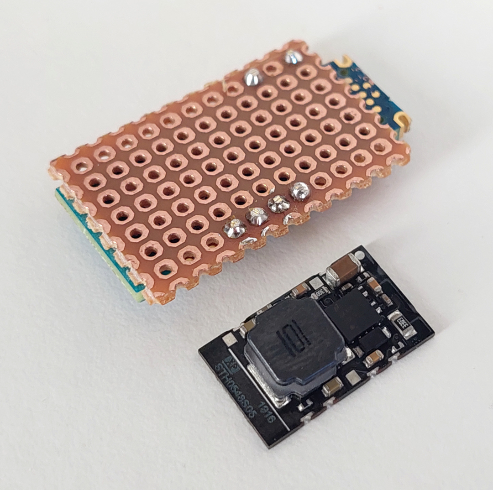
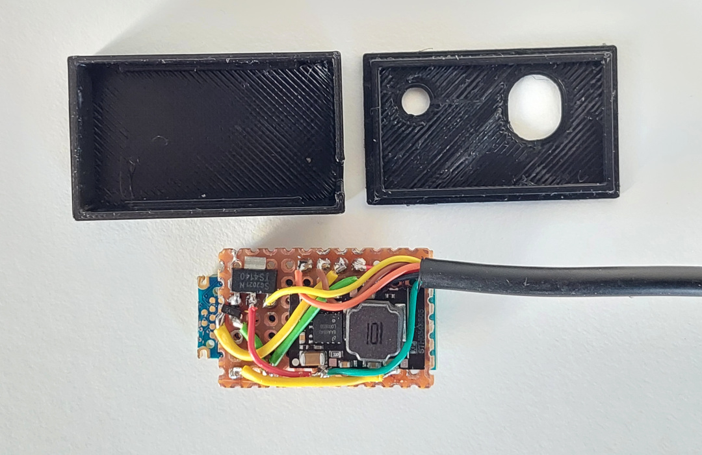

# How to build the TSDZ2 EBike wireless controller

Before you start you need to decide how you want to attach buttons and brake sensors and whether you want the option to have fewer wires on your EBike.

Both options require the use of the mobile app to configure the EBike. The mobile app connection is not required to control the EBike when riding - but can be used to provide real-time statistics; speed/motor current etc.

* **TSDZ2 EBike wireless controller** and **Wired Remote**:
    * You will not need to build the wireless remote.
    * Button keypad connects to the board directly.
    * Brake sensors connect direct to the motor.
    * You can mount the board either on the handlebars (so you can see LED signals easily) or you can mount closer to the motor if preferred.

* **TSDZ2 EBike wireless controller** and **[Wireless Remote](remote/build_remotes)**:
    * You will need to build the wireless remote.
    * Button keypad and Brake sensors connect to the Wireless Remote.
    * Wireless Remote is battery powered so can be mounted on the handlebars with no cables.
    * EBike wireless controller is mounted close to the motor. 

You will need the following components:
* **nRF52840 Nordic USB Dongle** 
  
* **(80V -> 5V power board**: costs 6€ and can be bought in many online shops like EBay, just search for "EBike buck dd7818ta 80". Alternatively you can use the [XP Power STH0548S05](https://export.rsdelivers.com/product/xp-power/sth0548s05/xp-power-surface-mount-dc-dc-switching-regulator/1883365) that is smaller but a bit more expensive. Please note that any DC-DC converter that you choose must have a voltage input of at least 60V and a 5V output.  

* **Perf board**: costs 1€, can be bought on EBay or other shops. 
  
* **Power switch BTS4140N**: costs 2€, can be bought on EBay or other shops. 
  
* **Transistor BSP296**: costs 2€, can be bought on EBay or other shops. 
  
* **TSDZ2 display extension cable**: costs 6€, can be bought on EBay or other shops. 
  

## Step by step instructions

1 - **Flash bootloader on the nrf52840 board** - see the page: [How to Flash the Wireless Bootloader on a Nordic Dongle](getting_started.md)

2 - **Build your board**

2.1 - Cut your nRF52840 board with a metal saw by hand and this way it will be smaller - here a picture as example:

2.2 - Solder all the components following the next schematic.

Schematic: Standard Controller (also need to build Wireless Remote)

Schematic: Wireless Controller with Wired Buttons (Wired Remote)

Wire multiple brake sensors in parallel.

nrf52840 board pinout:

**Next steps considers you are using the small DC-DC [XP Power STH0548S05](https://export.rsdelivers.com/product/xp-power/sth0548s05/xp-power-surface-mount-dc-dc-switching-regulator/1883365). If you decided to use the "EBike buck dd7818ta 80", the see instead here: [build using the EBike buck dd7818ta 80](ebike_wireless_controller_big.md)**

A perfboard were cut in a way that is has almost the same are as the power DC-DC board. See here all the boards, perfboard on the left, nRF52840 board at center and DC-DC power board at right: 

Note that perfboard must have that exact dimensions / number of holes, so it will fit inside the 3D printed box. 

The nrf52840 board were soldered to the perfboard using six small wires, to connect the needed six pads as you can see on the schematic: 

Here we can see the perford on the other side and the six small wires soldered: 

Next step were to solder the DC-DC board and the mosfets. Only that three connections of DC-DC are used, the GND on one side and Vin and Vout on the other side. Also I did not have with me the BSP296 mosfet and used another equivalent but smaller. (I also did cut a bit more the perfboard but was a mistake): 

Next, I tested to see if the board did fit on the case: 

Next I soldered all the wires including the ones of the cable to connect on the TSDZ2 display connector. 
See that other than the TSDZ2 display connector wires, there is only need for more five wires. And I could use for sure thinner wires, but I used the ones I had at hand: 

There is a red LED on the DC-DC board that is always on, to save that power, I simple removed the resistor R4 nard the LED: 

Final assembly. The holes are for the RGB LED and the button: 

Finally I did fill be box with translucid silicone and inserted the board - my objective is to have a robust and water prof device. Although not seen on the image, after I put the box cover and I did fully cover the holes with the silicone and it works very well to see the LED light and also to be able to click on the button as the silicone is flexible: 

Download here the files for 3D print the box:
* [TSDZ2_wireless_small_box.amf](TSDZ2_wireless_small_box.amf)
* [TSDZ2_wireless_small_box_cover.amf](TSDZ2_wireless_small_box_cover.amf)

3 - **Flash firmware on the nrf52840 board** - see the page: [How to Flash the Wireless Remote and Motor Controller Firmware](firmware.md)

4 - **Test** - when the board is powered up and running the firmware, you should see the "TSDZ2" Bluetooth device on your mobile phone.
