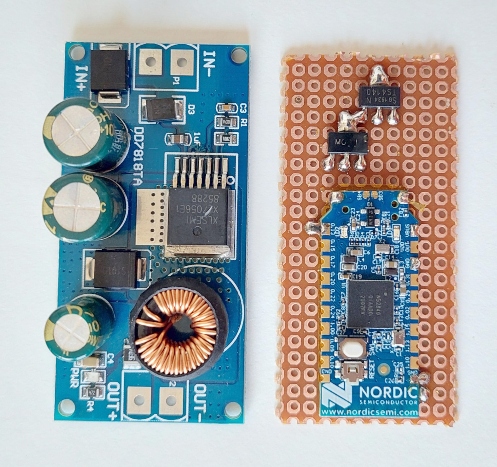
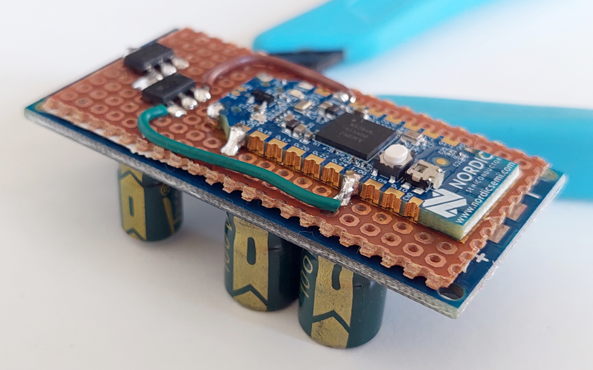
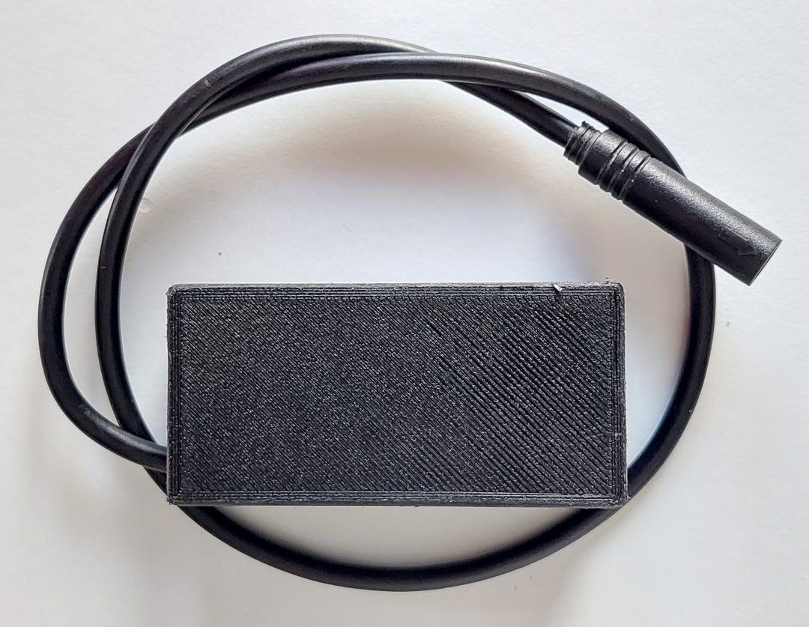

The follow information is about a way to build TSDZ2 EBike wireless controller using the DC-DC **EBike buck dd7818ta 80V -> 5V 1A**.

A perfboard were cut in a way that is has almost the same are as the power DC-DC board. See here all the boards, DC-DC power board on the left, perfboard at center and the nRF52840 at right: 

The nrf52840 board were soldered to the perfboard (note that there is tape under the nrf52840 board, to insulate his back from the metal parts of the perf board).  
The mosfets were also soldered: 

Here are the wires soldered (note that I also had to cut a bit the perfboard on the top, so it will be easier to solder the wires to the power on next stage): 

Finally I used a thin double sided tape to fix the perfboard to the back of the DC-DC board: 

Now with all the wires soldered, with the cable to connect on the TSDZ2 display connector: 

There is a red LED on the DC-DC board that is always on, to save that power, I simple removed the resistor R4 nard the LED: 

And inside of a 3D printed box. Note that I used a small zip tie to block the cable so it will not be possible to pull it to outside: 

Download here the files for 3D print the box:
* [TSDZ2_wireless_box.amf](https://github.com/OpenSourceEBike/OpenSourceEBike.github.io/raw/main/TSDZ2_wireless_box.amf)
* [TSDZ2_wireless_box_cover.amf](https://github.com/OpenSourceEBike/OpenSourceEBike.github.io/raw/main/TSDZ2_wireless_box_cover.amf)

