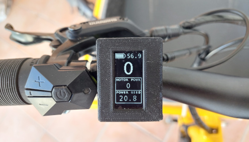
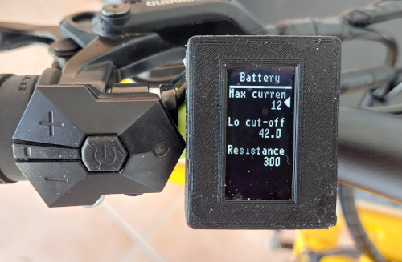

# EasyDIY OpenSource Ebike display

[This display is OpenSource](https://github.com/OpenSourceEBike/ev_display_bluetooth_ant) and easy to DIY, and was tested with [EBike TSDZ2 mid drive running our OpenSource firmware](https://github.com/OpenSourceEBike/TSDZ2_wiki/wiki). 

We are developing a version for Bafang M500/M600 motors!!

Main screen showing battery SOC, speed, motor power and battery power used: 

Configurations screen, showing some battery configuration options: 

## Main advantages of this display

* easy to build as DIY
* all the advanced configurations for the motor and battery are done directly on the display
* supports Bluetooth and ANT wireless communications
* supports 0.96 and 1.3 inches 128x64 OLED displays
* easy to install our firmware, includes OTA wireless updates
* easy to repair, can be opened easily and the electronic components are popular ones available worldwide
* easy to customize with some extra electronics so it can be reused on other devices, like adding CANBUS communication so it can work with more recent Bafang motors
* if you decide to stop using it, you can dismantle and reuse the electronic components on other projects

## Motivation

On the last years we developed OpenSource firmware for popular cheap EBike displays and we found some hard limitations:
* some displays stop to work suddenly, are expensive and can not be repaired because they are sealed and are not meant to be opened
* manufacturers makes different versions over the time of the same display and the firmware need to be developed again (at least partially)
* on some displays is almost impossible to install our advanced firmware
* it is impossible to use the same display for different devices because sometimes there are small electronics differences on the communications, like some devices using UART, other CANBUS and other UART one wire

## How to build

See here **[How to build the display - TSDZ2 version](build_display.md)**.

See here **[How to build the display - Bafang M500/M600 version](build_display-bafang_m500_M600.md)**.

## Operating Instructions

See here How to use the display (TODO)

## Community help

* Forum message: [DIY OpenSource display for EVs, TSDZ2 EBike motor and Xiaomi scooter](https://endless-sphere.com/forums/viewtopic.php?f=7&t=113971)
* Developers: [tools used for development](development/README.md)

# Other projects

* [TSDZ2 wireless and fully wireless remote](tsdz2_wireless/index.md) (with Garmin Edge integration for page change).
