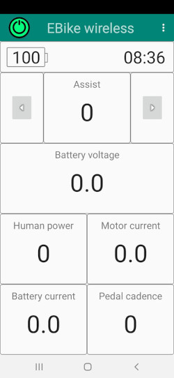
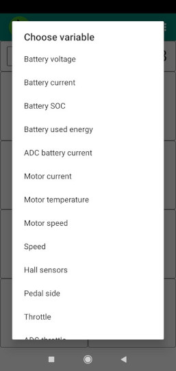

# TSDZ2 Wireless Project 
## Background
The project objective is to provide wireless to the TSDZ2 mid drive motor, free and OpenSource, making it support GPS bike computers, a mobile app and a wireless remote. The goal is to emulate and improve upon commercially available wirelessly controlled ebikes like the  [Specialized Turbo Levo Ebike](https://www.youtube.com/watch?v=F43oqj1Zlww).

The project utilizes the proven and popular **[TSDZ2 Flexible Open Source firmware](https://github.com/OpenSourceEBike/TSDZ2_wiki/wiki)** (original developed to be used with the SW102 or 850C/860C displays running our OpenSource firmware).

## EBike wireless controller

We have developed a **[DIY EBike wireless controller](ebike_wireless_controller.md)** to connect to the motor controller, on the display connector. With it alone, you can power on/off the TSDZ2 motor, increase/decrease assist levels and see the Ebike battery level. 
This wireless controller implements Bluetooth and ANT, is easy to build and costs only 25€ in materials.

Picture of our DIY EBike wireless controller: 
 

## Mobile app

We also developed a **[mobile app](android_app_operation.md)** and with that you can control the TSDZ2 motor as also change his configurations - there are over 100 configuration options that can be customized to fit any user's particular requirements!

Screenshots of our mobile app: 
 

## Fully wireless and wired remotes

We have also developed a **[DIY fully wireless remote](remote/build_remotes)**. There is also more simple wired remote if you prefer. 
With this remotes, is possible to power on/off the TSDZ2 motor, increase/decrease assist levels, display Ebike battery level and more. 

The wireless remote can also connect to a GPS display like a Garmin Edge to change data pages. It costs only 20€ in materials and uses a coin battery that will work for more than 2 years.

Pictures of our DIY fully wireless remote button with connection for brake sensors: 
  

----
## Getting Started

The steps for building the wireless motor controller and the remote control are described below:
* [How to build the TSDZ2 EBike Wireless Controller](ebike_wireless_controller.md)
* [How to build a remote](remote/build_remotes.md)

----
## Operating Instructions

You are now ready to enjoy your new wirelessly controlled ebike.

* [EBike wireless controller operating instructions](wireless_motor_operation.md)
* [Mobile app operating instructions](android_app_operation.md)
* [Remote operating instructions](operation.md)

-----
## Community help

* Forum message: [EBike wireless standard (like Specialized Turbo Levo) - OpenSource](https://endless-sphere.com/forums/viewtopic.php?t=106346)
* Developers: see [documentation](https://github.com/OpenSourceEBike/TSDZ2_wireless/blob/master/EBike_wireless_remote/documentation/README.md)
