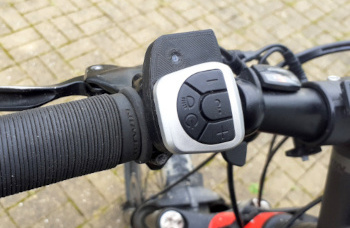

# TSDZ2 Wireless Project 
## Background
The project objective is to provide wireless TSDZ2 mid drive motor support for bike computers (and other wireless displays), a mobile android app for configuration and control, and a wireless remote control for assist level changing, power control and more. The goal is to emulate and improve upon commercially available wirelessly controlled ebikes like the  [Specialized Turbo Levo Ebike](https://www.youtube.com/watch?v=F43oqj1Zlww).

The project utilizes the proven and popular [Open Source firmware which has been developed for the TSDZ2 mid drive motor](https://github.com/OpenSourceEBike/TSDZ2_wiki/wiki) using the SW102 or 850C/860C displays.

Using this firmware, we have developed [a DIY wireless motor controller](https://github.com/OpenSourceEBike/TSDZ2_wireless/tree/master/EBike_wireless_TSDZ2) to connect to the motor, instead of using a wired display. This board supports multiple wireless formats, is easy to solder and costs only 25€.

Picture of our DIY wireless motor controller: 
 

With this wireless controller alone, you can power on/off the TSDZ2 motor and increase/decrease assist levels. If you use our mobile app, you will be able to accomplish the same actions and also change the motor configuration.
There are over 100 configuration options that can be customized to fit any user's particular requirements!

We have also developed [our own DIY wireless remote](remote/build_remote), that makes it possible to power on/off the motor, increase/decrease assist levels, display motor battety levels and more. In addition, it can also connect to a GPS display like a Garmin Edge to change data pages.  
This wireless remote costs only 20€ and the battery will work for more than 2 years.

Pictures of our DIY wireless remote button with connection for brake sensors: 
 
 
 

----
## Getting Started

The steps for building the wireless motor controller and the remote control are described below:
* [How to Assemble the TSDZ2 Wireless Controller](build_tsdz2_board.md)
* [How to Assemble the Wireless remote control with the original 3d printed case](remote/build_remote.md)
* [How to assemble the wireless remote control with an alternative 3d printed case](remote/alt/build_remote.md)

----
## Operating Instructions

You are now ready to enjoy your new wirelessly controlled ebike.

* [Wireless motor controller operating instructions](wireless_motor_operation.md)
* [Android app operating instructions](android_app_operation.md)
* [Wireless remote operating instructions](operation.md)

-----
## Community help

* Forum message: [EBike wireless standard (like Specialized Turbo Levo) - OpenSource](https://endless-sphere.com/forums/viewtopic.php?t=106346)
* Developers: see [documentation](https://github.com/OpenSourceEBike/TSDZ2_wireless/blob/master/EBike_wireless_remote/documentation/README.md)

