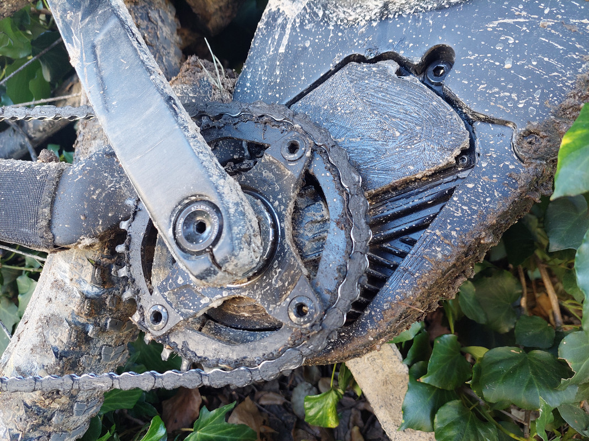
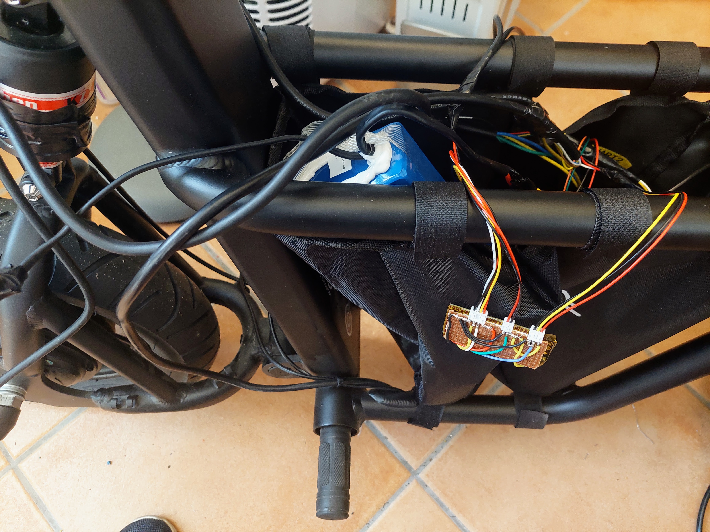
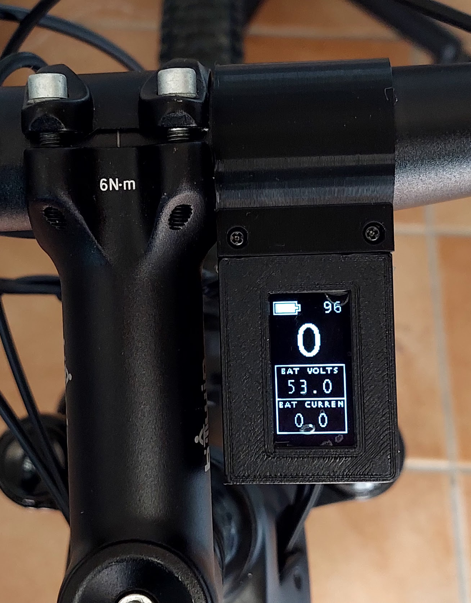

# EBike / EScooter modular DIY OpenSource electronics and software

 
| EBike with Bafang M500 mid drive motor | EScooter Xiaomi M365
|:----------:|:-------------:|
|  |  |

| EScooter Fiido Q1S
|:----------:|
|  

Over the years I did own a few different EBikes / EScooters from different brands, and I always found limitations on all of them, mainly on the software. Knowing that in general, all EBikes and EScooters are equal, I decided to replace the original motor controller electronics and display of all my EBikes/EScooters, with my own modular DIY version and running my software.

Because it is modular, DIY and OpenSource, this system is easy to adapt for any different EBike / EScooter brand, so it will be future prof and cheap as will be possible to save money by reusing the materials, software and knowledge.

I share here all the information and [source codes](https://github.com/OpenSourceEBike/EBike_EScooter_modular_DIY), about the build I did for my EBike, in the hope it will help others replicate and learn about EBikes / EScooters tecnhology.

For a user like me, it let me optimize my battery usage, so I can have a smaller and ligher battery, use a smaller motor, and so have a smaller and lighter MTB EBike with focus on my fitness.

For other users that may want a more powerfull motor, it let go behond the limits that the brands impose on the software.

And if you are looking for a more advanced system, with GPS navigation on the display, display showing your heart rate, pedal human power, etc, the best option is to also use a popular cycling GPS comnputer as the Garmin Edge.

## EBike / EScooter overview

In general, all EBikes and EScooters are equal - they have a battery, a motor, a motor controller electronics, input sensors and a display.

* **Battery:** most of the time is a standalone system, with an output voltage of like 36V or 48V, with only one connector with 2 wires: black (-) and red (+) 

* **Motor:** are in general very similar. To power the motor, they have 3 input phase wires connected to the coils. They may also have a small connector with 5 wires to output the hall sensors signals, to provide the rotor position information. 

* **Motor controller electronics:** use the battery voltage and drive the motor coils, to make the motor rotate, using the lowest energy possible and be silent. It also reads input sensors like the throttle, pedal torque sensor or brake sensor, as also sends and receive information to the display. 

* **Sensors:** can be like a throttle, brake sensor or a pedal torque sensor. Throttle outputs a electronic signal that represents his position, and with that the motor controller makes the motor rotate with more or less torque. The brake sensor, when pressed, will stop the motor. 

* **Display:** shows information to user, like what is the battery state of charge, what motor power is being used, and also let user select the motor assist level. 

## Modular DIY electronics and software details 

This modular and DIY system, replace the original motor controller and display, keeping the original battery and sensors.
It is composed of three different modular parts:
- Motor controller
- EBike/EScooter board
- Display

The motor controller and the EBike/EScooter board, togheter, replace the original motor controller.

### Motor controller

The motor controller used is the [popular and high performance OpenSource VESC](https://vesc-project.com/). You can buy it in many online stores like in Aliexpress, and there are [small ones of 2kW up to big ones of 20Kw or more](https://flipsky.net/).

VESC is able to drive any motor, has a motor auto detection feature and is very easy to configure.

We control the motor by sending commands to VESC, like the command to set the motor current / torque.

### EBike/EScooter board

The EBike/EScooter DIY board runs the application that implements the EBike/EScooter logic, for instance, it reads the throttle value and with it, sets the motor current by sending a command to the motor controller.

The microcontroller used is the popular ESP32, that has Wifi and Bluetooth. This ESP32 has a lot of memory and high speed processing, so it runs directly Pyhton software and we can edit/program the Pyhton software text files wirelessly, using our phone or computer.

This board needs to have a specific circuit for each EBike/EScooters sensors, for instance, a Bafang M500/M600 motor has a CANBUS torque sensor as input while an EScooter has only throttle as input.

### Display

This DIY display is small and shows basic information as EBike/EScooter speed, battery SOC and motor power. It uses a 3 buttons remote to let user change the motor assistance level as also set other features.

It uses the popular OLED 1.3inches screen. It also uses the ESP32, so it runs directly Pyhton software and we can edit/program this software wirelessly using our phone or computer.

# EScooter build

## Xiaomi M365

See **[Build with Xiaomi M365](build_EScooter_Xiaomi_M365/build_EScooter_Xiaomi_M365.md)**.

## Fiido Q1S

See **[Build with Fiido Q1S](build_EScooter_Fiido_Q1_S/build_EScooter_Fiido_Q1_S.md)**.

# EBike build with Bafang M500 motor

See: **[Build with Bafang M500 mid drive motor](build_EBike_Bafang_M500/build_EBike_Bafang_M500.md)**.

 

# Older projects

 The next links are here for historic reasons only:

* [EasyDIY OpenSource Ebike display](easy_diy_display_ebike_display/index.md) - previous 
* [TSDZ2 wireless and fully wireless remote](easy_diy_display_ebike_display/tsdz2_wireless/index.md) - with Garmin Edge integration for page change.
