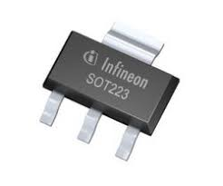

# TSDZ2 Wireless Project Objectives

This project aims to make TSDZ2 mid drive motor support wireless displays, mobile app and wireless remote control buttons, just like the commercial ebikes do, ie see: [Specialized Turbo Levo Ebike](https://www.youtube.com/watch?v=F43oqj1Zlww).

We developed [a DIY wireless board](https://github.com/OpenSourceEBike/TSDZ2_wireless/tree/master/EBike_wireless_TSDZ2) to connect to the motor, rather than using a display. The board is small, easy to build and costs only 25€.

With this wireless board alone, you can power on/off the TSDZ2 motor and increase/decrease the assist levels. If you use our mobile app, you will be able to accomplish the same actions and also change the motor configuration.

We also developed [our own DIY wireless remote](https://github.com/OpenSourceEBike/TSDZ2_wireless/tree/master/EBike_wireless_remote), that makes it possible control the motor to power on/off, increase/decrease the assist levels, and display motor battety levels. In addition, it can also connect to a GPS display like a Garmin Edge to change data pages.  
This wireless remote costs only 20€ and the battery will work for about 2.5 years.

## Community help

- Forum message: [EBike wireless standard (like Specialized Turbo Levo) - OpenSource](https://endless-sphere.com/forums/viewtopic.php?t=106346)
- Developers: see [documentation](https://github.com/OpenSourceEBike/TSDZ2_wireless/blob/master/documentation/README.md)

## How to build the TSDZ2 wireless board

You will need to acquire the following components:
* **[Wireless board - nRF52840 Nordic USB Dongle](https://www.nordicsemi.com/Software-and-tools/Development-Kits/nRF52840-Dongle)**: costs 10€ and can be bought in many online shops. 
  
* **60V -> 5V power board - EBike buck dd7818ta 80V -> 5V 1A**: costs 4€ and can be bought in many online shops like EBay, just search for "EBike buck dd7818ta 80". Other DC-DC converters can be used, like the [Traco power TEC-2-4811WI](https://uk.farnell.com/tracopower/tec-2-4811wi/dc-dc-converter-5v-0-4a/dp/2854928). Please note that any DC converter that you choose must have a voltage input of at least 60V and a 5V output.  
  
  
* **Power switch BTS4140N**: costs 2€, can be bought on EBay or other shops. 
  
* **Transistor BSP296**: costs 2€, can be bought on EBay or other shops. 
  
* **TSDZ2 display extension cable**: costs 6€, can be bought on EBay or other shops. 
  

## Schematic

## Firmware Installation

Once you have put the board assembled you are now ready to program the wireless bootloader.
follow the instructions [here](https://github.com/OpenSourceEBike/TSDZ2_wireless/tree/master/EBike_wireless_bootloader).
With the bootloader installed you can now program the Over the Air (OTA) updates for the wireless motor controller located [here](https://github.com/OpenSourceEBike/TSDZ2_wireless/releases)

To program the motor configuration and control the TSDZ2, download and install the android app from here: [https://github.com/OpenSourceEBike/TSDZ2_wireless/releases](https://github.com/OpenSourceEBike/TSDZ2_wireless/releases)

# Wireless remote

## Schematic

## How to build wireless remote
You will need to acquire the following components:
* **[Wireless board - nRF52840 Nordic USB Dongle](https://www.nordicsemi.com/Software-and-tools/Development-Kits/nRF52840-Dongle)**: costs 10€ and can be bought in many online shops. 
  
* **VLCD5 Keypad**: costs 10€, this is the keypad from the TSDZ2 original display. Can be bought in many online shops like EBay". 
  
* **CR2032 coin cell**: costs 1€, can be bought in any local shop or on EBay or other online shops.
*  
   
## Firmware Installation

Once you have put the board assembled you are now ready to program the wireless bootloader.
follow the instructions [here](https://github.com/OpenSourceEBike/TSDZ2_wireless/tree/master/EBike_wireless_bootloader).
With the bootloader installed you can now program the Over the Air (OTA) updates for the wireless remote located [here](https://github.com/OpenSourceEBike/TSDZ2_wireless/releases)