# Second Alternative Wireless remote design

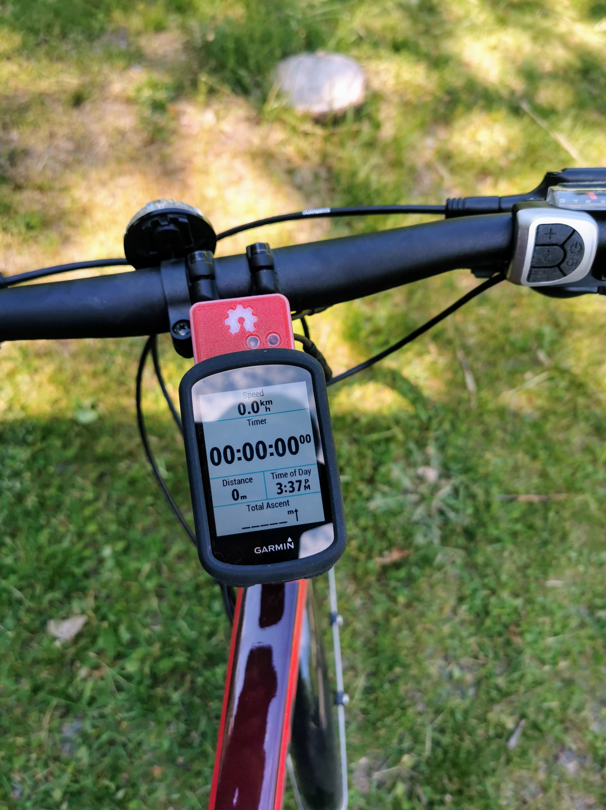

The concept behind this second alternative TSDZ2 wireless enclosure is to incorporate all the advantages of the first alternative remote design while greatly reducing assembly time and complexity by re-using the the existing VLCD5 button remote connector system.

## Design advantages

* Greatly improved battery life over the CR2032 button cell resulting in worry free operation.
The CR123 battery will last 6.5X longer than the cr2032 button battery resulting in more than 10 years of operation! (1500maH of battery  capacity vs 225maH for the CR2032)
* No disassembly of the keypad is needed, plug and play operation with the wireless enclosure.
* The VLCD5 button remote is low profile and small. It can therefore be positioned better for easy thumb access.
* The remote enclosure utilizes a easy to use and reliable garmin 1/4 turn mounting system
* Can be mounted under the garmin display, reducing the foorprint of the e-bike.
* Alternative button remotes can easily be substituted for the VLCD5 button remote  as they may become available in the future.
* Reduced handlebar space utilization.
* Simplified assembly of the wireless  enclosure.

## Operational Features

* turn on/off the motor
* increase/decrease assist level
* turn on/off walk assist
* turn on/off lights
* show battery level
* send the brake signal
* RGB LED to provide visual feedback
* Garmin Edge page change

## Re-design Considerations  

Although the original 3D printed case design has a number of very good features, (ie: it is very compact on the handlebar!), I wanted to redesign the enclosure to add a number of features that I find useful.
Note, the design choices made were for my use of the remote with my e-bike and you were may find the original design more to your liking.
Please choose the design that works for you.

The thoughts that went into the re-design are as follows:

* Greatly improve the potential battery life. Some users were concerned about the possibility of depleting a battery during a ride. with the larger CR123 battery, this possibility is effectively eliminated.
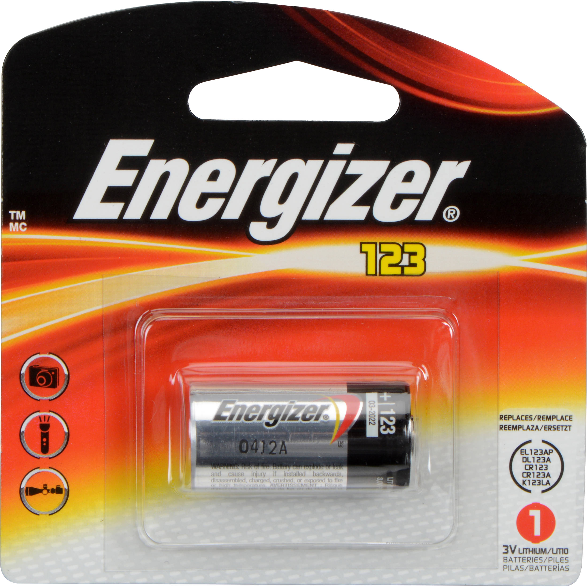
 Although the battery life with a cr2032 coin cell with the original design is well over 1 year, the re-design allows for the addition of a MUCH larger battery, namely the CR123A. This lithium battery has a capacity of 1500 mah, vs the 230 mah of a typical cr2032 coin cell. This is a improvement in battery life of over 6.5 times! This effectively eliminates any concerns that a user may have around battery life. The battery is also easily accessed when a replacement is needed.
* In the original design I find the keypad to be quite high and thus hard to reach with my thumb. The keypad ended up high due to design choice to stack all the components vertically. This re-design allows for the VLCD5 remote keypad to be used without modification resulting in a very low profile design.
* 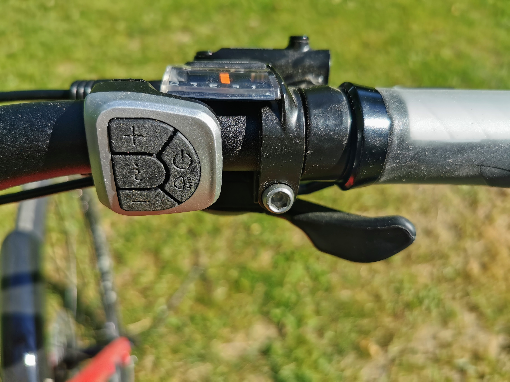
  
* Removed the clamping U-bolt and associated screws and replaced with a garmin 1/4 turn mounting system.
This allows for the use of garmin accessories to mount the wireless enclosure box.
ie:  the garmin forward mounting system
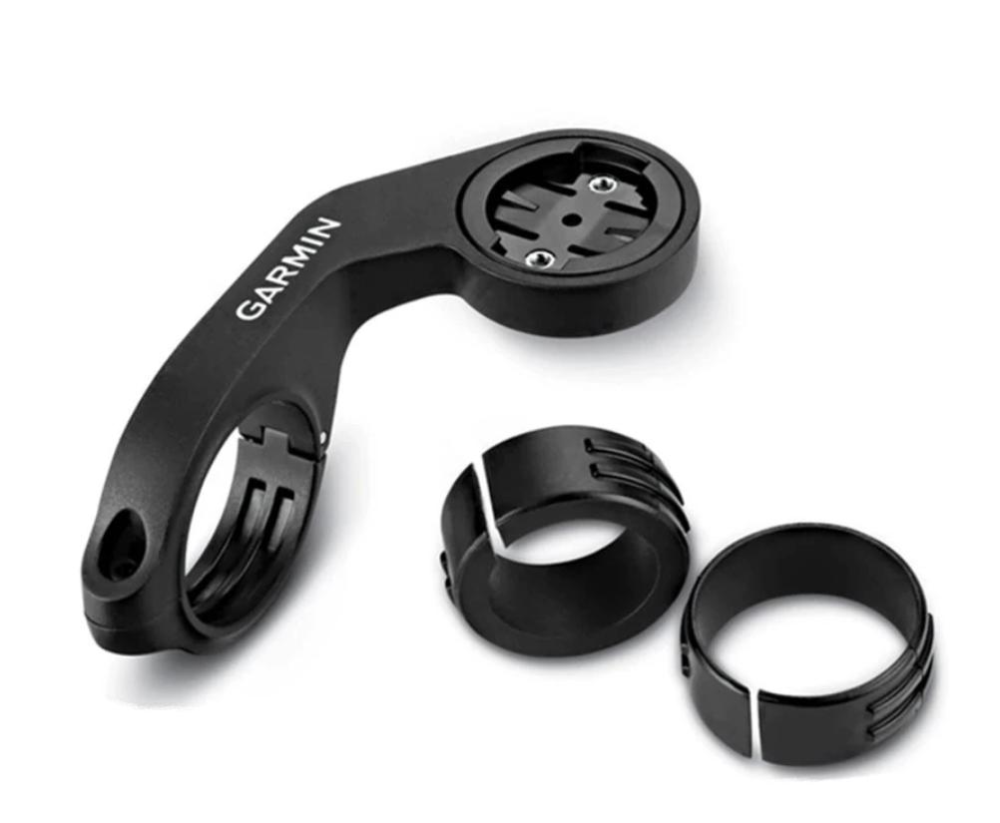
* Eliminated the need the cut the end off the nrf52840 to reduce it's length. The re-deign allows for the nrf52840 to be dropped into the case without modification.

* Added LED light pipes to the wireless enclosure to transmit light from the leds. This avoids the use of clear silicone or epoxy and allows for brighter displays.  I also added support in the case for both board leds. Note that at present we do not use the green led for any display information. However, this design will allow for that possibility in the future. (ie: display of motor error codes)
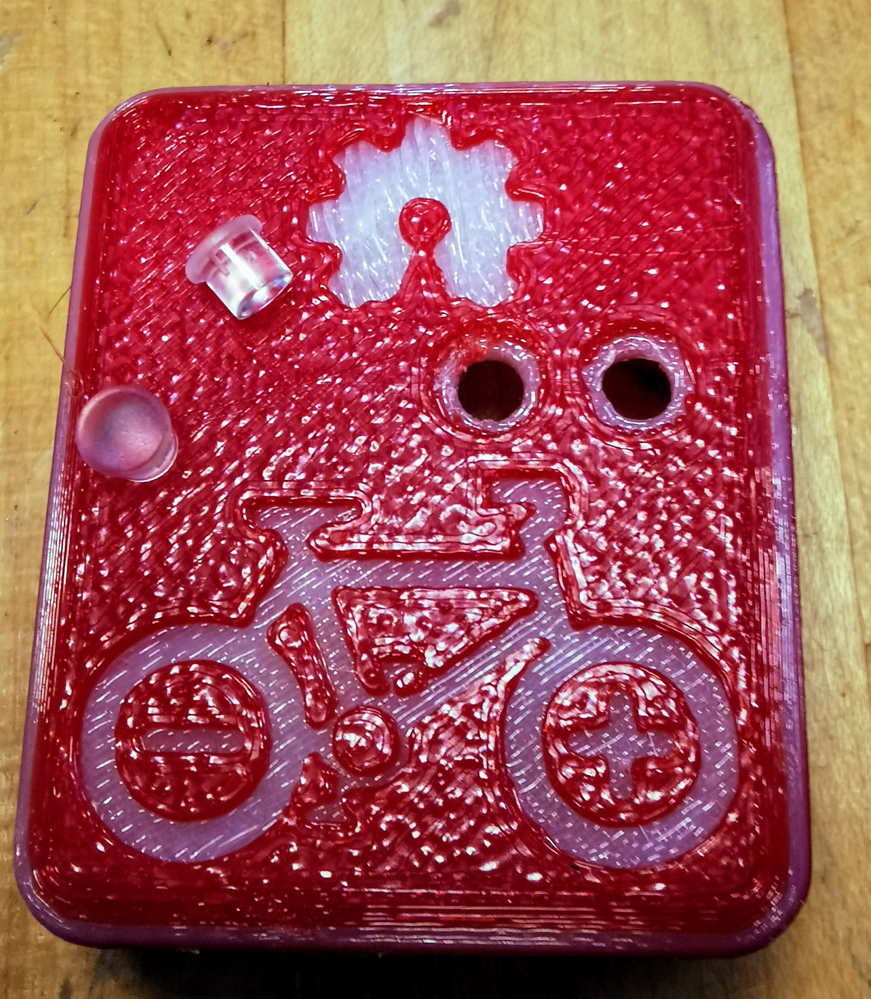

* Added a button recess in the 3d wireless box design to prevent the button on the board from being accidentally pressed when installed in the remote case.
  
* Eliminated the use of screws anywhere else in the design. The wireless enclosure uses a snap on lid.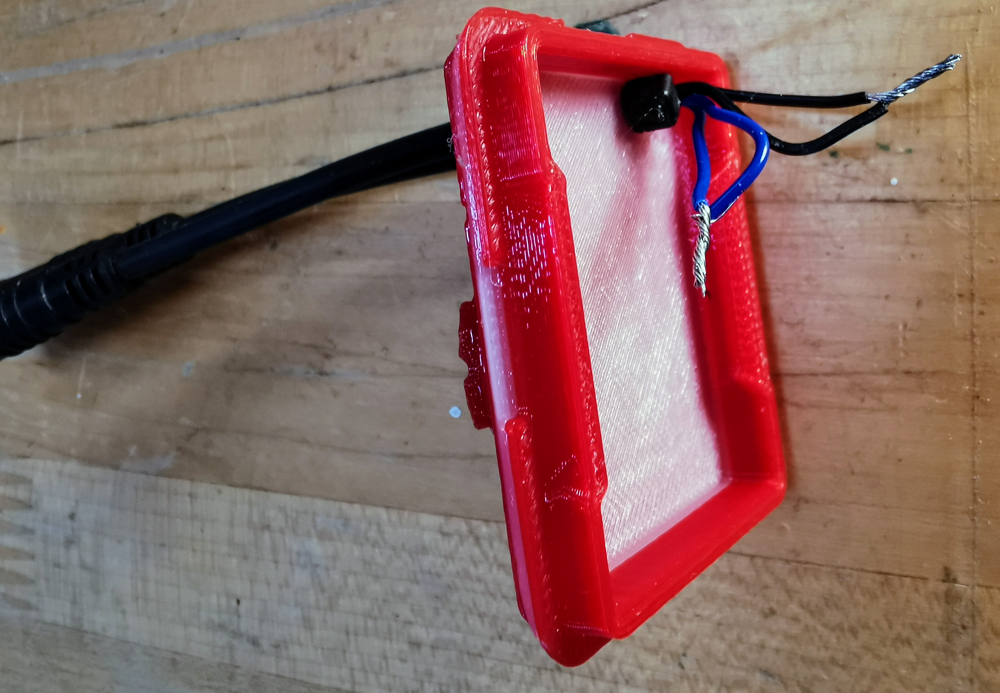
* I designed the remote using Fusion 360. The design files are located in the 3d_design_files folder. I have also included .step files to allow importing into other 3d design packages like Freecad.
The resulting design looks like [this](https://a360.co/34ONn2u
)

## How to build the wireless enclosure

You will need the following components:

* **nRF52840 Nordic USB Dongle**
  

* **VLCD5 display keypad or 860C display keypad**: costs 10€,.This is the keypad from the TSDZ2 original display which can also be purchased  in many online shops ie: [AliExpress](https://www.aliexpress.com/item/4001097689736.html?spm=a2g0s.9042311.0.0.27424c4dxp2RN0)  Can also be bought in many other online shops like EBay.

* **CR123 3V battery**: costs 1€, can be bought in any local shop or on EBay or other online shops.

* **2.54mm light pipes**: These can be purchased on Aliexpress or ebay. ie [AliExpress](https://www.aliexpress.com/item/4001097689736.html?spm=a2g0s.9042311.0.0.27424c4dxp2RN0)
Alternatively, you can use a drop of clear silicone, although the light transmission will not be as good.

* **Battery Clips**: These can be purchased on Aliexpress or ebay. ie [AliExpress](https://www.aliexpress.com/item/4000953728880.html?spm=a2g0s.9042311.0.0.27424c4dsstnu1)
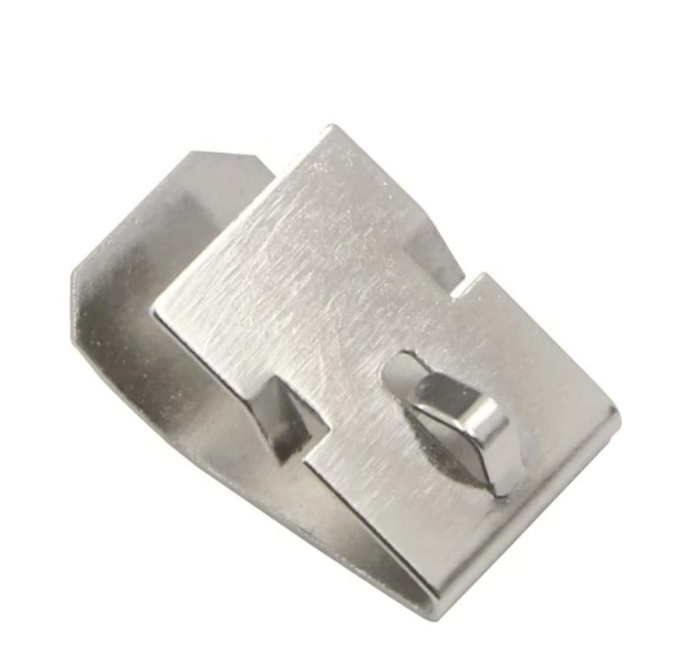

* **Brake Splitter Wire** This can be purchased from ali express or other online shops, and will usually be part of an ebike brake assembly.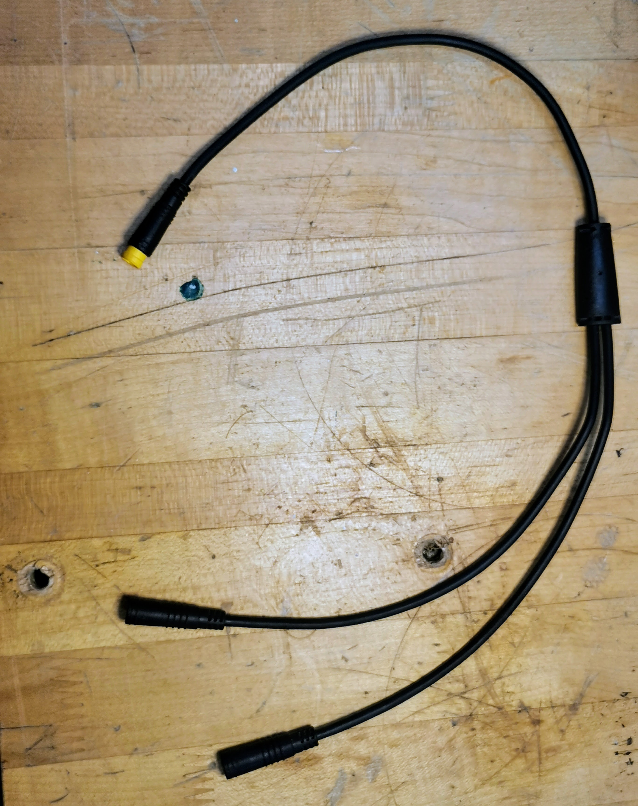

* **5 pin extension cable** This can be purchased from online retailers like [ali express](https://tinyurl.com/28p22mkj), and is used to make a connection to the VLCD5 button remote. Alternatively, you can use the connector that cam with the cable harness on the TSDZ2 ebike by cutting the cable.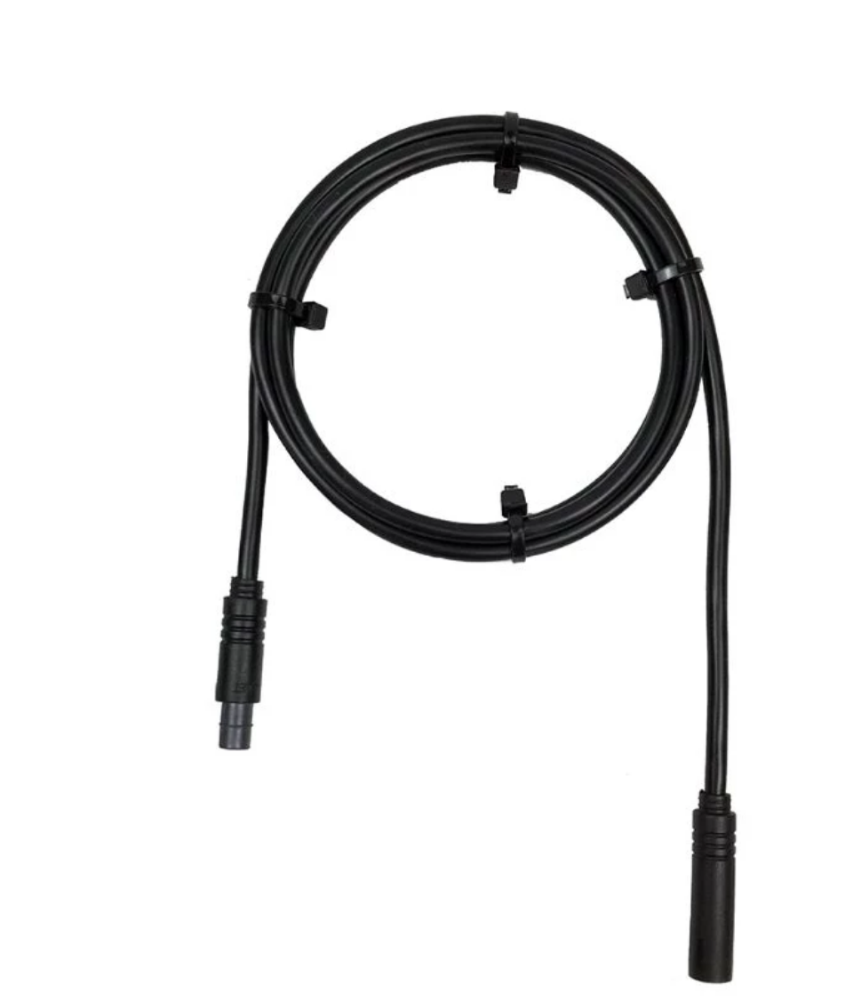

* **3D printed enclosure**: NOTE that if you do not have a 3D printer, you can improvise by simple use some black tape to protect the board, wires and the battery. If you 3D print this enclosure, it should costs about 1€.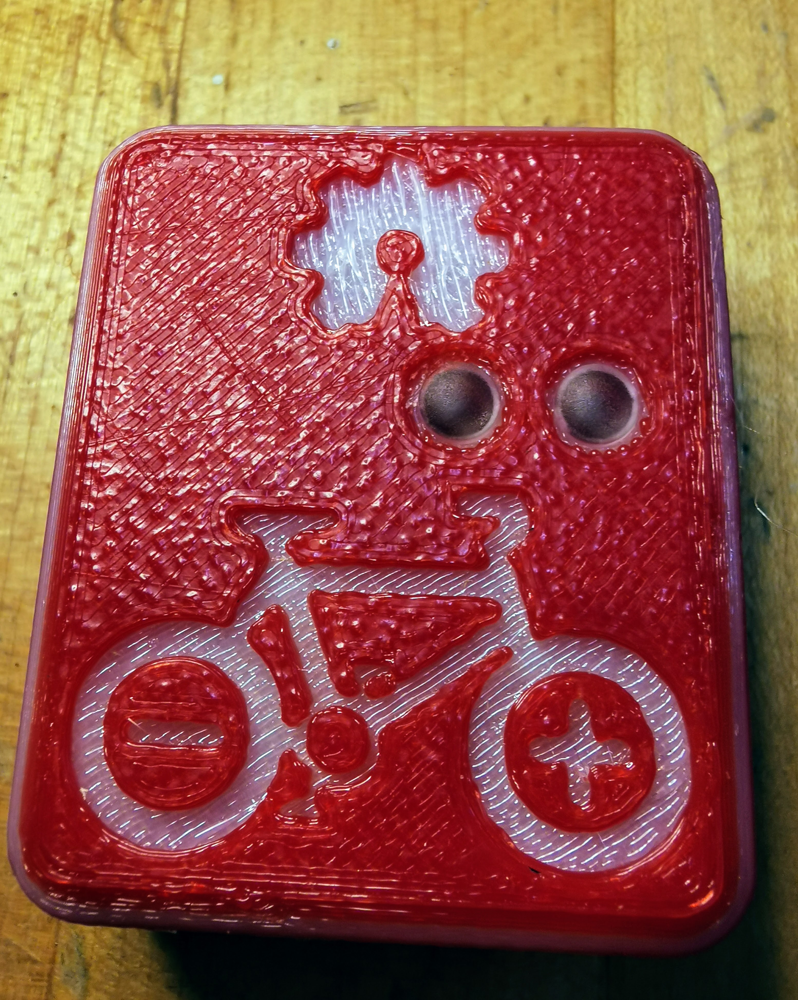

## Step by step instructions

1 - **Flash bootloader on the nrf52840 board** - see the page: [How to Flash the Wireless Bootloader on a Nordic Dongle](../getting_started.md)

2 - **Wireless enclosure schematic** - In the following steps you will solder all the wires following the below schematic. (use cr123 battery where it shows cr2032 battery)

Do not solder any wires to the battery, it would be dangerous. Simply solder to the battery clips and insert them into the case

Schematic:

nrf52840 board pinout:

You MUST cut the SB2 and solder the SB1 pads on the bottom of the board:

3 - **3d print the wireless enclosure** - 3D print the wireless enclosure, the quarter turn mount and up front garmin mounts(if needed). 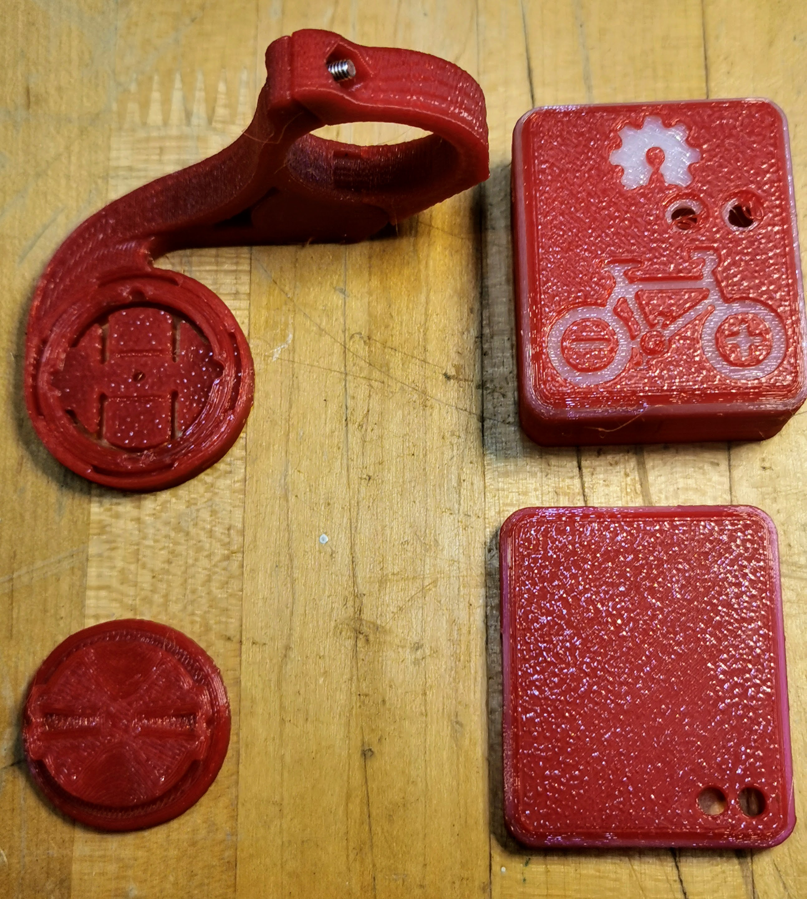
The stl files for 3d printing are located in the [stl_files](./stl_files) directory.
The wireless enclosure has the opensource hardware logo, and a stylized e-bike figure on the top of the box.
It can be printed in two colors to emphasized these design components as shown in the figure.
Please note that the garmin mount is licensed under creative commons by timangus and is located on thingiverse [here](https://www.thingiverse.com/thing:4483267).
Similarly, the garmin quarter turn mount is licensed under creative commons  by Whereswaldo and is located on thingiverse [here](http://www.thingiverse.com/thing:656833)

3D print the STL files (can be printed in PLA, but PETG will have better sun tolerance and at 0.2mm layer height) All files are located in the stl_files directory
Glue the quarter turn mount to the back of the wireless enclosure cover as shown: 

4 -Assembly:

* Using the brake spitter wire, as shown  Cut at the join and Push the brake wires through the lower assembly and secure the wire with a small zip tie for a strain relief.

* Cut a brake sensor extension cable to make a connection to the VLCD5 button remote. 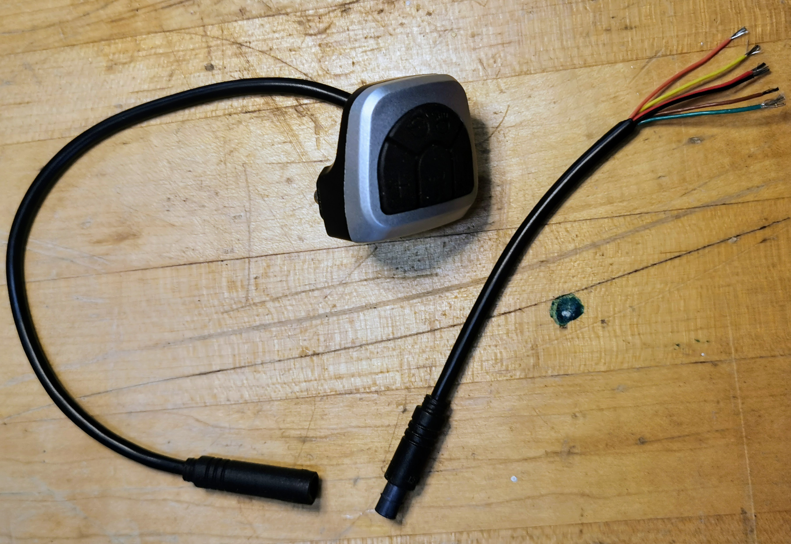
* Feed the 5 pin connector through the wireless enclosure cover and secure with a cable tie strain relief.
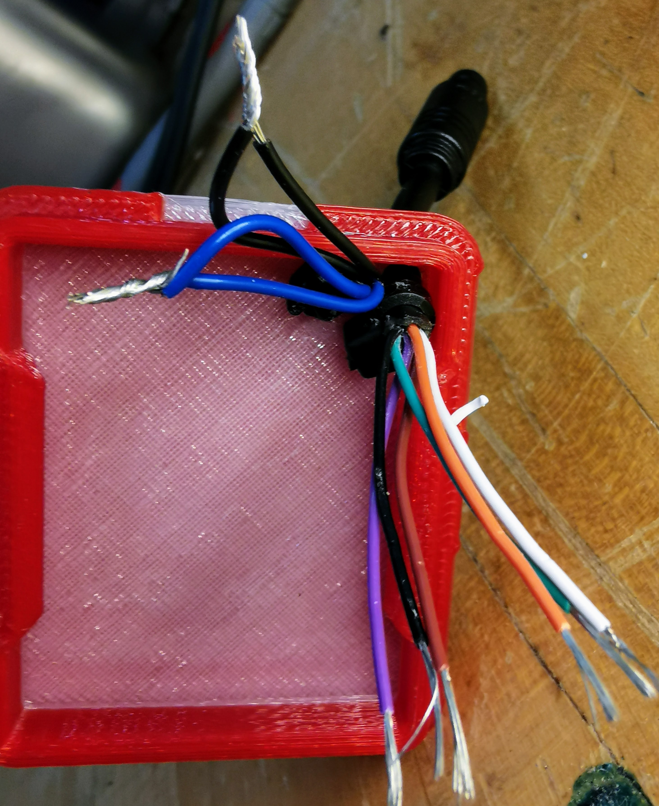
* Solder all connections to the nrf52840 board. 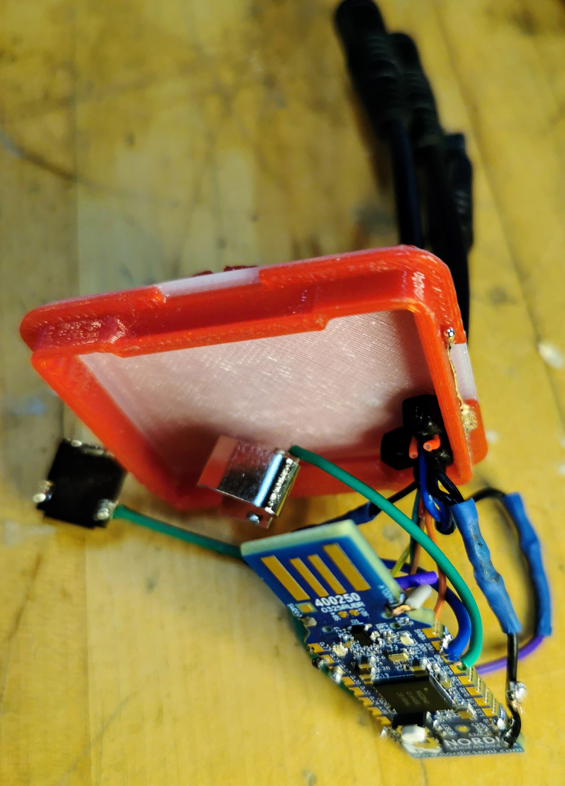
* glue the led light pipes into the wireless enclosure.

* attach the battery connections to the enclosure, add the cr123 battery and snap the top remote cover on the bottom case
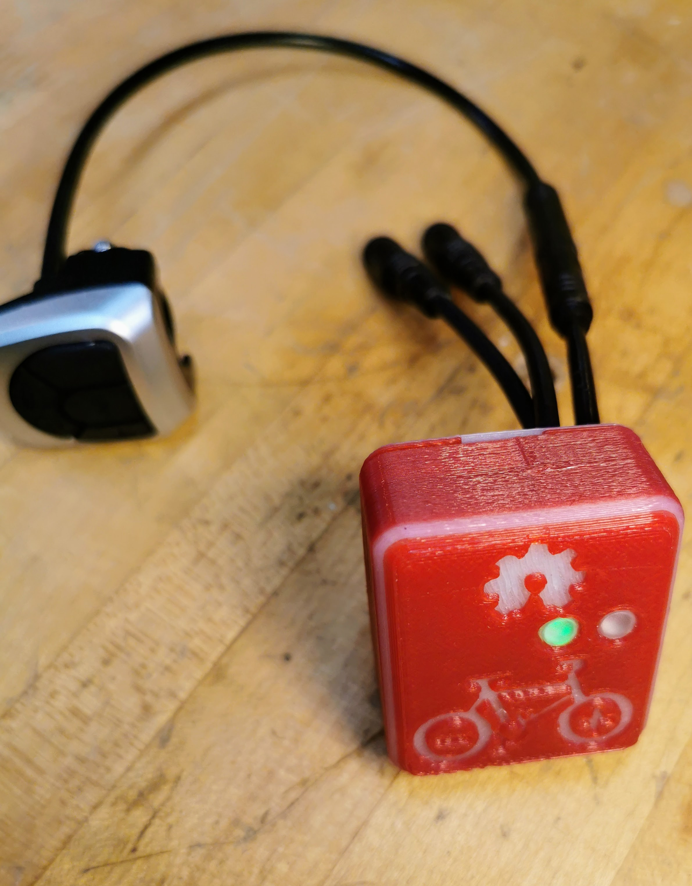
* attach the quarter turn garmin mounts for the wireless enclosure and garmin bike computer (if applicable) to the ebike.
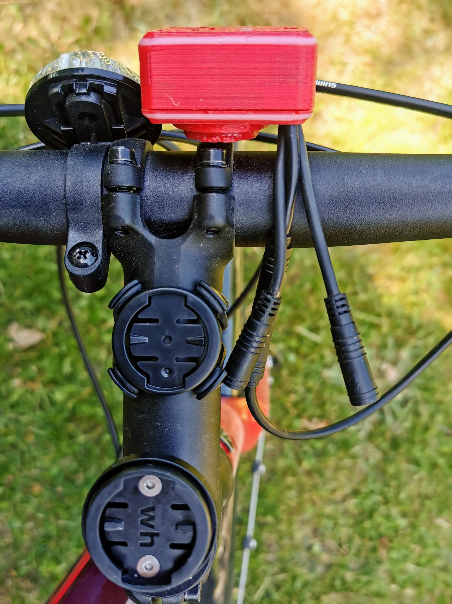
* Attach the wireless enclosure to the ebike.
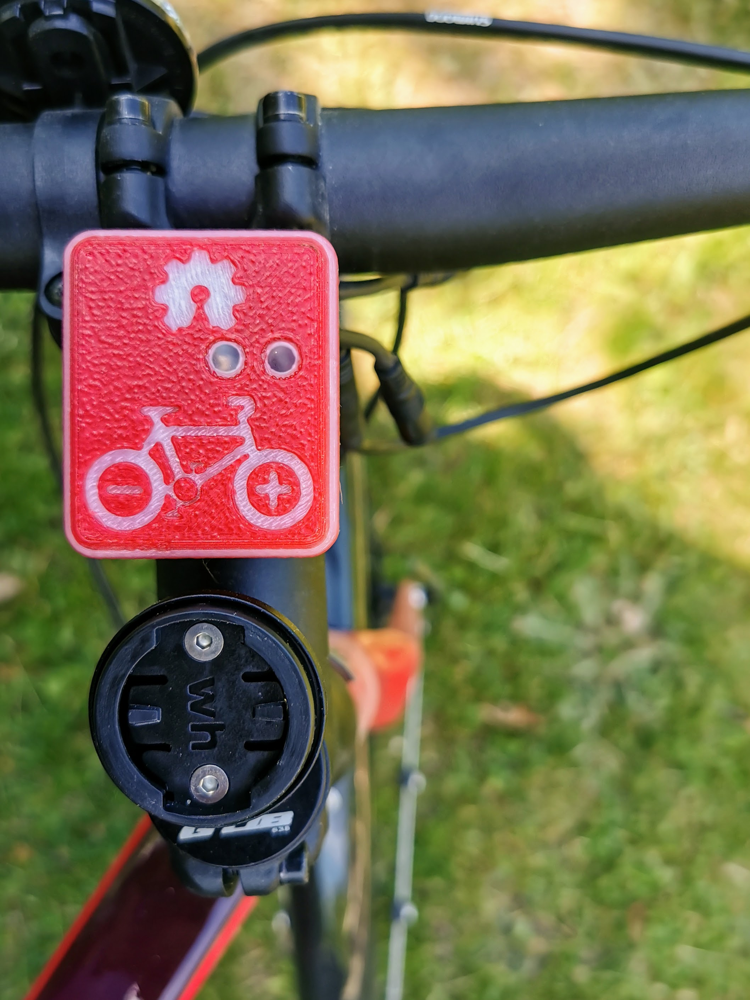
* finally, attach the garmin bike computer (if applicable)

5  **Flash firmware on the nrf52840 board** using the wired connections - see the page: [How to Flash the Wireless Remote and Motor Controller Firmware](../../firmware.md)

6- **Test** - Make sure the TSDZ2 wireless board if off. Power up the remote board and the firmware will blink the LED (LD2) with red color attempting to connect to the TSDZ2 wireless controller
