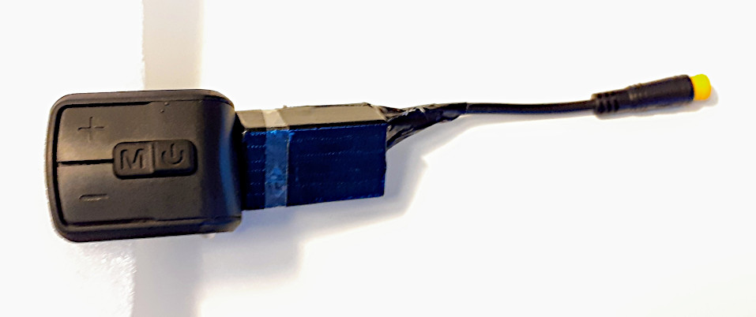
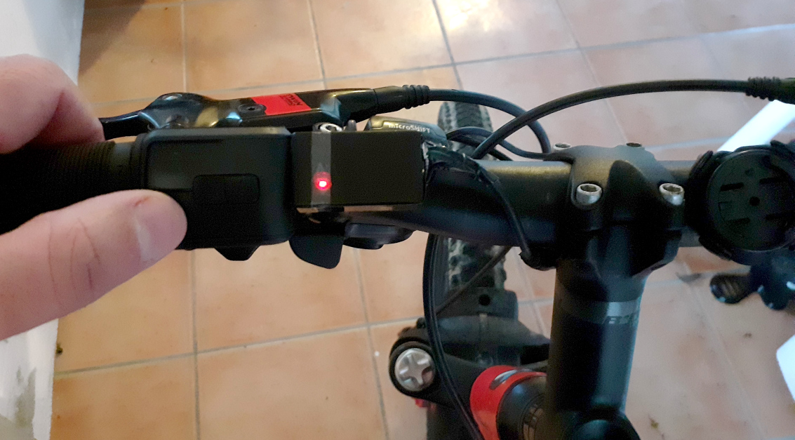
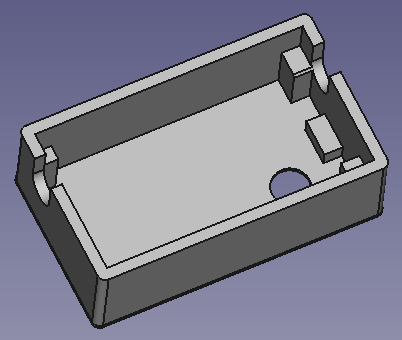
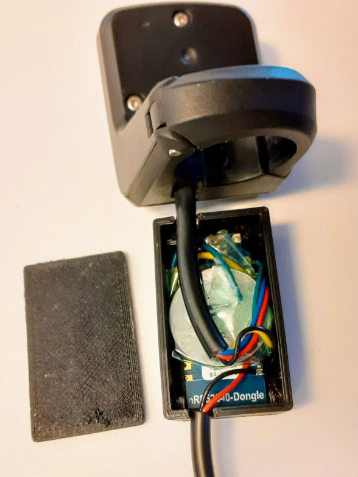

# Wireless remote

This is our wireless remote button for EBikes and/or GPS bike computers like the Garmin Edge. If you do not want to build your own, you can purchase on the market ebike remote controls. ie: the Garmin EBike Remote for about 80€.

However, our wireless remote control is considerably less expensive and offers several additional features for ebike control.

Example of a remote using the 860C display keypad, a 3D printed box and a cable with connector for the brake sensor: 

Installed on the handle bard:

# How to build wireless remote

You will need the following components:
* **nRF52840 Nordic USB Dongle** 
  
* **VLCD5 display keypad or 860C display keypad**: costs 10€, this is the keypad from the TSDZ2 original display. Can be bought in many online shops like EBay. 
  
* **CR2032 coin cell**: costs 1€, can be bought in any local shop or on EBay or other online shops.
 
  

Optional components:
* **Cable with 2 pins and water prof connector**: costs 2.5€, with a good connector used on EBikes, to connect to the brake sensors. Can be bought in many online shops like EBay - search for "julet mini connector" or "higo connector" and choose the 2 pin male and female, red color. 

* **3D printed box**: you can simple use some black to protect the board, wires and the battery and make the remote water prof, or you can 3D print this box - costs 1€.

## Step by step instructions

1 - **Flash bootloader on the nrf52840 board** - see the page: [How to Flash the Wireless Bootloader on a Nordic Dongle](../getting_started.md)

2 - **Build your board** - solder all the wires following the next schematic.

2.1 - Cut your nRF52840 board with a metal saw by hand, this way the board will be smaller and ready to be placed on the 3D printed box - here a picture as example:

Do not solder any wires to the battery, it would be dangerous. Simple use the wires against the battery and use same tape to get them in place. In the end you can use some little sponge to make pressure on so they will have a good contact with the battery.

Schematic:

nrf52840 board pinout:

You MUST cut the SB2 and solder the SB1 pads on the bottom of the board:

Example of a remote using the 860C display keypad, a 3D printed box and a cable with connector for the brake sensor: 

3 - **Flash firmware on the nrf52840 board** - see the page: [How to Flash the Wireless Remote and Motor Controller Firmware](../firmware.md)

4 - **Test** - Make sure the TSDZ2 wireless board if off. Power up the remote board and the firmware will blink the LED (LD2) with red color.

Optional:

* **3D print the box and cover** - here the STL files as also the source files for [FreeCAD](https://www.freecadweb.org/):
  * [remote.stl](remote.stl) - [remote.FCStd](remote.FCStd)
  * [remote_cover.stl](remote_cover.stl) - [remote_cover.FCStd](remote_cover.FCStd)
