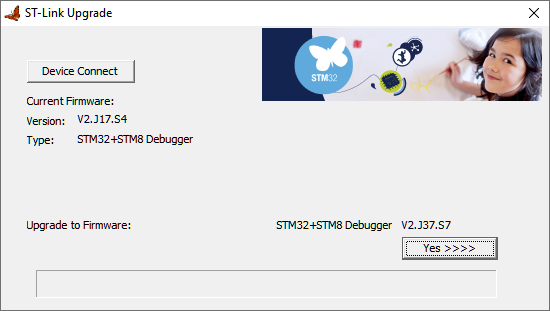

STLinkV2 is the programmer to use to flash the TSDZ2 motor firmware and the NRF52840 board bootloader.

You can buy STLinkV2 clones on EBay or Aliexpress for very cheap prices like 2€ (shipping included)

Whilst the cases look the same, there appear to be several different designs of boards inside with different microcontrollers. A few users have reported problems. If you buy one that has issues - you may be able to fix it by updating the firmware - see Troubleshooting below.

Some suggestions to buy STLinkV2:
* you can buy from EBay or Aliexpress and search for "STLinkV2"
* since they are really cheap, buy a few units
  * buy from different sellers and only 1 unit from each seller in case one doesn't work.

## Troubleshooting

If you have issues using your STLinkV2 clone adapter - try updating the firmware to the latest version.

You can get firmware from STMicroelectronics' [website](https://www.st.com/en/development-tools/stsw-link007.html). Note - if you are using a clone this is not supported by the manufacturer. **Use at your own risk.**

The update tool will show you the current firmware version of your adapter:

### Known issues using STLinkV2 clones to update OpenSourceEBike firmware.
If openocd throws the below error when trying to flash any of the EBike firmware then update the firmware to the latest version using the instructions above.

`Error: ST-Link version does not support DAP direct transport`
