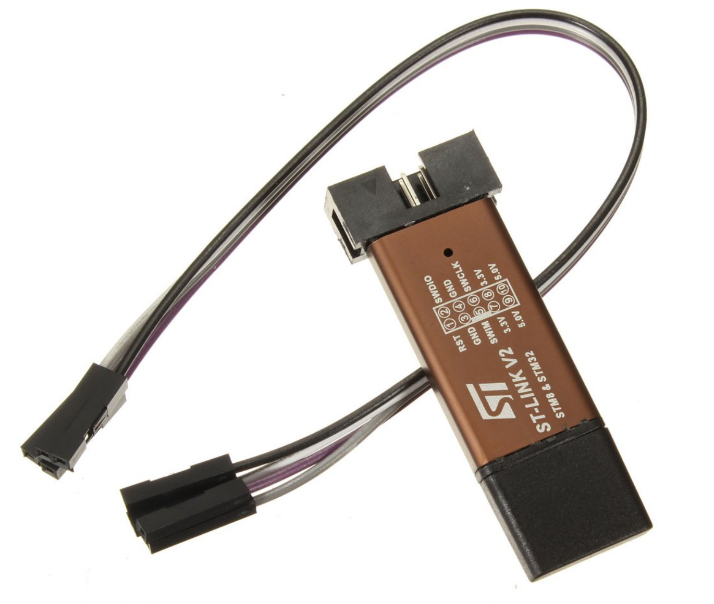

STLinkV2 is the programmer to use to flash the TSDZ2 motor firmware as also the NRF52840 boards bootloader.

You can buy STLinkV2 on EBay or Aliexpress for very cheap price like 2€ (shipping included) but unfortunately there are different versions of them and some simple do not work well (at least for flashing the TSDZ2 motor firmware).

From the outside, all of the versions are equal but if you open them you will clearly see differences:
* the microcontroller is different (the version that works well has the STM32F103)
* the board is different (the version that works well has 2 LEDs only at bottom)

See two version side by side, where the version at left is the one that works well:

Some suggestions to buy STLinkV2:
* you can buy from EBay or Aliexpress and search for "STLinkV2"
* since they are really cheap, buy a few units
  * buy from different sellers and only 1 unit from each seller
  