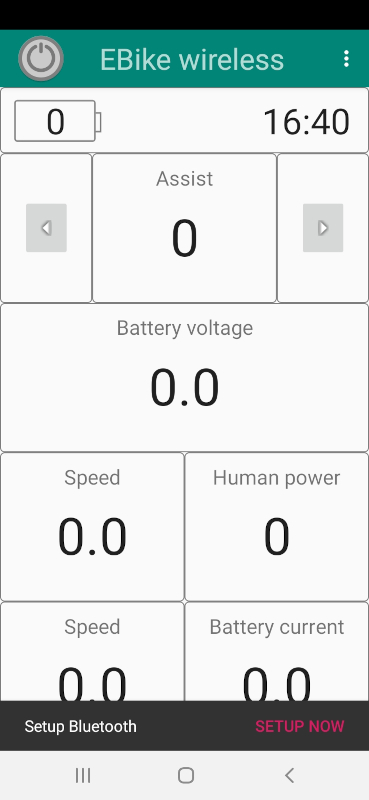
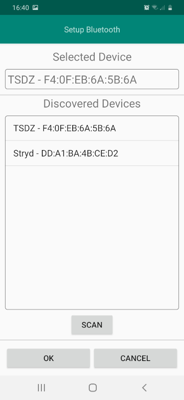
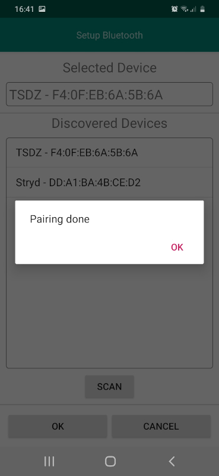
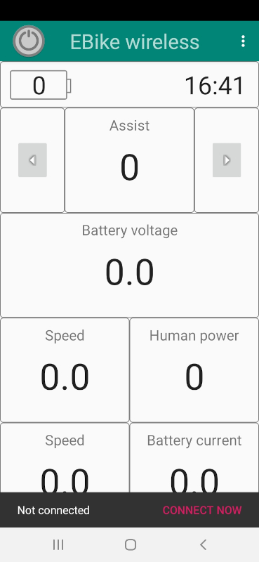
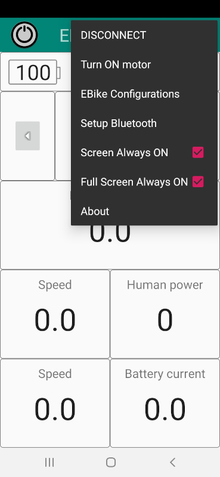
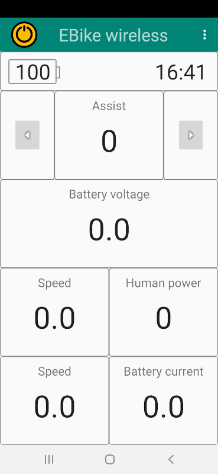
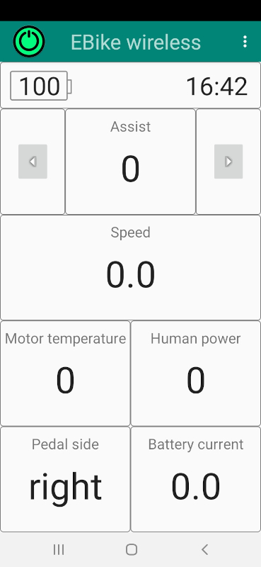
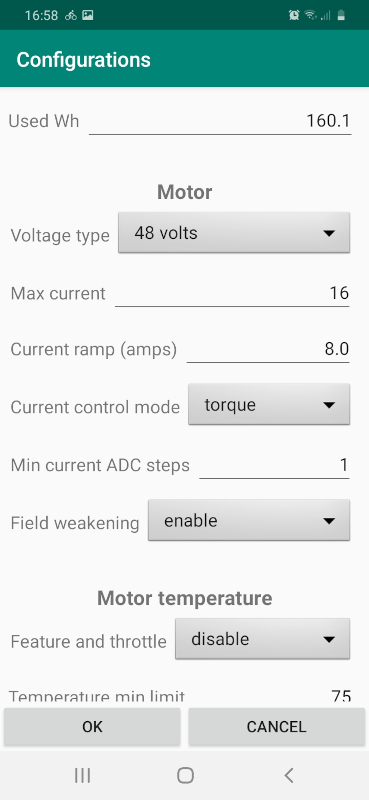
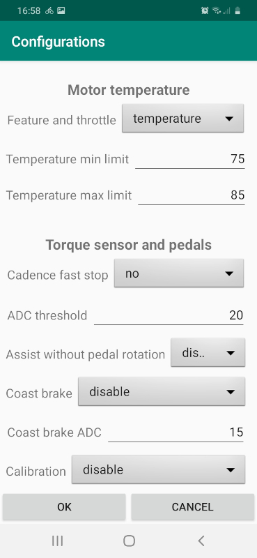

# Mobile app operation

Download [here (TSDZ2_wireless_vx.x.x.apk
)](https://github.com/OpenSourceEBike/TSDZ2_wireless/releases) the Android APK file of the mobile app - see the assets pane of latest version or previous ones.

Features:
* turn on/off the motor
* show Ebike battery level
* increase/decrease assist level
* 5 custom fields where you can choose a variable to be shown
* see and change any TSDZ2 motor configuration 

## Connect to TSDZ2 EBike wireless board

You can setup Bluetooth device clicking on the menu or on the bottom bar "SETUP NOW": 
  

Choose the TSDZ device from the list: 
  

You will get a confirmation message "Pairing done": 
  

You can connect to the device clicking on the menu or on the bottom bar "CONNECT NOW": 
  

## Turn on TSDZ2 motor

Now you can turn on the TSDZ2 motor, clicking on the menu "Turn ON motor". But before make sure to put the pedals on vertical and the left pedal near the ground: 
  

NOTE: While TSDZ2 motor turns on, you will see the icon at top left with orange color - you should no touch the pedals during this phase as the torque sensor is calibrated: 
  

TSDZ2 will be ready to use when the icon is green: 
  

## Configurations

On the menu you can click on "EBike configurations":

  

## Configure custom fields

Long press on the bottom 5 fields and you will be able to select which variable to show on that field: 
 
